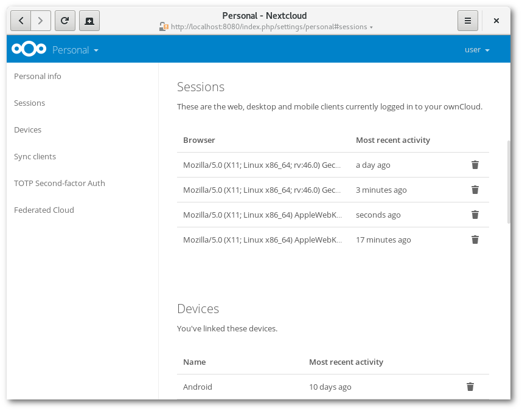

==================
管理连接的浏览器和设备
==================

在个人设置页面会对连接的浏览器和设备生成概要列表。

管理连接的浏览器
===========================
在连接的浏览器列表中，您会看到最近连接到您帐户的浏览器:

您可以使用回收站图标来断开列表中的任何浏览器。

设备管理
================
在已连接的设备列表中，您可以看到所有设备和客户端生成了设备名称及其最近的活动情况：

     :alt: 已连接设备列表。

您可以使用回收站图标来断开列表中的任何浏览器。

在列表的底部找到创建新的设备专用密码的按钮。您可以选择一个名称为了以后识别该令牌。生成的密码用于配置新客户端。理想情况下，为连接到您的帐户的每个设备生成单独令牌，以便您可以根据需要单独断开连接。

.. figure:: images/settings_devices_add.png
     :alt: 增加新设备。

.. 提示:: 在列表的底部找到创建新的设备专用密码的按钮。您可以选择一个名称为了以后识别该令牌。生成的密码用于配置新客户端。理想情况下，为连接到您的帐户的每个设备生成单独令牌，以便您可以根据需要单独断开连接。

.. 提示:: 如果您为帐户使用双重身份验证，则设备专用密码是配置客户端的唯一方法。客户端将拒绝使用您的登录密码的连接。
