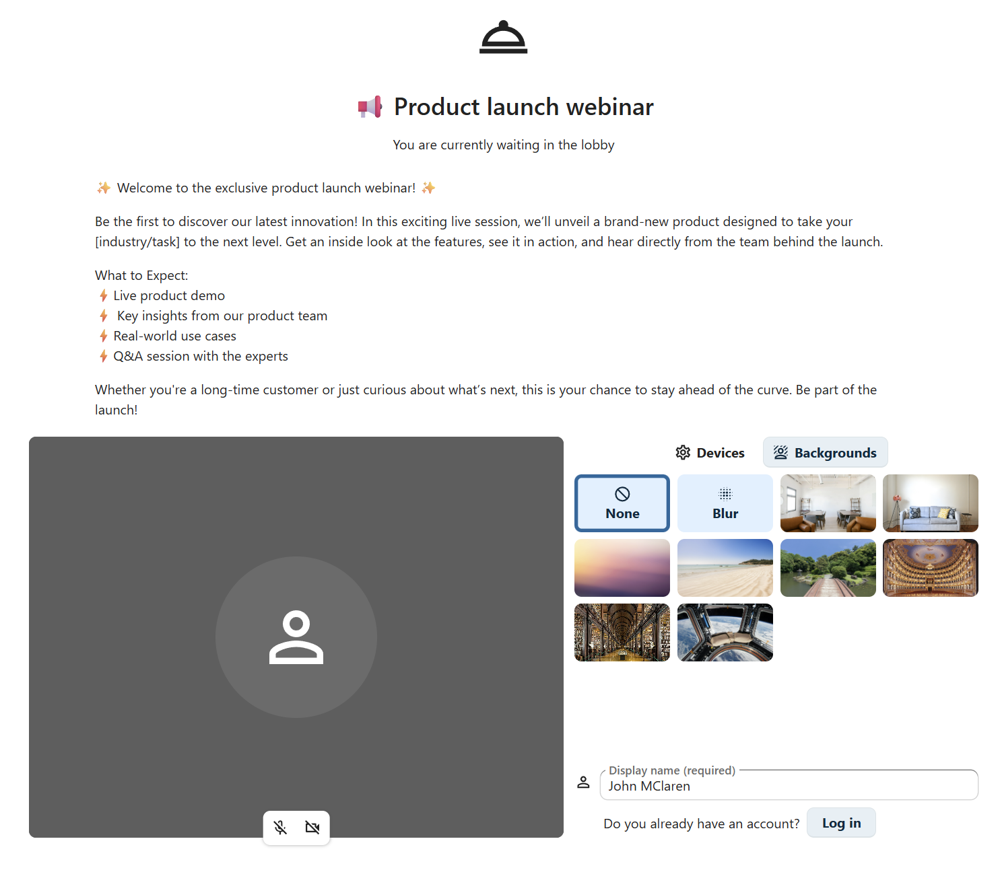

Advanced Talk features
======================

Nextcloud Talk has a number of advanced features users might find useful.

Matterbridge
------------

Matterbridge integration in Nextcloud Talk makes it possible to create 'bridges' between Talk conversations and conversations on other chat services like MS Teams, Discord, Matrix and others. You can find a list of supported protocols `on the Matterbridge github page. <https://github.com/42wim/matterbridge#features>`_

A moderator can add a Matterbridge connection in the chat conversation settings.

.. image:: images/matterbridge-settings.png

Each of the bridges has its own need in terms of configuration. Information for most is available on the Matterbridge wiki and can be accessed behind ``more information`` menu in the ``...`` menu. You can also `access the wiki directly. <https://github.com/42wim/matterbridge/wiki>`_

Lobby
-----

The lobby feature allows you to show guests a waiting screen until the call starts. This is ideal for webinars with external participants, for example.

You can choose to let the participants join the call at a specific time, or when you dismiss the lobby manually.

Commands
--------

Nextcloud allows users to execute actions using commands. A command typically looks like:

    ``/wiki airplanes``

Administrators can configure, enable and disable commands. Users can use the ``help`` command to find out what commands are available.

    ``/help``

.. image:: images/command-help.png

Find more information in the `admin documentation for Talk. <https://nextcloud-talk.readthedocs.io/en/stable/commands/>`_

Talk from Files
---------------

In the Files app, you can chat about files in the sidebar, and even have a call while editing it. You first have to join the chat.

.. image:: images/join-chat.png

You can then chat or have a call with other participants, even when you start editing the file.

.. image:: images/text-and-talk.png

In Talk, a conversation will be created for the file. You can chat from there, or go back to the file using the ``...`` menu in the top-right.

.. image:: images/file-room.png

Create tasks from chat or share tasks in chat
---------------------------------------------

If Deck is installed, you can use the ``...`` menu of a chat message and turn the message into a Deck task.

.. image:: images/chat-message-menu.png

.. image:: images/deck-talk-create-card-dialog.png

From within Deck, you can share tasks into chat conversations.

.. image:: images/deck-talk-share-card-to-chat-in-talk.png

