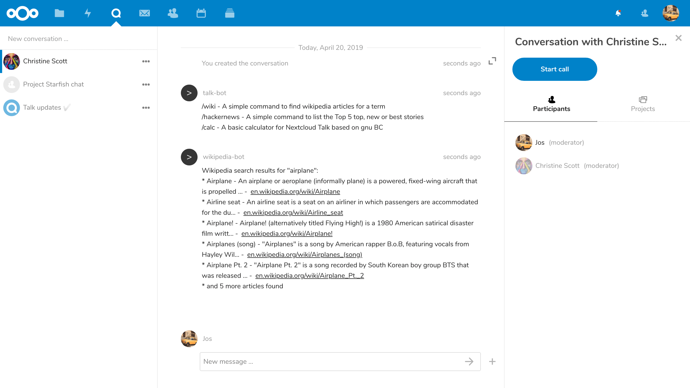

Advanced Talk features
======================

Nextcloud Talk has a number of advanced features users might find useful.

Matterbridge
------------

Matterbridge integration in Nextcloud Talk makes it possible to create 'bridges' between Talk conversations and conversations on other chat services like MS Teams, Discord, Matrix and others. You can find a list of supported protocols `on the Matterbridge github page. <https://github.com/42wim/matterbridge#features>`_

A moderator can add a Matterbridge connection in the chat conversation settings.

.. image:: images/matterbridge-settings.png

Each of the bridges has its own need in terms of configuration. Information for most is available on the Matterbridge wiki and can be accessed behind ``more information`` menu in the ``...`` menu. You can also `access the wiki directly. <https://github.com/42wim/matterbridge/wiki>`_

Lobby
-----

The lobby feature allows you to show guests a waiting screen until the call starts. This is ideal for webinars with external participants, for example.

.. image:: images/lobby-in-talk.png

You can choose to let the participants join the call at a specific time, or when you dismiss the lobby manually.

Commands
--------

Nextcloud allows users to execute actions using commands. A command typically looks like:

    ``/wiki airplanes``

Administrators can configure, enable and disable commands. Users can use the ``help`` command to find out what commands are available.

    ``/help``

Find more information in the `administrative documentation for Talk. <https://nextcloud-talk.readthedocs.io/en/stable/commands/>`_

Talk from Files
---------------

In the Files app, you can chat about files in the sidebar, and even have a call while editing it. You first have to join the chat.

.. image:: images/join-chat.png

.. image:: images/sidebar-chat.png

You can then chat or have a call with other participants, even when you start editing the file.

.. image:: images/text-and-talk.png

In Talk, a conversation will be created for the file. You can chat from there, or go back to the file using the ``...`` menu in the top-right.

.. image:: images/file-room.png

Create tasks from chat or share tasks in chat
---------------------------------------------

If Deck is installed, you can use the ``...`` menu of a chat message and turn the message into a Deck task.

.. image:: images/deck-talk-create-card-menu.png

From within Deck, you can share tasks into chat conversations.

.. image:: images/deck-talk-share-card-to-chat-menu.png

Breakout rooms
--------------
Breakout rooms allow you to divide a Nextcloud Talk call into smaller groups for more focused discussions. The moderator
of the call can create multiple breakout rooms and assign participants to each room.

Configure breakout rooms
^^^^^^^^^^^^^^^^^^^^^^^^

To create breakout rooms, you need to be a moderator in a group conversation. Click on the top-bar menu and click on
"Setup breakout rooms".

.. image:: images/talk-breakout-rooms-setup.png

A dialog will open where you can specify the number of rooms you want to create and the participants assignment method.
Here you'll be presented with 3 options:

- **Automatically assign participants**: Talk will automatically assign participants to the rooms.
- **Manually assign participants**: You'll go through a participants editor where you can assign participants to rooms.
- **Allow participants choose**: Participants will be able to join breakout rooms themselves.

.. image:: images/talk-breakout-rooms-setup-dialog.png

Manage breakout rooms
^^^^^^^^^^^^^^^^^^^^^

Once the breakout rooms are created, you will be able to see them in the sidebar.

.. image:: images/talk-breakout-rooms-sidebar.png

From the sidebar header

- **Start and stop the breakout rooms**: this will move all the users in the parent conversation to their respective breakout rooms.
- **Broadcast a message to all the rooms**: this will send a message to all the rooms at the same time.
- **Make changes to the assigned participants**: this will open the participants editor where you can change which participants are assigned to which breakout room. From this dialog it's also possible to delete the breakout rooms.

.. image:: images/talk-breakout-rooms-sidebar-header.png

From the breakout room element in the sidebar, you can also join a particular breakout room or send a message to a
specific room.

.. image:: images/talk-breakout-rooms-sidebar-item.png

Call recording
--------------
The recording feature provides users with an opportunity to:

- Start and stop recordings during a call.
- Record the video and audio stream of the speaker, as well as screen share.
- Access, share and download recorded files for future reference or distribution.

Enabling this feature requires the recording server to be set up by the system administration.

Manage a recording
^^^^^^^^^^^^^^^^^^

The moderator of the conversation can start a recording together with a call start or anytime during a call:

- **Before the call**: tick the checkbox "Start recording immediately with the call" in "Media settings", then click on "Start call".
- **During the call**: click on the top-bar menu, then click "Start recording".

.. image:: images/start-recording-before-call.png
.. image:: images/start-recording-in-call.png

The recording will start shortly, and you will see a red indicator next to the call time. You can stop the recording at any time while the call is still ongoing by clicking on that indicator and selecting "Stop recording", or by using the same action in the top-bar menu. If you do not manually stop the recording, it will end automatically when the call ends.

After stopping a recording, the server will take some time to prepare and save the recorded file. The moderator, who started the recording, receives a notification when the file is uploaded. From there, it can be shared in the chat.

.. image:: images/share-recording-notification.png
.. image:: images/shared-recordings.png

Recording consent
^^^^^^^^^^^^^^^^^

For compliance reasons with various privacy rights, it is possible to ask participants for consent to be recorded before joining the call. The system administration has the flexibility to utilize this feature in several ways:

- Disable consent completely.
- Enable mandatory consent system-wide, requiring consent for all conversations.
- Allow moderators to configure this option on a conversation level. In such cases, moderators can access the conversation settings to configure this option accordingly:

.. image:: images/enable-recording-consent.png

If recording consent is enabled, every participant, including moderators, will see a highlighted section in the "Media settings" before joining a call.
This section informs participants that the call may be recorded. To give explicit consent for recording, participants must check the box. If they do not give consent, they will not be allowed to join the call.

.. image:: images/give-recording-consent.png

