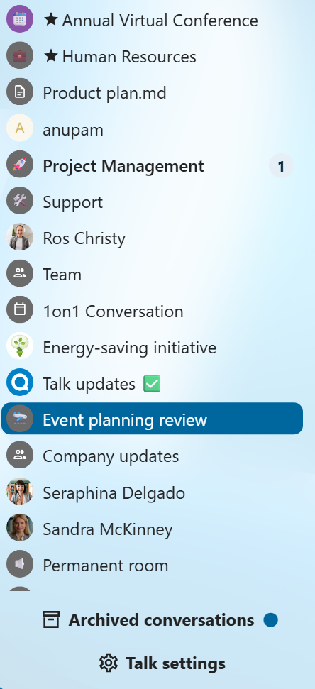

==========
Appearance
==========

Compact view of conversations list
----------------------------------

Compact view allows to hide last message preview in the conversation list, providing a more focused interface.

Chat messages
-------------

Chat appearance settings allow you to customize the look of your conversation chats.
You can choose between classic list or message bubbles, with your own messages on the side.

You can change both settings from the ``Talk settings`` dialog  in ``Appearance`` section.

.. image:: images/talk-appearance-settings.png
   :width: 600px