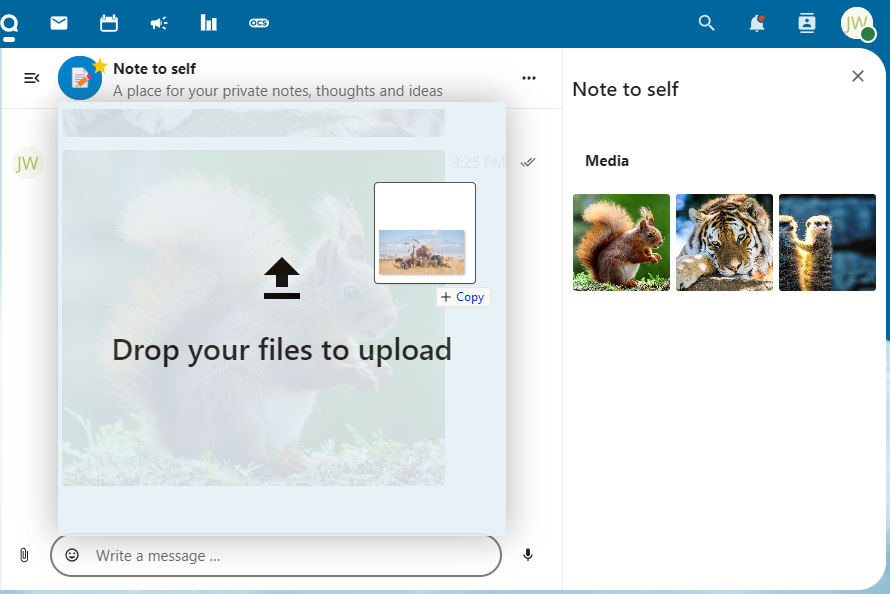
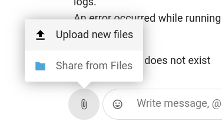
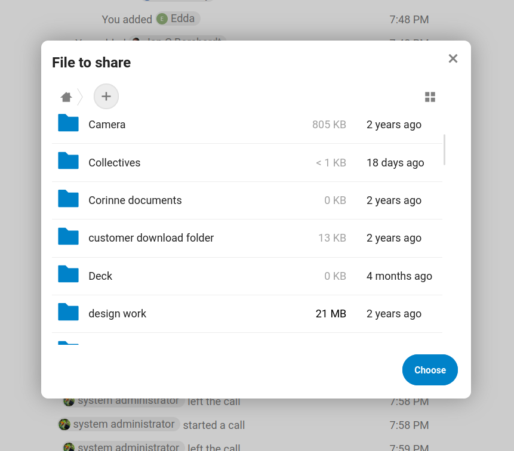
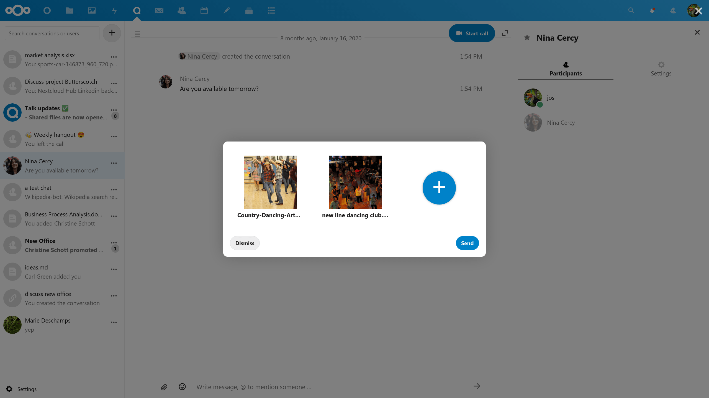
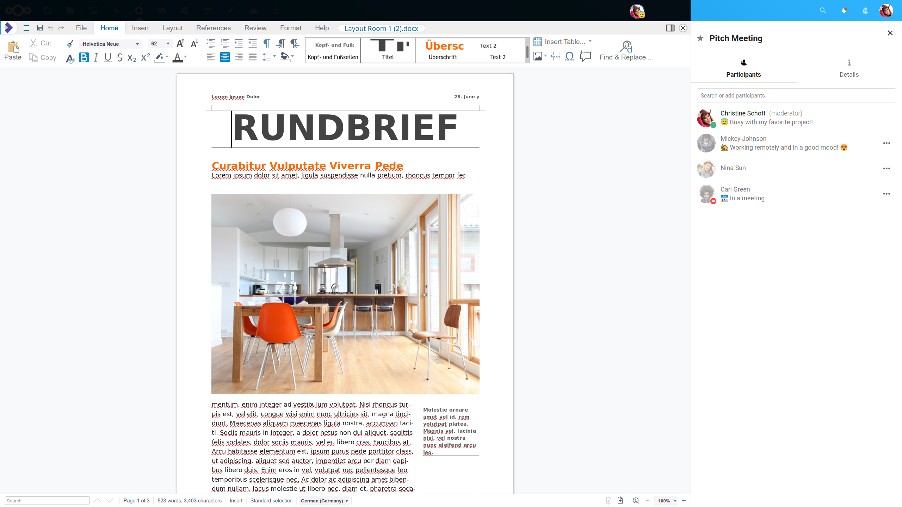
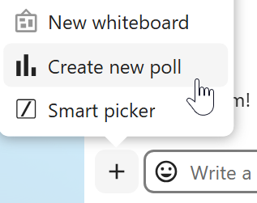
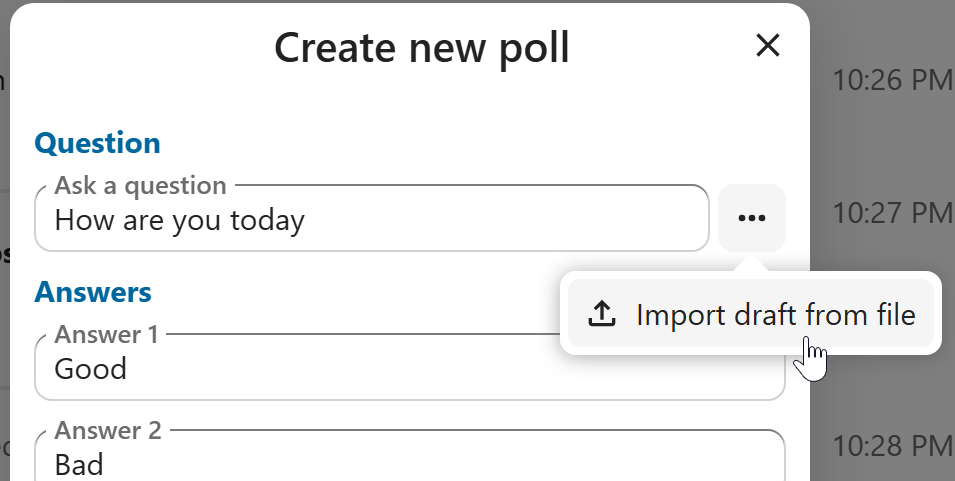
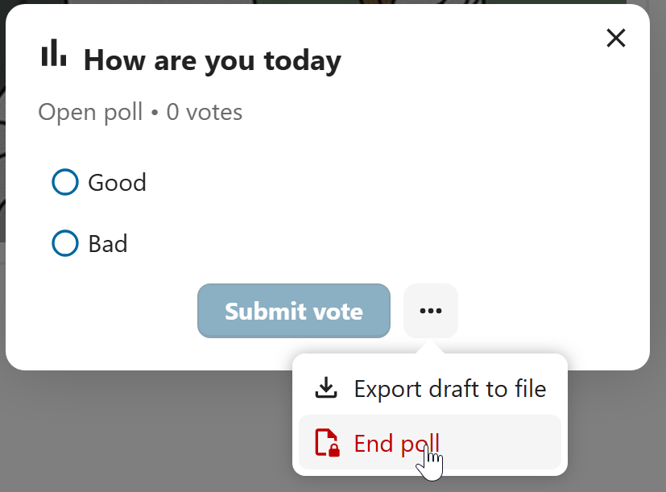
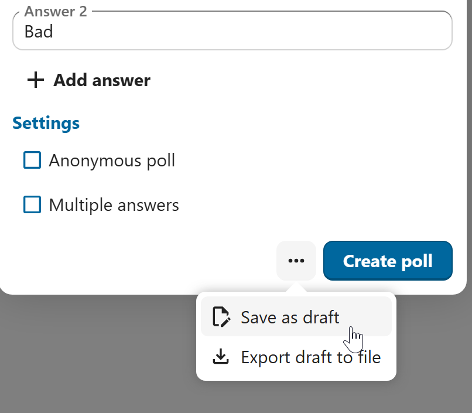
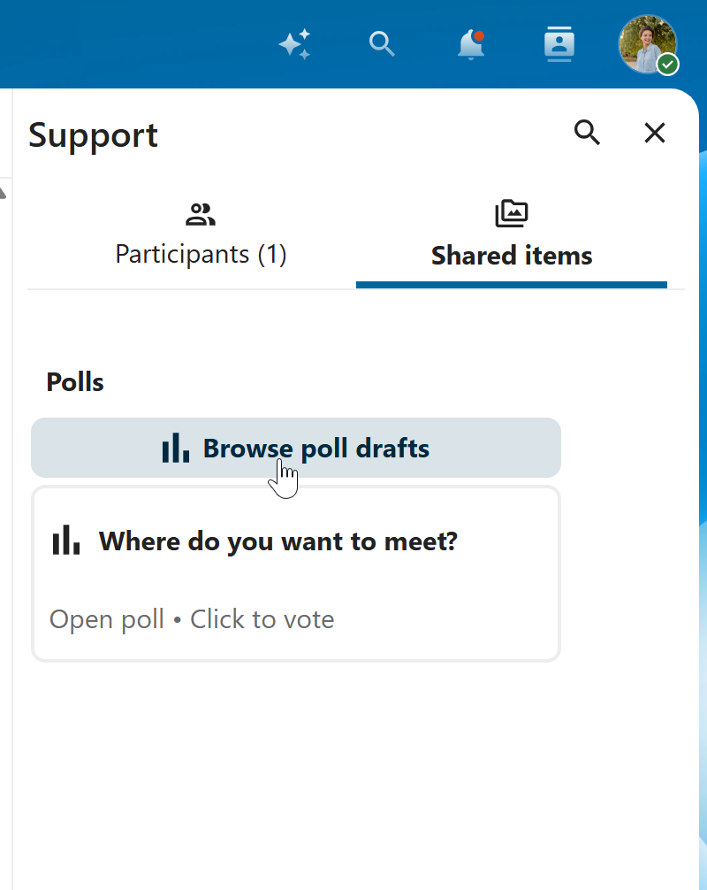

===========
Attachments
===========

Sharing files in a chat
-----------------------

You can share files in a chat in three ways.

First, you can simply drag'n'drop them on the chat.

Second, you can select a file from your Nextcloud Files or a file manager by choosing the little paperclip and selecting where you'd like to pick the file from.

You can add more files until you are done and decide to share the files. You can also add a text caption to your shared files, providing a brief description or context.

All users will be able to click the files to view, edit or download them, regardless of whether they have a Nextcloud account. Users with an account will have the file automatically shared with them while external guest users will get them shared as a public link.

Polls in chat
-------------

You can create a poll in groups chats from the new message additional actions.

A poll has two settings:

- **Anonymous polls**: Participants cannot see who voted for which option.
- **Allow multiple choices**: Participants can select more than one option.

You can also import polls for auto-fill and export polls as JSON files to save them locally.

You can close a poll from the poll dialog.

As a moderator, you can create the poll directly or you can save it as a draft to edit it later.

You can find poll drafts in ``Shared items`` tab or next to the poll title input field.

