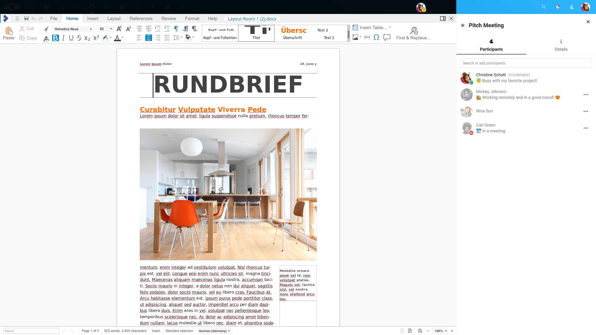

===========
Attachments
===========

Sharing files in a chat
-----------------------

You can share files in a chat in 3 ways.

First, you can simply drag'n'drop them on the chat.

.. image:: images/drag-and-drop.png
   :width: 600px

Second, you can select a file from your Nextcloud Files or a file manager by choosing the little paperclip and selecting where you'd like to pick the file from.

.. image:: images/share-files-in-chat.png
   :width: 500px

.. image:: images/share-files-in-chat-selection.png
    :width: 600px

You can add more files until you are done and decide to share the files. You can also add a text caption to your shared files, providing a brief description or context.

.. image:: images/talk-upload-files.png
   :width: 500px

All users will be able to click the files to view, edit or download them, irrespective of them having a user account. Users with an account will have the file automatically shared with them while external guest users will get them shared as a public link.

.. FIXME Add polls, voice messages?, shared items view