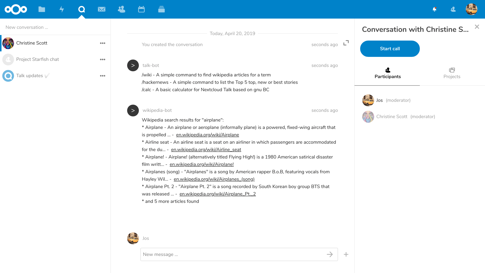

Bots and commands
=================

Bots
----

Bots can respond to chat messages, provide automated replies, and integrate with external services. Your administrator
can enable bots for your Talk instance.

Some examples of available bots:

- **Call summary** — Posts an overview message after a call ends, listing all participants and outlining any tasks that
  were mentioned.
- **Agenda bot** — Helps manage meeting agendas with time monitoring and permission-based access control.
- **Roll a dice** — Type ``/roll`` in a conversation to roll dice.

A full list of available bots and installation instructions can be found in the `Talk administration documentation <https://nextcloud-talk.readthedocs.io/en/latest/bot-list/>`_.

Commands
--------

.. warning::
   Commands have been removed in favor of Bots.

Nextcloud allows users to execute actions using commands. A command typically looks like:

    ``/wiki airplanes``

Administrators can configure, enable and disable commands. Users can use the ``help`` command to find out what commands are available.

    ``/help``

