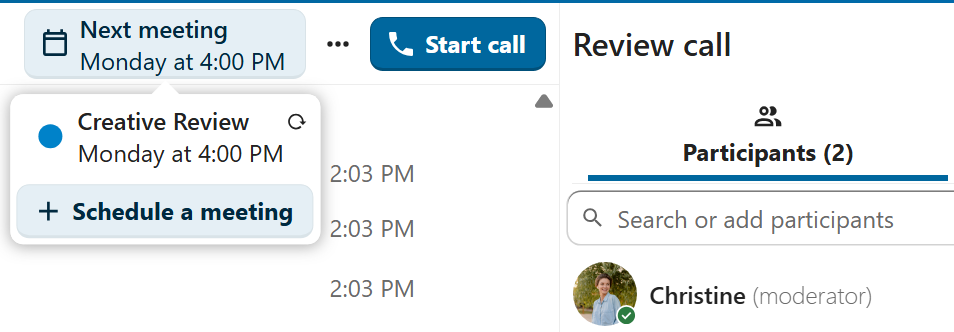

Calendar integration with Talk
==============================

Meetings and events
--------------------

If calendar events have a Talk conversation set as event location, you will see an information about upcoming events inside of this conversation.
That way you can stay informed about scheduled meetings or activities directly within your chat.
If Calendar app is enabled, you can click on an event to view details.

It is possible to schedule a meeting directly from a conversation. In the dialog, you can set meeting details such as title, date, time and description.
You can also choose to invite all participants including email guests, or select specific ones.

Schedule from Calendar
^^^^^^^^^^^^^^^^^^^^^^

When creating a new event in Calendar, you can set a Talk conversation as event location. This will create a new conversation if one does not exist yet.

When the event is created, you will see a link to the conversation in the event details. Conversation will also show up in the list of conversations (discoverable by ``Events`` filter).

Like instant meetings, event conversations will be automatically deleted after configured period of inactivity (by default 28 days).