================
Joining a call
================

Starting or joining a call
---------------------------

Browser and Talk Desktop client
~~~~~~~~~~~~~~~~~~~~~~~~~~~~~~~~

When you are part of a conversation and have permission to do so, you can start a call at any time by clicking ``Start
call`` in the top bar.
When a call is already in progress, join it by clicking the green ``Join call`` button in the chat area or the top bar.

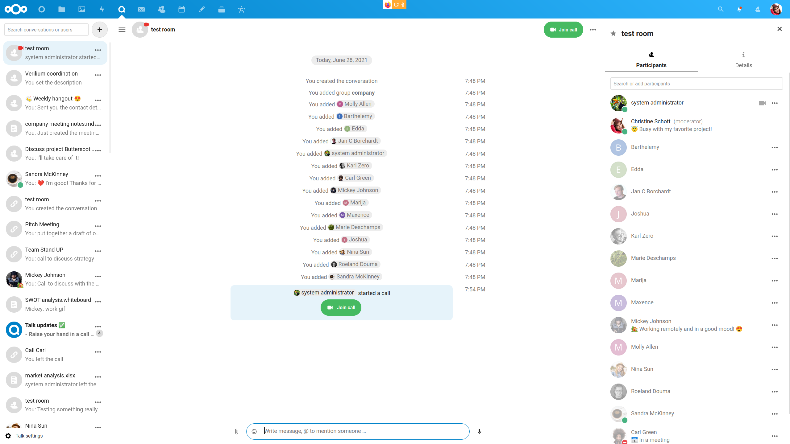

.. note:: If you have not yet given permission to the browser or the Talk Desktop client to use your microphone and camera,
    you will be prompted to do so when you click ``Start call`` or ``Join call``.
    Choose the microphone and camera you would like to use and click ``Allow`` to grant access to your devices.

You will see ``Media settings``, where you can customise your call experience:

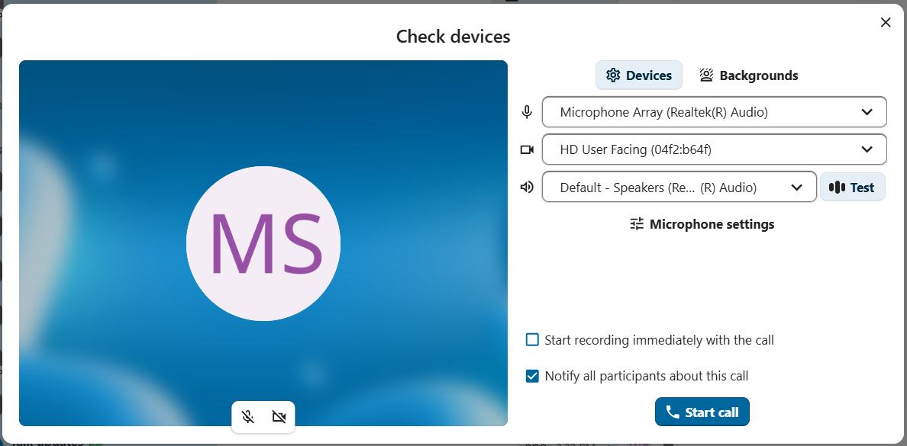

Controlling audio and video
^^^^^^^^^^^^^^^^^^^^^^^^^^^

Use the microphone and camera icons at the bottom of the video preview to mute or unmute your microphone and enable or
disable your camera before joining.

.. note:: If one or both of your icons are greyed out, you either do not have a microphone or camera installed, or you did not give permission to the browser or Talk Desktop
    client to use your microphone or camera. Check that you have granted permission to the browser or Talk Desktop client, and make sure your microphone and camera are not
    in use by another application.

Device settings allow you to choose which microphone and camera you want to use. This is useful if you have more than
one microphone or camera available:

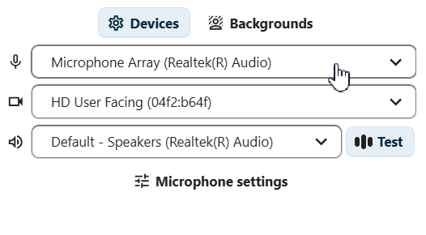

Backgrounds
^^^^^^^^^^^

Backgrounds let you replace your video background with one of the predefined images.
You can also upload your own image or choose one already in Nextcloud Files.
Alternatively, choose the ``blur`` option to blur your live video background.

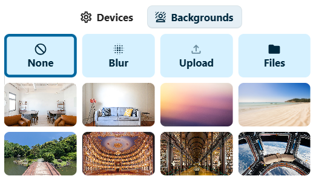

Immediately join a call
^^^^^^^^^^^^^^^^^^^^^^^

If you wish to skip ``Media settings`` in the future, toggle the ``Skip device preview before joining a call`` switch in
app settings.
For future calls in this conversation, you will join directly, skipping the preview dialog.

Record a call
^^^^^^^^^^^^^

If you started the call and wish to record it, check the ``Start recording immediately with the call`` checkbox.
The call recording option might not be available to you, depending on whether your system administrators have enabled
this option
and whether you have ``Moderator`` permission for the conversation.
If you are joining and the call is being recorded, you might be required to consent before being allowed to join.
For more information, see :ref:`Call recording <call-recording>`.

Start the call
^^^^^^^^^^^^^^

Click the ``Start call`` button at the bottom of ``Media settings`` to notify all conversation participants of the call.
If you do not want to notify the other participants, start a silent call by opening the three-dot menu to the left of
the ``Start call`` button
and choosing ``Call without notification``.

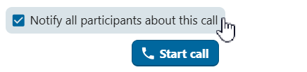

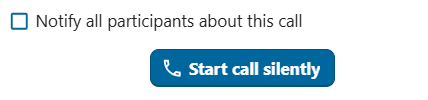

.. note:: Other participants can modify notifications on a per-conversation level, including whether they want to receive call notifications.

Your user status will be set to ``In a call`` and your user status icon will display the speech bubble emoji.

Mobile clients
~~~~~~~~~~~~~~

When you are part of a conversation and have permission to do so, you can start a call at any time by
tapping the ``Phone`` or ``Video`` icon in the top bar.
The ``Phone`` icon starts a voice-only call; the ``Video`` icon starts a video call.

A voice call uses the device microphone and earpiece, like a regular phone call.
A video call uses the loudspeaker in hands-free mode and enables your front-facing camera by default; you can disable it
at any time.

If someone else starts a call, you may receive a notification and your device may ring or vibrate,
depending on your notification settings.
Tap ``Phone`` or ``Video`` to join, or tap the red button to decline. Declining dismisses the call notification on that
device.

You can control your microphone and camera (if in a video call) with the options shown at the bottom of the screen.

Your user status will be set to ``In a call`` and your user status icon will display a speech bubble.

During a call
--------------

After you join a call, you will see the call view. It shows the video feeds of all participants currently in the call,
with additional information and controls.

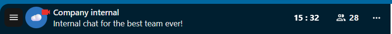

The leftmost element shows the elapsed call time.

Next to it, you will see the number of participants that have joined the current call.
Clicking the number opens the right sidebar and shows the list of participants.
Participants that have joined the call will be listed first.

You will also see each participant's talking time if they have spoken during the call:

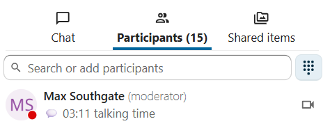

You can access additional call options and settings from the three-dot menu in the top bar.

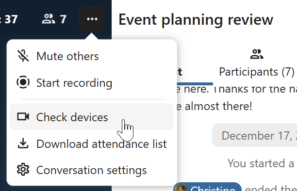

Set up breakout rooms
~~~~~~~~~~~~~~~~~~~~~

Breakout rooms allow you to divide a call into smaller groups for more focused discussions.
Depending on your permissions and how your instance is configured, this option may not be available to you.
For more information, see :ref:`Breakout rooms <breakout-rooms>`.

Download call participants list
~~~~~~~~~~~~~~~~~~~~~~~~~~~~~~~

You can download the list of participants in a call from the three-dot menu in the top bar. This downloads a CSV file
with the names and email addresses of all participants.

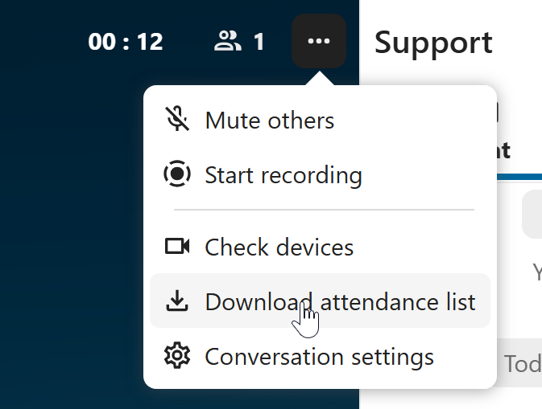

The CSV file contains the following columns:

- **Name**: The name of the participant.
- **Email**: The email address of the participant.
- **Type**: Indicates whether the participant is a registered user or a guest.
- **Identifier**: Unique identifier for the participant.

Controlling audio and video
~~~~~~~~~~~~~~~~~~~~~~~~~~~

Bottom bar of the call view offers media controls, layout settings and other features you can use during a call.

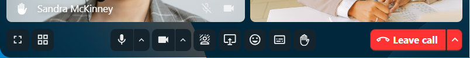

Use the microphone and camera icons to mute/unmute your microphone and enable/disable your camera.
You can also use the keyboard shortcuts ``M`` to mute/unmute your microphone and ``V`` to enable/disable your camera.
Use the space bar to push-to-talk: when you are muted, pressing space will unmute you until you let go; when you are
unmuted, pressing space will mute you until you let go.

Reactions
~~~~~~~~~

The reactions button lets you send an emoji reaction to all participants in the call.

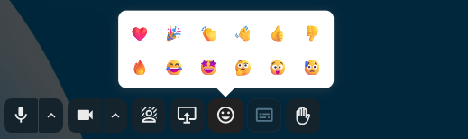

Every participant will see the emoji rising from the bottom of their call screen. The emoji disappears after two
seconds.

Raise hand
^^^^^^^^^^

Clicking ``Raise hand`` will notify moderators and show an icon next to your name. This is also available via the
keyboard shortcut ``R``.

Full screen
^^^^^^^^^^^

Resizes your browser window or the Talk Desktop client to full-screen mode.
Also available via the keyboard shortcut ``F``. Press ``ESC`` to return to the regular view.
