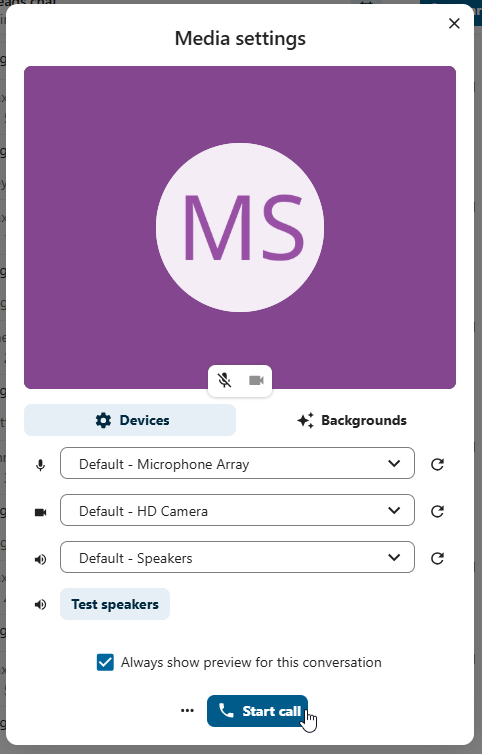
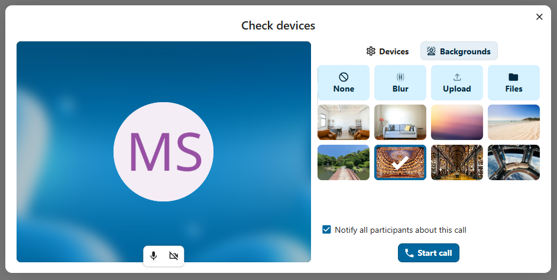
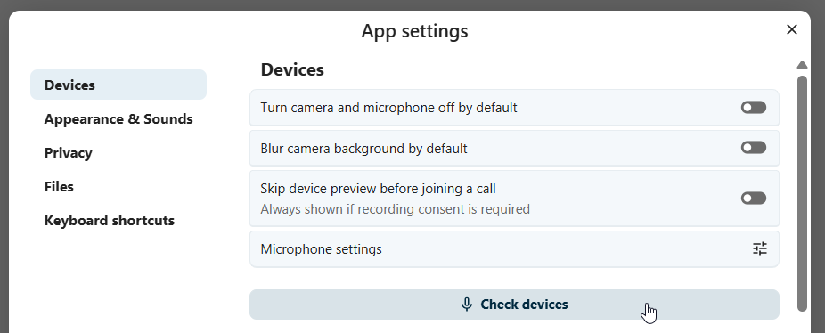

================
Joining a call
================

When you're in a conversation, you can start a call any time with the ``Start call`` button. Other participants will get notified and can join the call.

If somebody else has started a call already, the button will change in a green ``Join call`` button.

.. image:: images/join-call.png
    :width: 600px

During a call, you can mute your microphone and disable your video with the buttons on the right side of the top bar, or using the shortcuts ``M`` to mute audio and ``V`` to disable video. You can also use the space bar to toggle mute. When you are muted, pressing space will unmute you so you can speak until you let go of the space bar. If you are unmuted, pressing space will mute you until you let go.

You can hide your video (useful during a screen share) with the little arrow just above the video stream. Bring it back with the little arrow again.

You can access your settings and choose a different webcam, microphone and other settings in the ``...`` menu in the top bar.

.. image:: images/media-settings.png
    :width: 300px

From the media settings dialog, you can also change the background of your video.

All these settings are also available as direct actions in the bottom bar.

You can change other settings in the ``Talk settings`` dialog.

Download call participants list
--------------------------------

You can download the list of participants in a call from the ``...`` menu in the top bar. This will download a CSV file with the names and email addresses of all participants in the call.

.. image:: images/download-participants-list.png
   :width: 400px

The table in the CSV file contains the following columns:

- **Name**: The name of the participant.
- **Email**: The email address of the participant.
- **Type**: Indicates whether the participant is a registered user or a guest.
- **Identifier**: Unique identifier for the participant.

