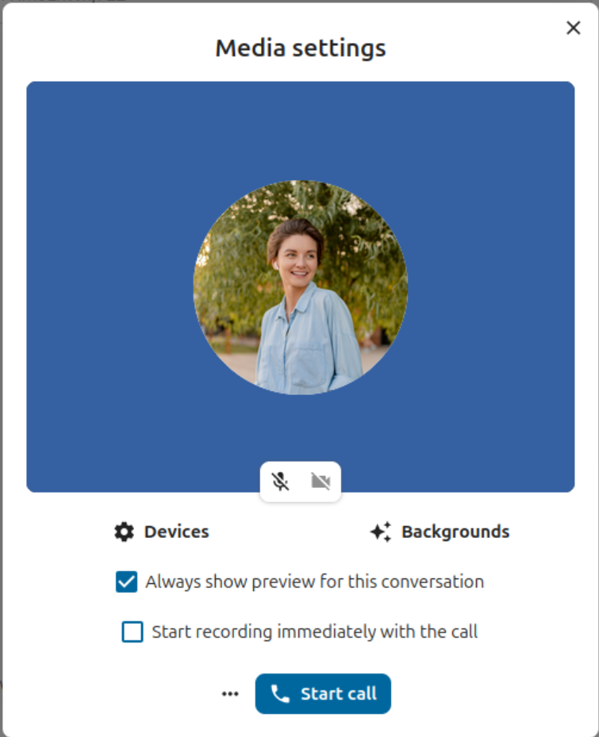
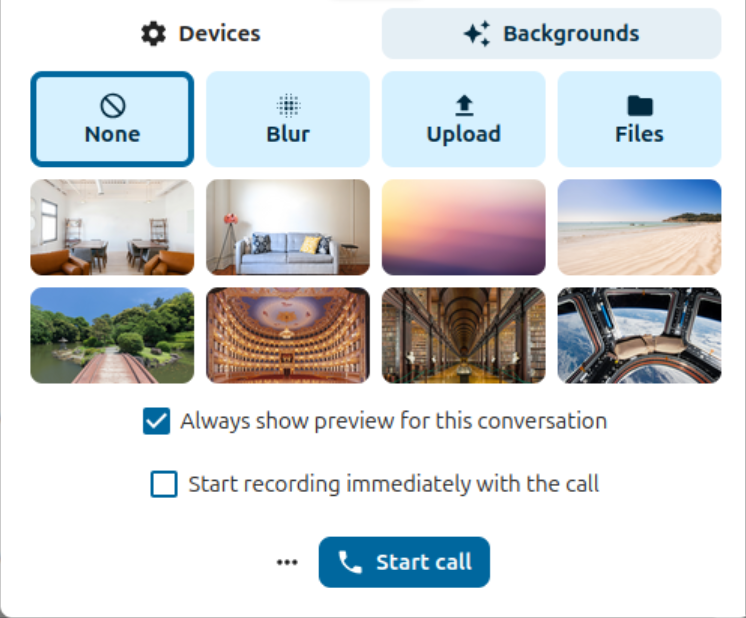
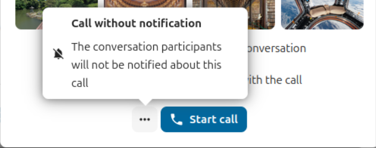
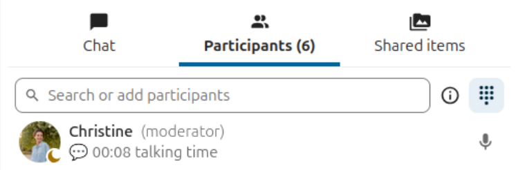
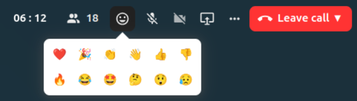

====
Call
====

Starting or joining a call
--------------------------

Browser and Talk Desktop client
~~~~~~~~~~~~~~~~~~~~~~~~~~~~~~~

When you are part of a conversation and have permission to do so, you can start a call at any time by clicking on the ``Start call`` button in the top bar.
When a call is ongoing, you can join it by clicking on the green ``Join call`` button in the chat or in the top bar.

.. image:: images/join-call.png
    :width: 600px

.. note:: If you have not yet given permission to the browser or the Talk Desktop client to use your microphone and camera,
    you will be prompted to do so when clicking the ``Start call`` or ``Join call`` button.
    Please choose the microphone and camera you would like to use and click on ``Allow`` to grant the browser or Talk Desktop client access to your devices.

You will see the ``Media settings`` which allow you to customize your call experience:



Controlling audio and video
^^^^^^^^^^^^^^^^^^^^^^^^^^^

You can mute or un- mute your microphone and enable or disable your video camera by clicking on the respective icons on the bottom of the video preview.
This will allow you to join a call with a muted or un- muted microphone, and to join a call with an enabled or disabled camera.

.. note:: If one or both of your icons are greyed out, you either do not have a microphone or camera installed, or you did not give permission to the browser or Talk Desktop
    client to use your microphone or camera. Please re- check if you have granted permission to the browser / Desktop client and make sure your microphone and camera are not
    used by another program.

Device settings allow you to choose which microphone and camera you want to use. This is useful if you have more than one microphone or camera available to you:


Backgrounds
^^^^^^^^^^^

Backgrounds allow you to set virtual background images which will replace your video background with one of the predefined images.
You can also upload your own image or choose one that was uploaded to Nextcloud Files.
You can also choose the "blur" option which will blur your live video background instead.



Immediately join a call
^^^^^^^^^^^^^^^^^^^^^^^

If you wish to skip the ``Media settings`` in the future, you can uncheck the ``Always show preview for this conversation`` checkbox.
For future calls in this conversation, you will start or join a call directly and skip the dialogue.


Record a call
^^^^^^^^^^^^^
If you started the call and wish to record the call, you can check the checkbox for ``Start recording immediately with the call``.
The call recording option might not be available to you, depending on whether your system administrators have enabled this option,
and whether you have ``Moderator`` permission for the conversation.
If you are joining the call and the call is being recorded, you might be required to consent to the recording before being allowed to join.
For more information on call recordings, please check :ref:`call recording<call-recording>`

Start the call
^^^^^^^^^^^^^^

Now you can click the ``Start call`` button at the bottom of the ``Media Settings``, which will then notify all conversation participant of the call.
If you do not want to notify the other participants, you can start a silent call by opening the three- dot menu to the left of the ``Start call`` button
and clicking on ``Call without notification``.




.. note:: Other participants can modify notifications on a per- conversation level, including if they want to receive call notifications.

Your user status will be set to ``In a call`` and your user status icon will display the ``speech bubble`` emoji.

Mobile clients
~~~~~~~~~~~~~~

When you are part of a conversation and have permission to do so, you can start a call at any time by
clicking on the ``Phone`` or ``Video`` icon in the top bar.
The ``Phone`` button will immediately start a voice call, and the ``Video`` icon will immediately start a video call.

For a ``Phone`` call, the Talk client will behave like a regular phone call, using the phone microphone and phone speaker.
For a ``Video```call, your microphone is in hands- free mode and uses the loudspeaker. Your front- facing camera will be enabled by default, but can be disabled.

If someone else started a call, you might see a call notification and your mobile device might ring or vibrate.
This depends on your mobile device settings.
You can join with the ``Phone`` or ``Video`` option or decline the call by clicking the red button. Declining the call on your mobile device
will mute the call notification.

You can control your microphone and camera (if in a video call) with the options shown at the bottom of the screen.

Your user status will be set to ``In a call`` and your user status icon will display a speech bubble.

During a call - Browser and Talk Desktop client
-----------------------------------------------

After you joined a call, you will see the call view.

The top right corner of the call screen offers information, options and features you can make use of during a call.


Elapsed call time and number of participants
~~~~~~~~~~~~~~~~~~~~~~~~~~~~~~~~~~~~~~~~~~~~

The left- most position shows you the elapsed call time.

Next to it, you will see the number of participants that have joined the current call.
Clicking on the number will open the right sidebar and and show you the list of participants.
Participants that have joined the call will be listed first.

You will also see each participants talking time if they have spoken during the call:



Reactions
~~~~~~~~~
The third option, reactions, lets you send one of the shown emojis to all participants in the call.



Every participant will see the emoji rising up from the bottom of their call screen. The emoji will disappear after two seconds.

Screen sharing
~~~~~~~~~~~~~~

You can click the monitor icon to share your screen.

.. note:: If you have not yet given permission to the browser or the Talk Desktop client to share your screen,
    you might be prompted to do so when clicking the ``Share screen`` button.
    Please click on ``Allow`` to grant the browser or Talk Desktop client access to your screen.

Depending on your browser or if you use the Talk Desktop client, you will get the option to share a monitor, an application window or a single browser tab.
If video from your camera is also available, other participants will see it in a small presenter view next to the screen share.

.. image:: images/share-screen-with-camera.png
    :width: 700px

To stop sharing your screen, click on the ``Share screen`` button again and choose ``Stop screensharing``.

Controlling audio and video
~~~~~~~~~~~~~~~~~~~~~~~~~~~

You can mute and un- mute your microphone and enable and disable your camera with the video and microphone icons.
You can also use the keyboard shortcuts ``M`` to mute and un- mute your microphone and ``V`` to enable and disable your camera.
You can also use the space bar to toggle mute. When you are muted, pressing space will unmute you so you can speak until you let go of the space bar.
If you are unmuted, pressing space will mute you until you let go.

Three-dot menu options
~~~~~~~~~~~~~~~~~~~~~~
You can access different call options and settings from the three-dot menu in the top bar.

.. image:: images/media-settings.png
    :width: 300px

Raising your hand
^^^^^^^^^^^^^^^^^

Clicking the button will notify moderators that you have done so, and will also show an icon next to your name. This option is also available via the keyboard shorcut ``R``.

Media settings
^^^^^^^^^^^^^^

This option will display the same media settings which were displayed to you at the start of the call if you did not enable the
``Always show preview for this conversation`` option.

Here, you can change your microphone and camera settings as well as set background images, and enable or disable ``Always show preview for this conversation``.

Please read the section "Starting a call -  Browser and Talk Desktop client" to find a more comprehensive description of the options offered.

Grid view / Speaker view
^^^^^^^^^^^^^^^^^^^^^^^^

You can switch the view in a call with the little four-block icon. You can switch between between speaker view and grid view.
The grid view will show everyone as a tile. If the amount of participants do not fit on the screen,
buttons will appear on the left and right that let you go to the next grid of participants.

.. image:: images/talk-grid-view.png
    :width: 700px

The promoted view centres the speakers tile in a large format and places the other participants in a row below.
If the people do not fit on the screen, buttons will appear on the left and right that let you navigate to the next row of participants.

.. image:: images/talk-promoted-view.png
    :width: 700px

Full screen
^^^^^^^^^^^

The full screen option will resize your browser window or the Talk Desktop client to "Full Screen" mode.
This option is also available via the keyboard shortcut ``F``. To return to the regular view, use the ``ESC`` key.

Set up breakout rooms
^^^^^^^^^^^^^^^^^^^^^

Breakout rooms allow you to divide a Nextcloud Talk call into smaller groups for more focused discussions. The moderator
of the call can create multiple breakout rooms and assign participants to each room.
Depending on your permissions and how your system administrators have configured your instance, this option may not be available to you.
For more information on breakout rooms, please check out :ref:`breakout rooms<breakout-rooms>`


