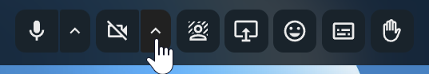
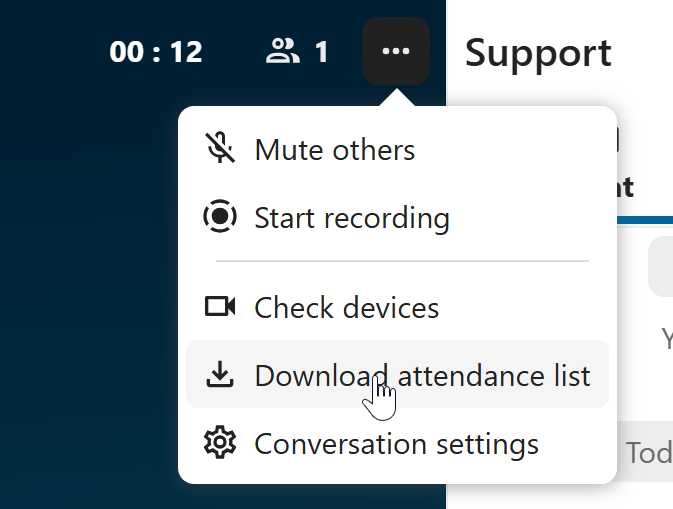

====
Call
====

Starting a call
---------------

When you're in a conversation, you can start a call any time with the ``Start call`` button. Other participants will get notified and can join the call.

.. image:: images/device-settings-before-call.png
    :width: 600px

If somebody else has started a call already, the button will change in a green ``Join call`` button.

.. image:: images/join-call.png
    :width: 600px

During a call, you can mute your microphone and disable your video with the buttons on the right side of the top bar, or using the shortcuts ``M`` to mute audio and ``V`` to disable video. You can also use the space bar to toggle mute. When you are muted, pressing space will unmute you so you can speak until you let go of the space bar. If you are unmuted, pressing space will mute you until you let go.

You can hide your video (useful during a screen share) with the little arrow just above the video stream. Bring it back with the little arrow again.

You can access your settings and choose a different webcam, microphone and other settings in the ``...`` menu in the top bar.

.. image:: images/media-settings.png
    :width: 300px

From media settings dialog, you can also change the background of your video.

.. image:: images/background-settings-in-call.png
    :width: 500px

All these settings are also available as direct actions in the bottom bar.

You can change other settings in the ``Talk settings`` dialog.

.. image:: images/talk-settings.png
    :width: 600px

Starting a screen share
-----------------------

You can click the monitor icon on your video stream to share your screen. Depending on your browser, you will get the option to share a monitor, an application window or a single browser tab.
If video from your camera is also available, other participants will see it in a small presenter view next to the screen share.

.. image:: images/share-screen-with-camera.png
    :width: 700px

You can zoom in and out of the shared screen with mouse wheel, double click or touchpad gestures.

Changing view in a call
-----------------------

You can switch the view in a call in the bottom bar between promoted view and grid view. 

.. image:: images/call-view-toggle-button.png
    :width: 300px

The grid view will show as many people as the screen can fit, allowing navigation with buttons on the left and right.

.. image:: images/talk-grid-view.png
    :width: 700px

The promoted view shows the speaker large and others in a row below. If the people do not fit on the screen, buttons will appear on the left and right that let you navigate.

.. image:: images/talk-promoted-view.png
    :width: 700px

Download call participants list
-------------------------------

You can download the list of participants in a call from the ``...`` menu in the top bar. This will download a CSV file with the names and email addresses of all participants in the call.

The table in the CSV file contains the following columns:

- **Name**: The name of the participant.
- **Email**: The email address of the participant.
- **Type**: Indicates whether the participant is a registered user or a guest.
- **Identifier**: Unique identifier for the participant.

Call live transcription
-----------------------

Call live transcription allows to transcribe the speech in real-time during a call. It is set up by the system administration (High-performance backend and `Live Transcription App <https://apps.nextcloud.com/apps/live_transcription>`_ are required).
Moderators need to set the language of the transcription in the conversation settings. All participants then can enable or disable the transcription for themselves in the call bottom bar.
When enabled, the transcription will appear in the bottom and will be updated in real-time.

With `live_transcription` provider app enabled, you can also use live translation. Instead of receiving the transcription in the original message, it will be translated to the language of your choice.

.. image:: images/call-translation-actions.png
   :width: 400px

