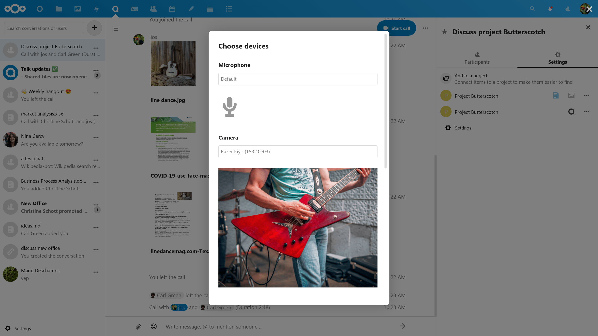

====
Call
====

Starting a call
---------------

When you're in a conversation, you can start a call any time with the ``Start call`` button. Other participants will get notified and can join the call.

.. image:: images/device-settings-before-call.png
    :width: 400px

If somebody else has started a call already, the button will change in a green ``Join call`` button.

.. image:: images/join-call.png
    :width: 600px

During a call, you can mute your microphone and disable your video with the buttons on the right side of the top bar, or using the shortcuts ``M`` to mute audio and ``V`` to disable video. You can also use the space bar to toggle mute. When you are muted, pressing space will unmute you so you can speak until you let go of the space bar. If you are unmuted, pressing space will mute you until you let go.

You can hide your video (useful during a screen share) with the little arrow just above the video stream. Bring it back with the little arrow again.

You can access your settings and choose a different webcam, microphone and other settings in the ``...`` menu in the top bar.

.. image:: images/media-settings.png
    :width: 300px

From media settings dialog, you can also change the background of your video.

.. image:: images/background-settings-in-call.png
    :width: 400px

You can change other settings in the ``Talk settings`` dialog.

Starting a screen share
-----------------------

You can click the monitor icon on your video stream to share your screen. Depending on your browser, you will get the option to share a monitor, an application window or a single browser tab.
If video from your camera is also available, other participants will see it in a small presenter view next to the screen share.

.. image:: images/share-screen-with-camera.png
    :width: 700px

Changing view in a call
-----------------------

You can switch the view in a call with the little four-block icon in the top-right between promoted-view and grid view. The grid view will show everyone equally big and if the people do not fit on the screen, buttons will appear on the left and right that let you navigate.

.. image:: images/talk-grid-view.png
    :width: 700px

The promoted view shows the speaker large and others in a row below. If the people do not fit on the screen, buttons will appear on the left and right that let you navigate.

