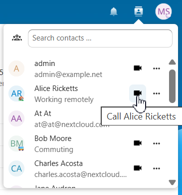
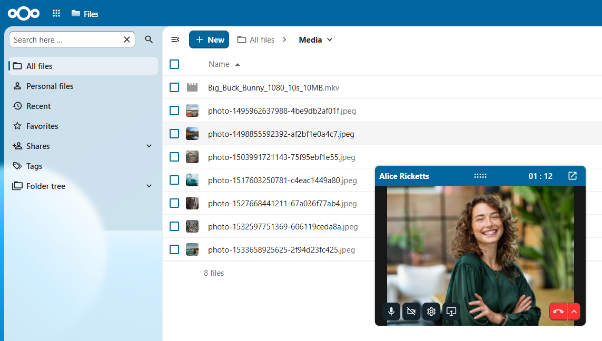

.. SPDX-FileCopyrightText: 2026 Nextcloud GmbH and Nextcloud contributors
.. SPDX-License-Identifier: CC-BY-4.0

===================
Call from anywhere
===================

Start a call with any user directly from the avatar menu.
No need to navigate to a conversation first; call while working on files, tasks, or other activities!

Accessing the call menu
-----------------------

1. Click on a user's avatar from any app in your Nextcloud workspace to open a menu
2. Select ``Call {user}``
3. A direct call is initiated immediately in a floating window

Best Practices
~~~~~~~~~~~~~~

- **Check availability**: Check user status to see whether people are available before calling
- **Respect preferences**: Some may prefer messages over calls. Could this have been an e-mail?
- **Switch to groups**: Create a dedicated conversation for multi-user discussions

See also:

- :doc:`call`
- :doc:`conversations`
- :doc:`open_conversations`
