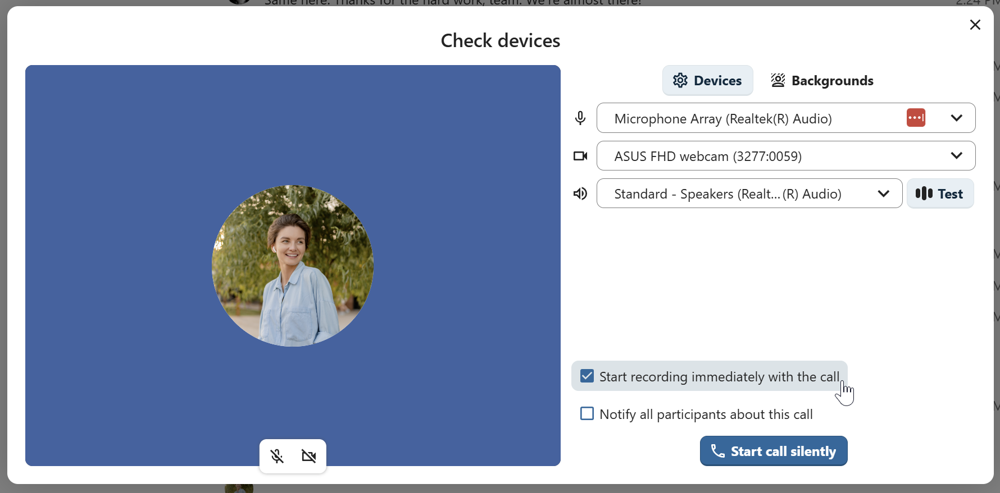
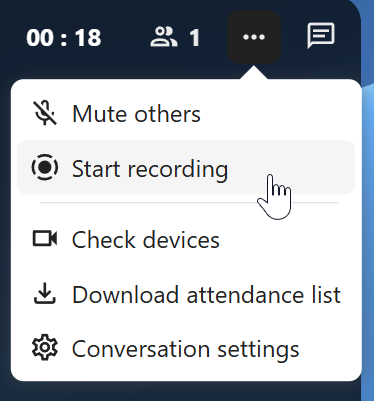

.. _call-recording:
==============
Call recording
==============

The recording feature provides users with an opportunity to:

- Start and stop recordings during a call.
- Record the video and audio stream of the speaker, as well as screen share.
- Access, share and download recorded files for future reference or distribution.

Enabling this feature requires the recording server to be set up by the system administration.

Manage a recording
------------------

The moderator of the conversation can start a recording together with a call start or anytime during a call:

- **Before the call**: tick the checkbox "Start recording immediately with the call" in "Media settings", then click on "Start call".
- **During the call**: click on the top-bar menu, then click "Start recording".

|

The recording will start shortly, and you will see a red indicator next to the call time. You can stop the recording at any time while the call is still ongoing by clicking on that indicator and selecting "Stop recording", or by using the same action in the top-bar menu. If you do not manually stop the recording, it will end automatically when the call ends.

.. image:: images/stop-recording.png
    :width: 500px

After stopping a recording, the server will take some time to prepare and save the recorded file. The moderator, who started the recording, receives a notification when the file is uploaded. From there, it can be shared in the chat.

.. image:: images/share-recording-notification.png
    :width: 300px

|

.. image:: images/shared-recordings.png
    :width: 400px

Recording consent
-----------------

For compliance reasons with various privacy rights, it is possible to ask participants for consent to be recorded before joining the call. The system administration has the flexibility to utilize this feature in several ways:

- Disable consent completely.
- Enable mandatory consent system-wide, requiring consent for all conversations.
- Allow moderators to configure this option on a conversation level. In such cases, moderators can access the conversation settings to configure this option accordingly:

.. image:: images/enable-recording-consent.png
    :width: 500px

.. FIXME make screenshots below from user perspective not moderator

If recording consent is enabled, every participant, including moderators, will see a highlighted section in the "Media settings" before joining a call.
This section informs participants that the call may be recorded. To give explicit consent for recording, participants must check the box. If they do not give consent, they will not be allowed to join the call.

.. image:: images/give-recording-consent.png
    :width: 500px

|

.. image:: images/give-recording-consent-checked.png
    :width: 500px

.. FIXME add where they can be rewatched afterwards