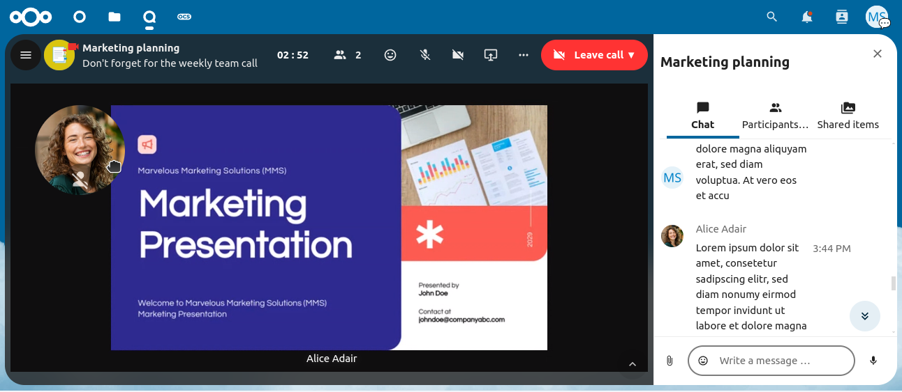

==============
Screen sharing
==============

Click the monitor icon in the toolbar to share your screen.

.. note:: If you have not yet given permission to the browser or the Talk Desktop client to share your screen,
    you might be prompted to do so when you click ``Share screen``.
    Please click on ``Allow`` to grant the browser or Talk Desktop client access to your screen.

Depending on your browser or the Talk Desktop client, you will get the option to share a monitor, an application window, or a single browser tab.
If video from your camera is also available, other participants will see it in a small presenter view next to the screen share.

To stop sharing your screen, click the ``Share screen`` button again and choose ``Stop screensharing``.

You can zoom in and out of the shared screen with the mouse wheel, double-click, or touchpad gestures.
