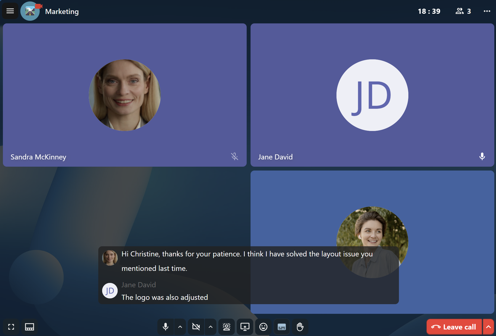
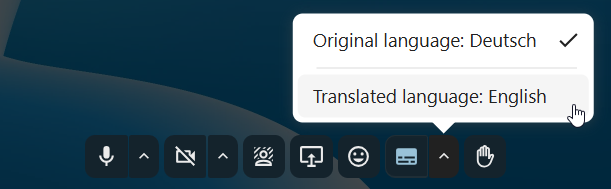

=============================
Transcription and translation
=============================

Call live transcription
-----------------------

Call live transcription transcribes speech in real-time during a call. It is set up by the system administration (High-performance backend and `Live Transcription App <https://apps.nextcloud.com/apps/live_transcription>`_ are required).
Moderators need to set the transcription language in the conversation settings. All participants can then enable or disable the transcription for themselves in the call bottom bar.
When enabled, the transcription appears at the bottom of the screen and is updated in real-time.

Live translation
----------------

With the `live_transcription` provider app enabled, you can also use live translation. Instead of receiving the transcription in the original language, it will be translated to the language of your choice.

