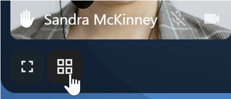

===========
Call layout
===========

You can switch between grid view and speaker view using the toggle icon in the three-dot menu or the bottom bar.

Grid view
---------

Grid view shows all participants as tiles. Use the navigation buttons on the left and right to scroll through
participants when they do not all fit on the screen.

.. image:: images/talk-grid-view.png
    :width: 700px

Speaker view
-------------

Speaker view (also called promoted view) centres the active speaker in a large tile and places the other participants in
a row below.
Use the navigation buttons on the left and right to scroll through participants when the row overflows.

