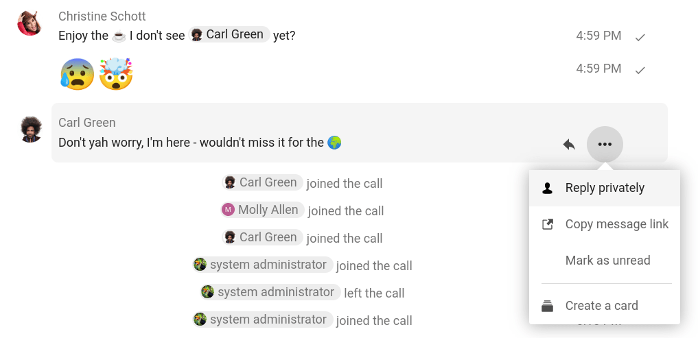

================
Sending messages
================

Using Markdown
---------------

You can enhance your messages with a markdown syntax support. See list for usage:

**Headings and dividers**

.. code-block:: none

  # Heading 1
  ## Heading 2
  ### Heading 3
  #### Heading 4
  ##### Heading 5
  ###### Heading 6

  Heading
  ===
  Normal text
  ***
  Normal text

**Inline decorations**

.. code-block:: none

  **bold text** __bold text__
  *italicized text* _italicized text_
  `inline code` ``inline code``
  ```
  .code-block {
    display: pre;
  }
  ```

**Lists**

.. code-block:: none

  1. Ordered list
  2. Ordered list

  * Unordered list
  - Unordered list
  + Unordered list

**Quotes**

.. code-block:: none

  > blockquote
  second line of blockquote

**Task lists**

.. code-block:: none

  - [ ] task to be done
  - [x] completed task

**Tables**

.. code-block:: none

  Column A | Column B
  -- | --
  Data A | Data B

Inserting emoji
---------------

You can add emoji using the picker on the left of the text input field.

.. image:: images/emoji-picker.png
   :width: 400px

.. FIXME Smart picker

.. FIXME Mention integration apps like github, gitlab, giphy, …

Replying to messages and more
-----------------------------

You can reply to a message using the arrow that appears when you hover a message.

.. image:: images/reply.png
   :width: 600px

In the ``...`` menu you can also choose to reply privately. This will open a one-on-one conversation.



Here you can also create a direct link to the message or mark it unread so you will scroll back there next time you enter the chat. When it is a file, you can view the file in Files.

Silent messages
---------------

If you don't want to disturb anyone in the middle of the night, there is a silent mode for chatting.
While it is enabled, other participants will not receive notifications from your messages.

.. image:: images/message-silent.png
   :width: 600px
