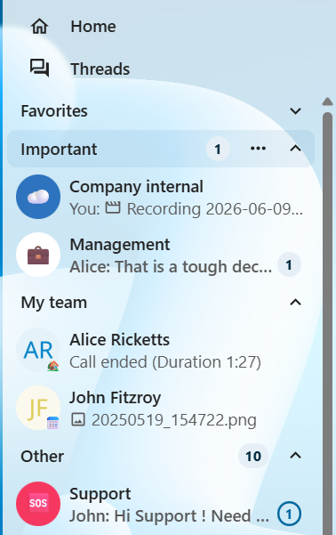
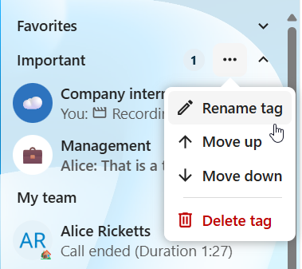
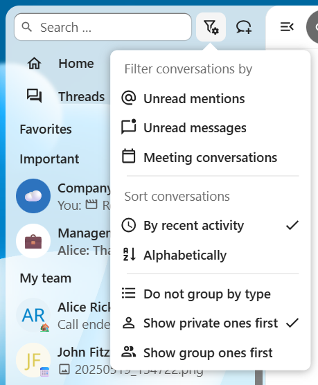

.. SPDX-FileCopyrightText: 2026 Nextcloud GmbH and Nextcloud contributors
.. SPDX-License-Identifier: CC-BY-4.0

========================
Organizing conversations
========================

Nextcloud Talk offers features to organize and manage your conversations efficiently.

Tags
----

Create custom tags to categorize your conversations and keep them organized.
Tags help you group conversations by project, team, topic, or any other criteria that makes sense for your workflow.

1. Select a conversation and open actions menu
2. Select ``Tags`` and choose an existing tag or create a new one
3. The conversation will now be tagged and grouped accordingly

You can later manage existing tags by renaming, reordering or deleting them.

Sorting and grouping
--------------------

You can additionally customize how conversations appear in the list.
They can be sorted:

- **By last activity**: Show most recently active conversations first (default)
- **Alphabetically**: Sort conversations alphabetically by name

Similar types can also be grouped together:

- **Do not group by type**: Keep a flat list of all conversations
- **Show private ones first**: Show private conversations before groups/public
- **Show group ones first**: Show groups/public conversations before private

See also:

- :doc:`conversations`
- :doc:`open_conversations`
- :doc:`calendar_integration`
