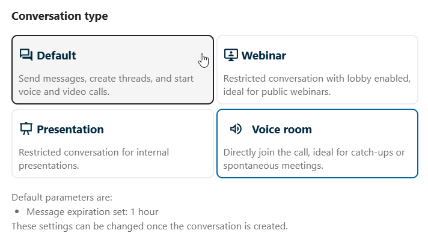

.. SPDX-FileCopyrightText: 2026 Nextcloud GmbH and Nextcloud contributors
.. SPDX-License-Identifier: CC-BY-4.0

======================
Conversation presets
======================

Conversation presets allow administrators to define templates for new conversations, with pre-configured settings such as permissions, lobby rules, and conversation type.

Available presets
-----------------

Depending on your instance configuration, you may see presets when creating a new conversation.
Each preset applies a specific set of defaults suited to a particular use case.

Voice room
----------

A permanent call room ("Voice room") is a conversation preset optimized for non-obligatory, always-available meetings.
Any person entering the conversation will be joining the call there, making it easier to start communicating.
Messages in voice room conversation are set to expire after certain time, to keep it lightweight and spontaneous.

Webinar
-------

Moderators can configure a preset to force the lobby, ensuring participants wait for a moderator before joining.
When a conversation uses a forced lobby preset:

- Participants see a waiting room upon joining
- A moderator must allow them to the conversation or lift the lobby
- Useful for webinars, interviews, or controlled meetings

Presentation
------------

Presentation preset is useful for internal meetings, where it is expected to have more listeners than speakers.
Participant permissions are optimized to ensure the best performance and moderation experience, allowing presenters to speak uninterrupted.

See also:

- :doc:`conversations`
- :doc:`webinar`
- :doc:`open_conversations`
