=============
Conversations
=============

Nextcloud Talk lets you chat and have video calls on your own server.

Chats and calls take place in conversations. You can create any number of conversations. There are different types of conversations:

1. Private (one-to-one) conversations
^^^^^^^^^^^^^^^^^^^^^^^^^^^^^^^^^^^^^
This is where you have a private chat or call with another Talk user.

In content sidebar, you can find additional information about the person you are chatting with, such as their email address, phone number, or other details they have shared in their profile.

.. image:: images/one-to-one-right-sidebar.png
    :width: 300px

Nobody except you and the other person can see this conversation or join a call in it.
You can extend an ongoing call to a new group conversation by adding more people. Call will be continued there without interruption.

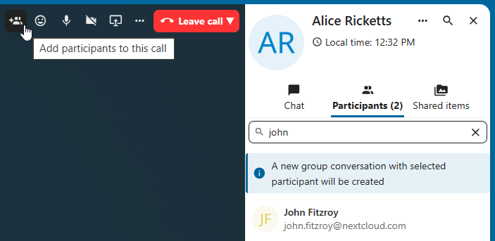

If a user becomes unavailable and set an **out-of-office** status in ``Personal settings > Availability``, you will find additional information in this conversation, such as provided description, absence date, or their replacement person.

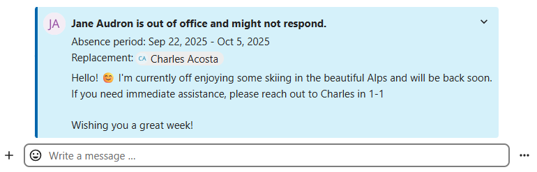

2. Group conversations
^^^^^^^^^^^^^^^^^^^^^^
A group conversation can have any number of people in it.
You can add internal users, email guests, groups or teams to a group conversation upon creation, or when it already exists, via the ``Participants`` tab.

A group conversation can be shared with a public link, so guests can join a chat and a call.
It can also be opened to registered users (or users from 'Guests' app), so they can discover and join this conversation.

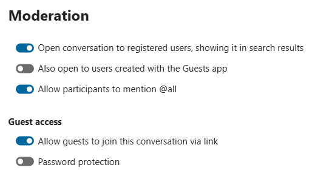

3. Note to self
^^^^^^^^^^^^^^^
This is a special conversation with yourself. Messages here do not have a limit for editing or deletion. You can use it to:

- **Take notes**: write down ideas, reminders, or important information you want to keep handy.
- **Create to-do lists**: use Markdown syntax to create checklists for tasks you need to complete.
- **Forward messages from other chat**: use the message menu to forward important messages from other conversations to your Note to self.

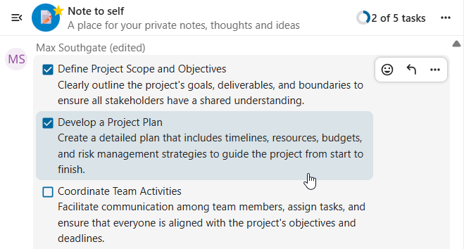

4. Disposable conversations
^^^^^^^^^^^^^^^^^^^^^^^^^^^
These conversations cover some special cases and exist for a limited period of time. Retention period can be configured by an instance administration:

- **Instant meetings**: these conversations can be created for quick, ad-hoc meetings. They can be started instantly from the Talk Dashboard.
- **Event conversations**: these are created when set as an event location by Calendar app.
- **Phone conversations**: these are dedicated for SIP dial-in & dial-out phone calls (requires a SIP gateway).
- **Video verification**: these are created, when someone tries to access a public link, protected by password with video verification (deleted instantly after call ends).

.. image:: images/instant-meeting-dispose.png
    :width: 500px

Talk Dashboard
--------------

The Talk Dashboard is your central hub for managing and accessing your conversations. It provides an overview of your:

- Unread mentions and messages in private chats;
- Message reminders, scheduled to be tackled on later;
- Scheduled meetings, with event details and shortcut buttons to join them;
- Shortcut actions to create new conversations, join open ones, or quickly check your media devices.

.. image:: images/talk-dashboard.png
    :width: 600px

Creating a conversation
-----------------------

You can create a private (one-to-one) chat by searching for the name of a user, a group or a team and clicking it. For a single user, a conversation is immediately created and you can start your chat. For a group or circle you get to pick a name and settings before you create the conversation and add the participants.

.. image:: images/chat-with-one-user.png
    :width: 400px

If you want to create a custom group conversation, click the button next to the search field and filters button and then on ``Create a new conversation``.

.. image:: images/create-new-conversation.png
    :width: 400px

You can then pick a name for the conversation, put a description, and set up an avatar for it (with uploaded photo or emoji), and select if the conversation should be open to external users and if other users on the server can see and join the conversation.

.. image:: images/creating-open-conversation.png
    :width: 500px

In the second step, you get to add participants and finalize the creation of the conversation.

.. image:: images/add-participants.png
    :width: 500px

After confirmation you will be redirected to the new conversation and can start communicating right away.

.. image:: images/new-room.png
    :width: 700px

Filter your conversations
-------------------------

You can filter your conversations using the filter button next to the search field. There are several options for filtering:
1. **Unread mentions**: view unread private conversations, or group conversations, where you have been mentioned.
2. **Unread messages**: view unread messages in all conversations you are a part of.
2. **Event conversations**: view all conversations, created for upcoming or past events.

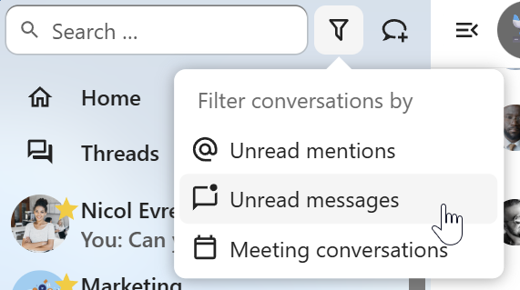

You can then clear the filter from the filters menu.

.. image:: images/clear-filter.png
    :width: 400px

Compact view of conversations list
----------------------------------

Compact view allows to hide last message preview in the conversation list, providing a more focused interface. 
You can enable it from the ``Talk settings`` dialog  in ``Appearance`` section.

.. image:: images/talk-compact-view.png
   :width: 200px

Archive conversations
---------------------
You can archive conversations that you no longer need to see in your main conversation list. When a conversation is archived, it will be moved to the ``Archived conversations`` section.
An archived conversation will not appear in your main conversation list, but it will still align with notification level set in its settings.

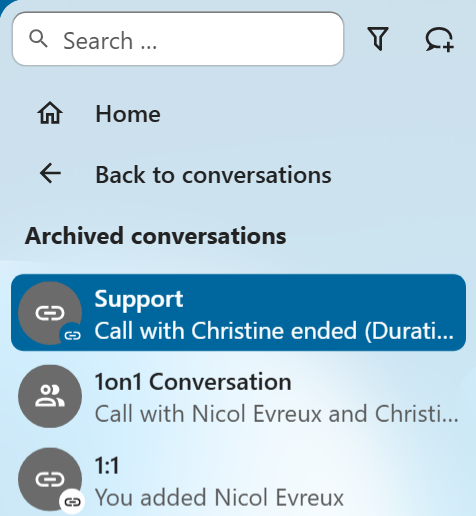

The list is accessible from the button at the bottom of the navigation bar.

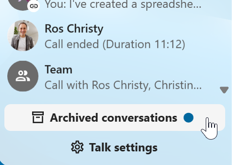

Managing a conversation
-----------------------

You are always moderator in your new conversation. In the participant list you can promote other participants to moderators using the ``...`` menu to the right of their user name, assign them custom permissions or remove them from the conversation.

Changing permissions of a user that joined a public conversation will also permanently add them to the conversation.

.. image:: images/participant-menu.png
    :width: 400px

Moderators can configure the conversation. Select ``Conversation settings`` from the ``...`` menu of the conversation on the top to access the settings.

.. image:: images/open-settings.png
    :width: 400px

Here you can configure the description, guest access, if the conversation is visible to others on the server and more.

.. image:: images/conversation-settings-dialog.png
   :width: 600px

Ban participants
----------------

To help keep discussions safe and under control, moderators can ban participants from conversations.
It could be internal users or guests (in this case their IP-addresse will additionally be banned).

In the participants list, select the user or guest you, and click ``Remove participant``.

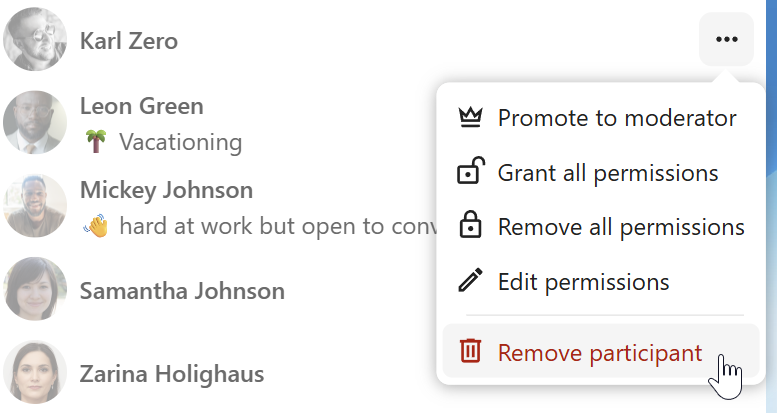

There, toggle checkbox ``Also ban from this conversation`` and provide a reason for the ban. The banned user will be removed and prevented from rejoining.

.. image:: images/ban-participant-dialog.png
    :width: 400px

You can later find the list of banned users in the ``Moderation`` section of conversation settings.
Here, you can see the reason for the ban and revert it if needed.

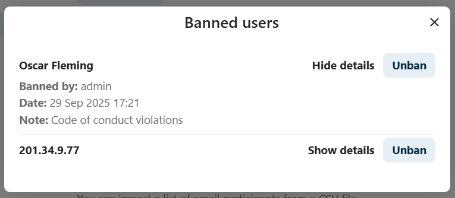

Messages expiration
-------------------

A moderator can configure message expiration under the ``Conversation settings`` within the ``Moderation`` section. Once a message reaches its expiration time, it is automatically removed from the conversation.
The available expiration durations are 1 hour, 8 hours, 1 day, 1 week, 4 weeks, or never (which is the default setting).

.. image:: images/messages-expiration.png
   :width: 500px

Notifications and privacy
-------------------------

By default, Nextcloud Talk will notify you about:

- New messages in private conversations;
- Replies to messages you sent;
- Messages mentioning you or group/team you are member of;
- Started calls in conversations you are part of.

You can change this behavior in the conversation settings. Additionally, you can configure:

- **Important conversations**: you will be always notificed about new messages, even if you are in "Do Not Disturb" mode;
- **Sensitive conversations**: content of messages will not be shown in the conversation list and obscured from notifications.

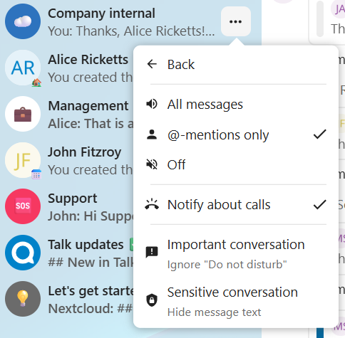

To have more control over your privacy, you can also configure the visibility of your typing and read indicators in ``Talk settings``:

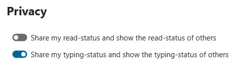
