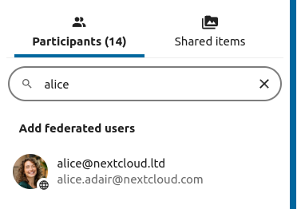
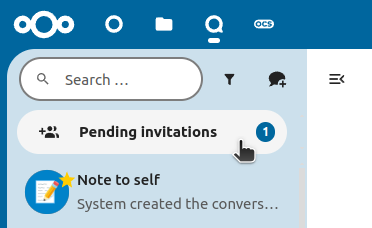
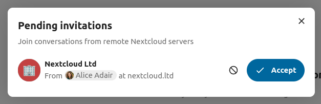
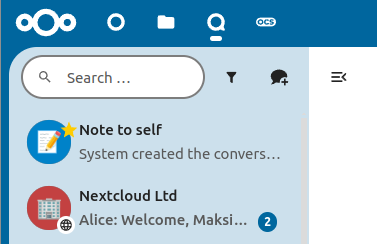

Federation
==========

With the Federation feature, users can create conversations across different federated Talk instances and use Talk
features as if they were on the same server.

This feature must be enabled by a system administrator.

Sending an invitation
---------------------

To receive an invitation, the other party needs your CloudID. You can find your CloudID in **Personal settings** under
**Sharing** — it looks like ``user@cloud.example.com``.

The moderator of the conversation can send an invite to a participant on a different server:

Accepting an invitation
-----------------------

When receiving a notification, the user will see a counter of pending invites above the conversations list.

Upon clicking it, more information will be provided about the inviting party, and the user can either accept or decline
the invitation.

By accepting the invite, the conversation will appear in the list as any other one.

You can use it to chat with participants from other federated servers, join calls, and use other available Talk
features.
