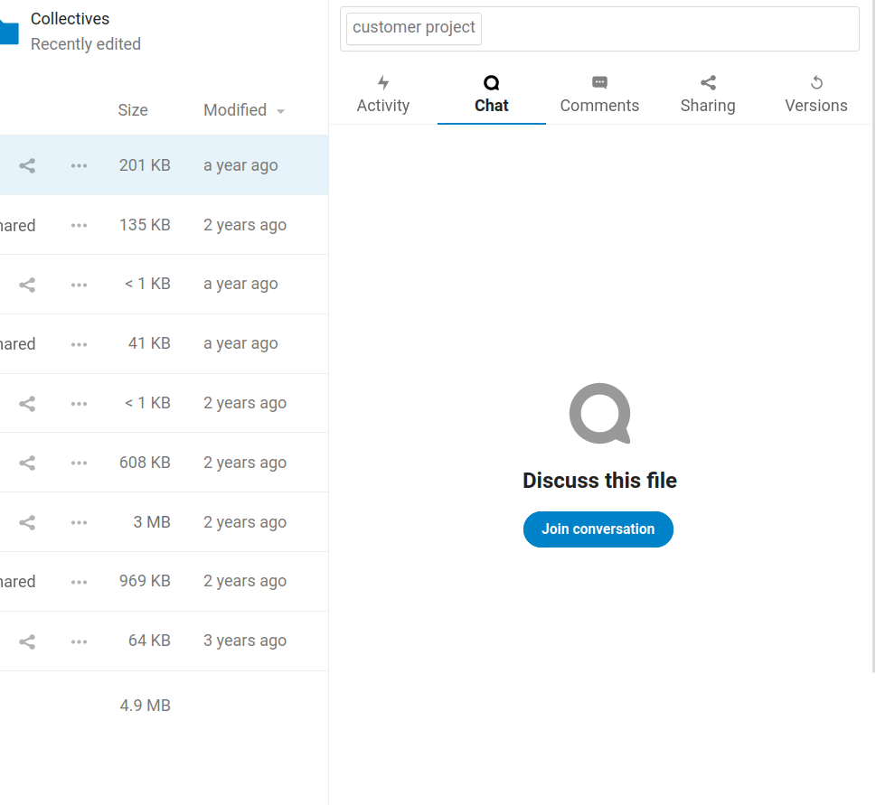
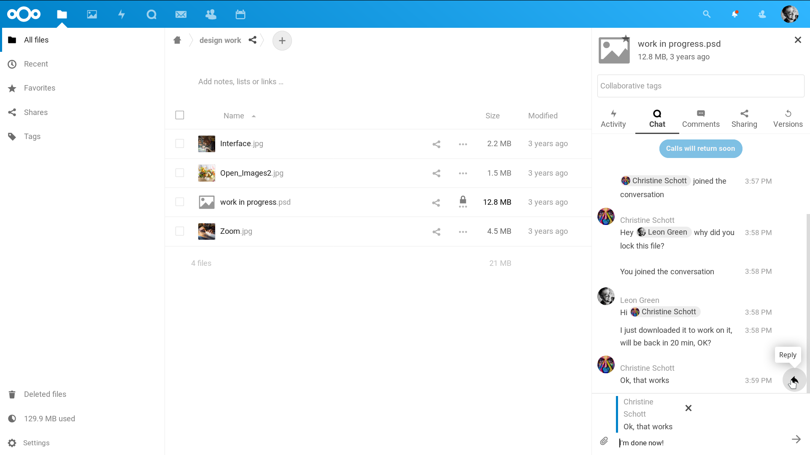
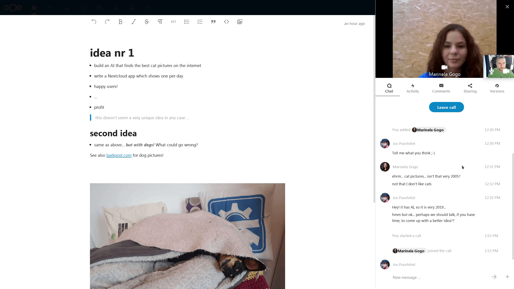
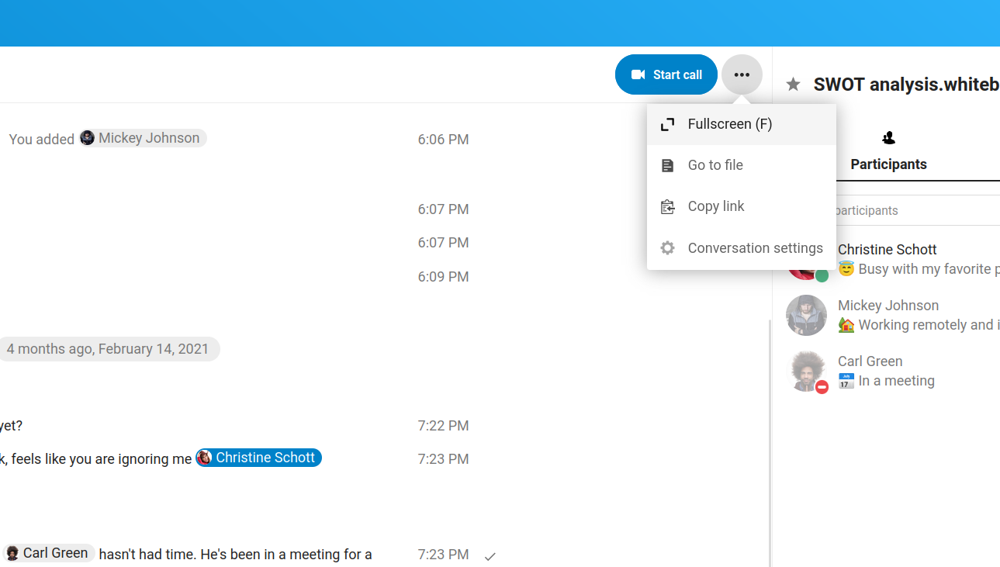

Files integration
=================

Talk from Files
---------------

In the Files app, you can chat about files in the sidebar, and even have a call while editing the file. You first have to join the chat.

|

You can then chat or have a call with other participants, even when you start editing the file.

In Talk, a conversation will be created for the file. You can chat from there, or go back to the file using the ``...`` menu in the top-right.

.. FIXME Add video verification for public shares
