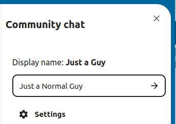
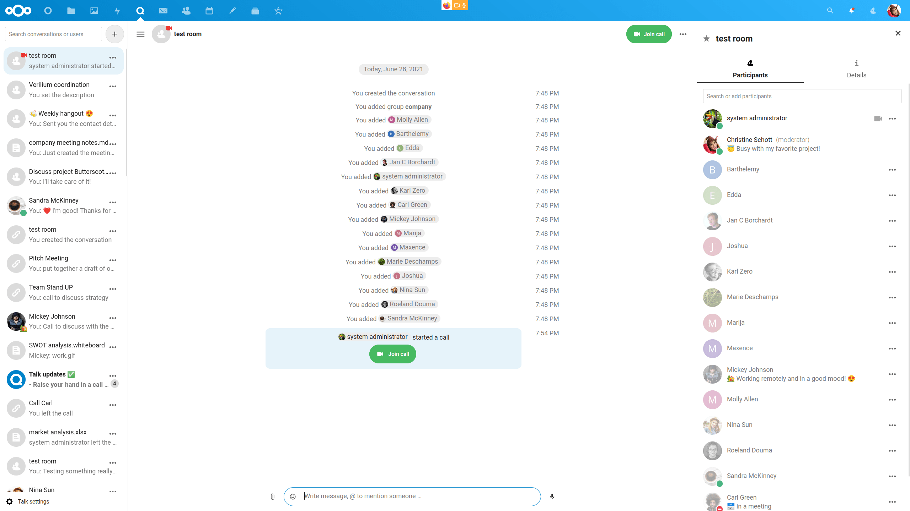

Join a call or chat as guest
============================

Nextcloud Talk offers audio/video call and text chat integrated in Nextcloud. It offers
a web interface as well as mobile apps.

You can find out more about Nextcloud Talk `on our website <https://nextcloud.com/talk/>`_.

Joining a chat
--------------

If you received a link to a chat conversation, you can open it in your browser to join the chat. Here, you will be prompted to enter your name before joining.

.. image:: images/guest-view.png
    :width: 400px

You can also change your name later by clicking the ``Edit`` button, located top-right.

Your camera and microphone settings can be found in the ``Settings`` menu. There you can also find a list of shortcuts you can use.

.. image:: images/guest-settings.png
    :width: 600px

Joining a call
--------------

You can start a call any time with the ``Start call`` button. Other participants will get notified and can join the call. If somebody else has started a call already, the button will change in a green ``Join call`` button.

Before actually joining the call you will see a device check, where you can pick the right camera and microphone, enable background blur or even join with any devices.

.. image:: images/device-settings-before-call.png
    :width: 400px

During a call, you can find the Camera and Microphone settings in the ``...`` menu in the top bar.

.. image:: images/guest-call-menu.png
    :width: 300px

During a call, you can mute your microphone and disable your video with the buttons in the top-right, or using the shortcuts ``M`` to mute audio and ``V`` to disable video. You can also use the ``space bar`` to toggle mute. When you are muted, pressing space will unmute you so you can speak until you let go of the space bar. If you are unmuted, pressing space will mute you until you let go.

You can hide your video (useful during a screen share) with the little arrow just above the video stream. Bring it back with the little arrow again.

Starting a screen share
-----------------------

You can click the monitor icon on your video stream to share your screen. Depending on your browser, you will get the option to share a monitor, an application window or a single browser tab.

More settings
-------------

In the conversation menu you can choose to go full-screen. You can also do this by using the ``F`` key on your keyboard. In the conversation settings, you can find notification options and the full conversation description.

.. image:: images/guest-room-menu.png
    :width: 500px
