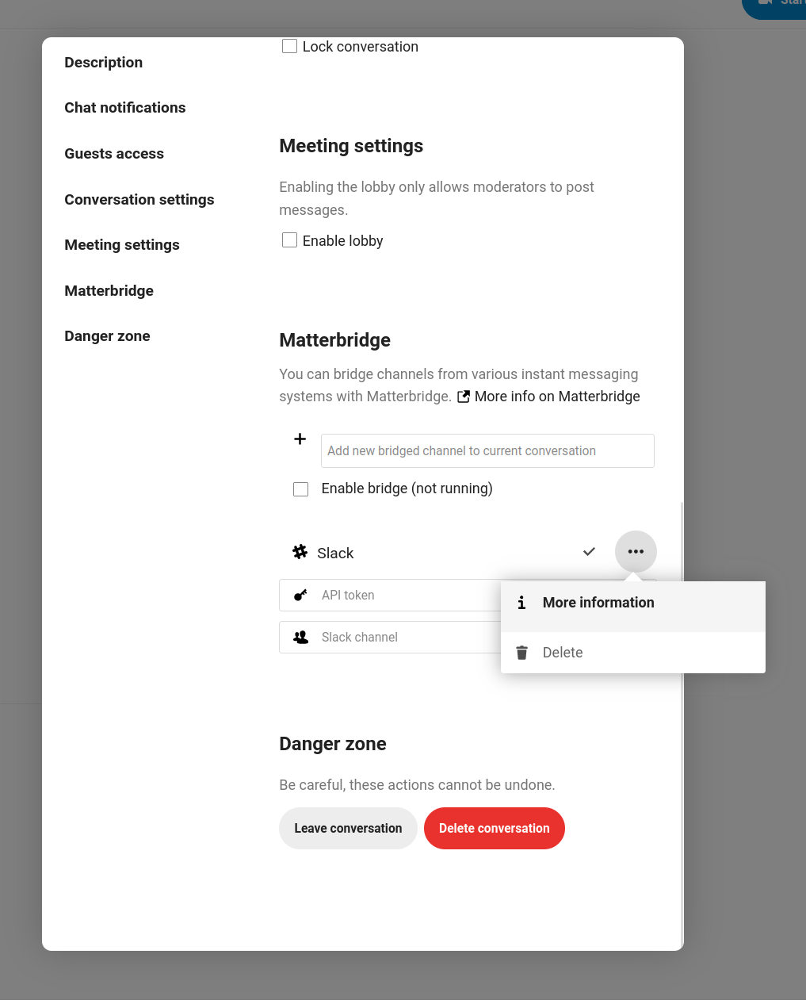

Matterbridge
============

Matterbridge integration in Nextcloud Talk makes it possible to create 'bridges' between Talk conversations and conversations on other chat services like MS Teams, Discord, Matrix and others. You can find a list of supported protocols `on the Matterbridge github page. <https://github.com/42wim/matterbridge#features>`_

.. note::
   The Matterbridge app must be installed by an administrator before this feature is available. See the `Talk administration documentation <https://nextcloud-talk.readthedocs.io/en/latest/matterbridge/>`_ for setup instructions.

A moderator can add a Matterbridge connection in the chat conversation settings.

Each bridge has its own configuration requirements. Information for most is available on the Matterbridge wiki and can be accessed behind ``more information`` menu in the ``...`` menu. You can also `access the wiki directly. <https://github.com/42wim/matterbridge/wiki>`_
