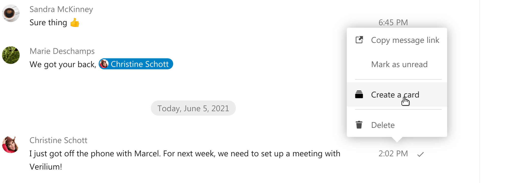
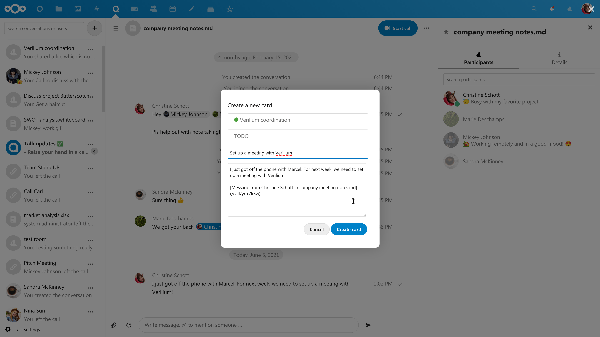
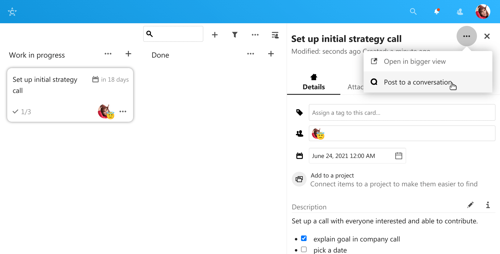
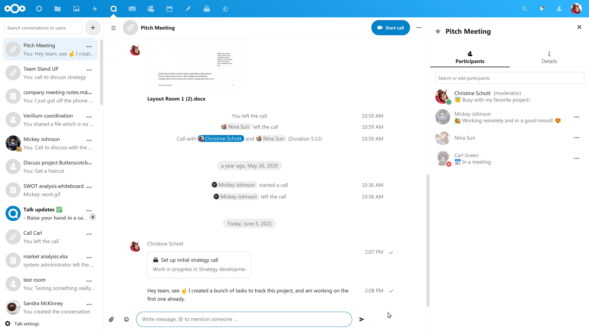

==============================
Apps integrating with messages
==============================

Several apps integrate with Talk messages, allowing you to turn messages into actionable items or share content directly in conversations.

Deck
----

Create tasks from chat message
^^^^^^^^^^^^^^^^^^^^^^^^^^^^^^

If Deck is installed, you can use the ``...`` menu of a chat message and turn the message into a Deck card.

|

Share card into a chat
^^^^^^^^^^^^^^^^^^^^^^

From within Deck, you can share cards into a chat.

|

