=========================
Interacting with messages
=========================

Editing messages
----------------

You can edit messages and captions to file shares up to 6 hours after sending.

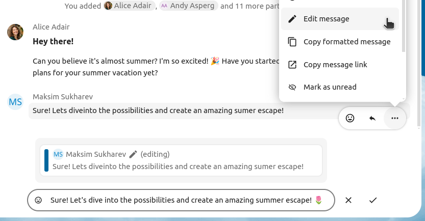

Pinning messages
----------------

A moderator can pin important messages in a conversation, for a certain period of time or until it's no longer relevant.

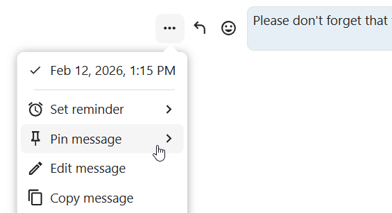

Pinned messages are highlighted and accessible above the chat or in the ``Shared items`` tab of the content sidebar. If you no longer need a pinned message, you can unpin it for everyone or only yourself from quick actions.

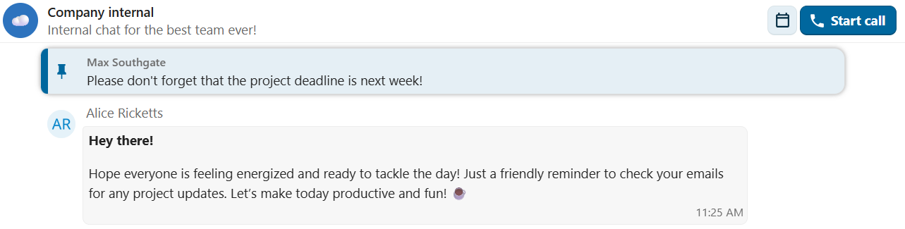

Setting reminder on messages
----------------------------

You can set reminders on specific messages. If there's an important message you want to be notified about later, simply hover over it and click on the reminder icon.

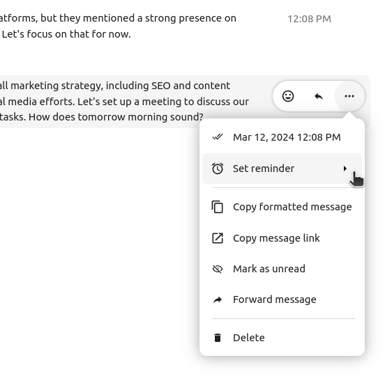

In the submenu, you can select an appropriate time to receive a notification later.

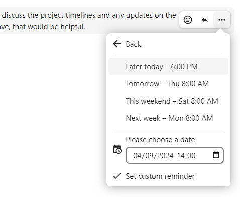

You can also forward a message to another conversation using the ``...`` menu, or send it to your **Note to self** conversation for personal reference.

Messages search in a conversation
---------------------------------

In addition to global unified search, you can search for messages within a specific conversation. In the content sidebar of a conversation, click the search icon to open the search tab.

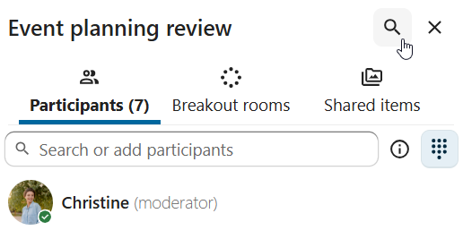

You can narrow down your search by using filters such as date range, and sender.

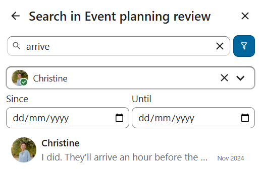

Threaded messages
-----------------

You can create threads in conversations to keep discussions organized. The thread creation option is available in the new message additional actions.

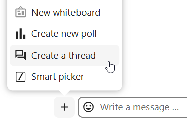

Then, you can add a title and description for the thread and start the discussion.

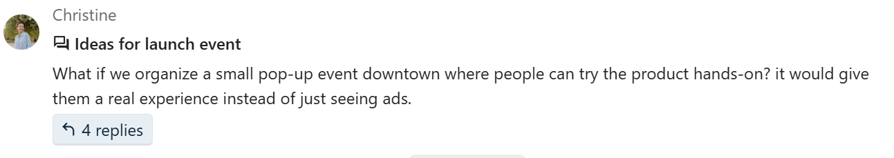

You can view all replies in a thread either from the replies button on the message or from ``Shared items`` tab in the content sidebar.

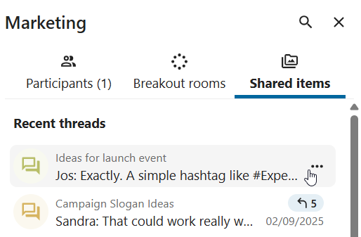

You can subscribe to a thread to receive notifications about new replies. It is possible to subscribe from the thread itself or from the sidebar.

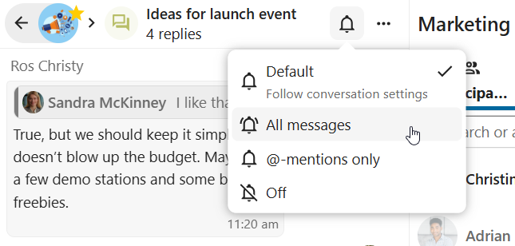

Subscribed threads are easily accessible from the navigation bar in ``Threads`` navigation.

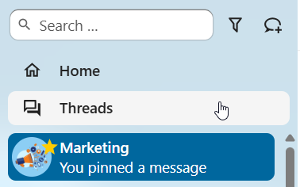

You can edit the thread title from the thread itself or from the sidebar.

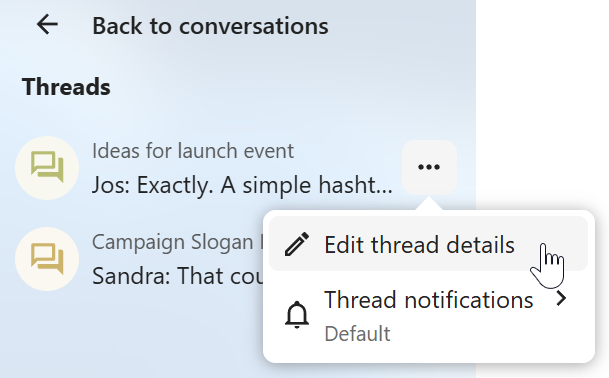

Private replies
---------------

Private replies are messages sent directly to a participant in a one-to-one conversation, in response to a specific message in a group conversation while maintaining privacy.

1. In a group or public conversation, locate a message you want to reply to privately
2. Hover over the message or access the message menu
3. Select "Reply in private"
4. A one-to-one conversation window opens with the original message quoted
5. Type your response and send

The quoted message appears in your reply, providing full context of what you're responding to — including the original sender's name, message content, and timestamp.

Message reactions
-----------------

Add emoji reactions to messages to quickly express agreement, celebrate, or indicate emotions without typing full responses.

1. Hover over a message in the chat
2. Click the smiley face icon or "Add reaction" button
3. Select an emoji from the picker
4. The reaction appears below the message with a count

Click on a reaction to see who reacted. To remove your reaction, click the X or click the emoji again.
