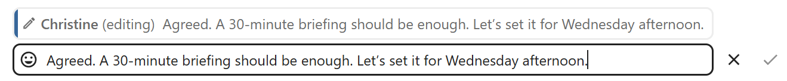
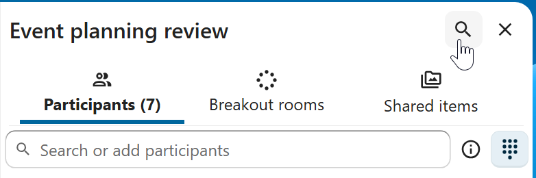
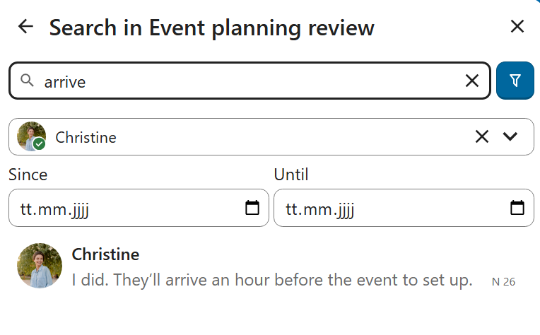
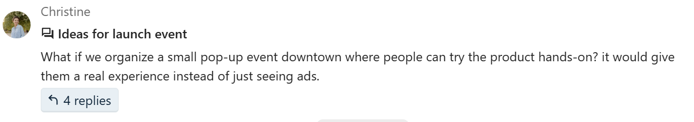
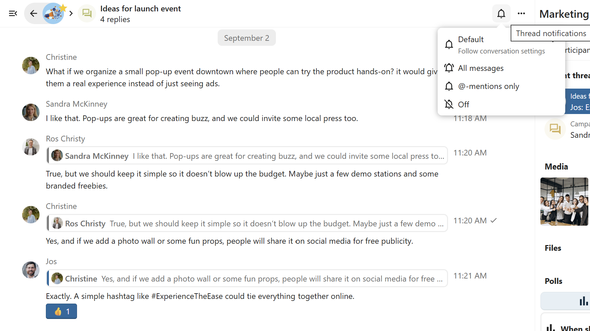

=========================
Interacting with messages
=========================

Editing messages
----------------

You can edit messages and captions to file shares up to 6 hours after sending.

Setting reminder on messages
----------------------------

You can set reminders on specific messages. If there's an important message you want to be notified about later, simply hover over it and click on the reminder icon.

.. image:: images/set-message-reminder.png
   :width: 400px

In the submenu, you can select an appropriate time to receive a notification later.

.. image:: images/configure-message-reminder.png
   :width: 400px

Messages expiration
-------------------

.. FIXME Duplicate with conversation management but worth it?

A moderator can configure message expiration under the ``Conversation settings`` within the ``Moderation`` section. Once a message reaches its expiration time, it is automatically removed from the conversation.
The available expiration durations are 1 hour, 8 hours, 1 day, 1 week, 4 weeks, or never (which is the default setting).

.. image:: images/messages-expiration.png
   :width: 500px

.. FIXME Mention integration with Note-to-self and Forwarding

Messages search in a conversation
---------------------------------

In addition to global unified search, you can search for messages within a specific conversation. In the content sidebar of a conversation, click the search icon to open the search tab.

You can narrow down your search by using filters such as date range, and sender.

Threaded messages
-----------------

You can create threads in conversations to keep discussions organized. The thread creation option is available in the new message additional actions.

.. image:: images/thread-create-action.png
   :width: 500px

Then, you can add a title and description for the thread and start the discussion.

You can view all replies in a thread either from the replies button on the message or from ``Shared items`` tab in the content sidebar.

.. image:: images/threads-list-shared-items.png
   :width: 500px

You can subscribe to a thread to receive notifications about new replies. It is possible to subscribe from the thread itself or from the sidebar.

Subscribed threads are easily accessible from the navigation bar in ``Threads`` navigation.

.. image:: images/threads-followed.png
   :width: 500px

Editing thread title is possible from the thread itself or from the sidebars.

.. image:: images/thread-edit-title.png
   :width: 500px