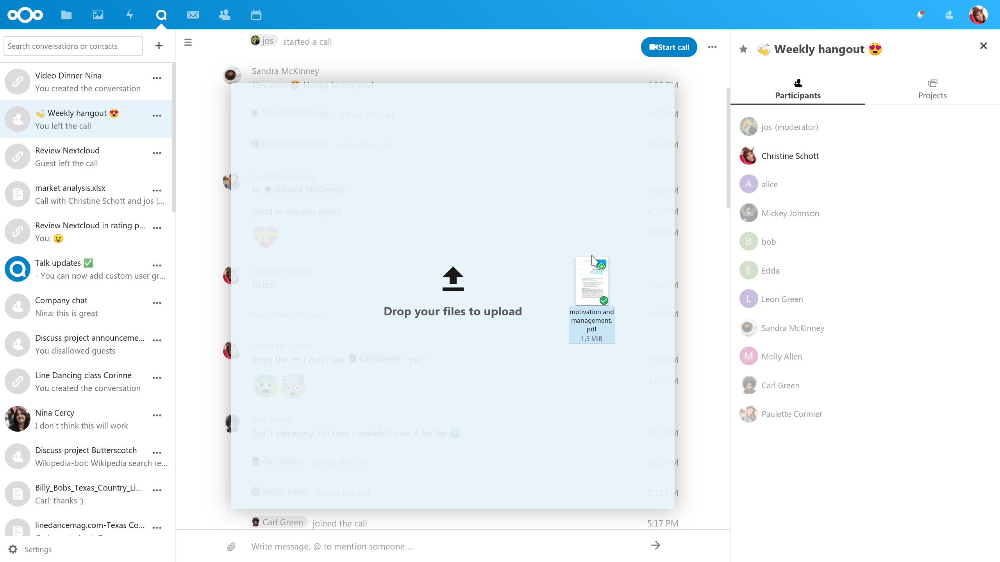
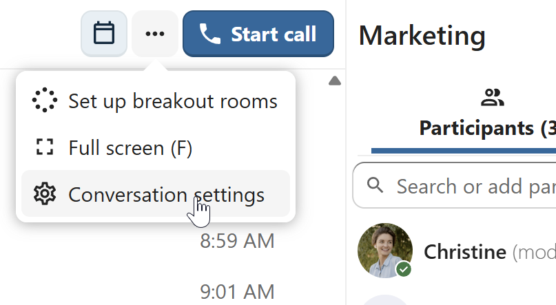
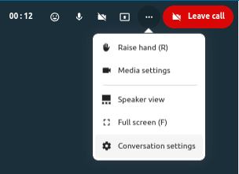

========================
Basics of Nextcloud Talk
========================

Nextcloud Talk lets you chat and have video calls on your own server.

Chats and calls take place in rooms. You can create any number of rooms. There are two kinds of rooms:

1. **One-on-one rooms.** This is where you have a private chat or call with another Talk user. You can't add other people to this room or share it with a link. You start a direct one-on-one chat by looking for another user in the search bar and then clicking their name.

2. **Group rooms.** Besides the person who created the room, a group room can have any number of people in it. A group room can be shared publicly with a link, so external guest users can join a call. It can also be listed, so other people on your Nextcloud server can join the room.

Creating a chat
---------------

You can create a direct, one-on-one chat by searching for the name of a user, a group or a circle and clicking it. For a single user, a room is immediately created and you can start your chat. For a group or circle you get to pick a name and settings before you create the room and add the participants.

.. image:: images/chat-with-one-user.png

If you want to create a custom group room, click the ``plus`` button next to the search field. You can then pick a name for the room and select if the room should be open to external users and if other users on the server can see and join the room.

In the second step, you get to add participants and finalize the creation of the conversation.

.. image:: images/add-participants.png

You can cancel the creation of a room by clicking outside the white menu area at any time.

Sharing files in a chat
-----------------------

You can share files in a chat in 3 ways.

First, you can simply drag'n'drop them on the chat.

Second, you can select a file from your Nextcloud Files or a file manager by choosing the little paperclip and selecting where you'd like to pick the file from.

.. image:: images/share-files-in-chat.png

.. image:: images/share-files-in-chat-selection.png

You can add more files until you are done and decide to share the files.

.. image:: images/talk-upload-files.png

All users will be able to click the files to view, edit or download them, irrespective of them having a user account. Users with an account will have the file automatically shared with them while external guest users will get them shared as a public link.

.. image:: images/editing-document-in-chat-room.png

Inserting emoji
---------------

You can add emoji using the picker on the left of the text input field.

.. image:: images/emoji-picker.png

Replying to messages and more
-----------------------------

You can reply to a message using the arrow that appears when you hover a message.

.. image:: images/reply.png

In the ``...`` menu you can also choose to reply privately. This will open a one-on-one chat.

.. image:: images/chat-message-menu.png

Here you can also create a direct link to the message or mark it unread so you will scroll back there next time you enter the chat. When it is a file, you can view the file in Files.

Managing a room
---------------

You are always moderator in your new room. In the participant list on the right you can elevate other participants to moderators using the ``...`` menu  to the right of their user name, or remove them from the room. 

.. image:: images/participant-menu.png

Moderators can configure the room. Select ``Configuration settings`` from the ``...`` menu  of the room on the top to access the settings.

Here you can configure the name, guest access, if the room is visible to others on the server and more.

Starting a call
---------------

When you're in a room, you can start a call any time with the ``🎥 Start call`` button. Other participants will get notified and can join the call. If somebody else has started a call already, the button will change in a green ``🎥 Join call`` button.

.. image:: images/join-call.png

During a call, you can mute your microphone and disable your video with the buttons on your video on the bottom-right, or using the shortcuts ``m`` to mute audio and ``v`` to disable video. You can also use the space bar to toggle mute. When you are muted, pressing space will unmute you so you can speak until you let go of the space bar. If you are unmuted, pressing space will mute you until you let go.

You can hide your video (useful during a screen share) with the little arrow just above the video stream. Bring it back with the little arrow again.

You can access your settings and choose a different webcam, microphone and other settings in the ``...`` menu  on your video.

.. image:: images/talk-settings.png

Starting a screen share
-----------------------

You can click the monitor icon on your video stream to share your screen. Depending on your browser, you will get the option to share a monitor, an application window or a single browser tab.

Changing view in a call
-----------------------

You can switch the view in a call with the little four-block icon in the top-right between promoted-view and grid view. The grid view will show everyone equally big and if the people do not fit on the screen, buttons will appear on the left and right that let you navigate.

.. image:: images/talk-grid-view.png

The promoted view shows the speaker large and others in a row below. If the people do not fit on the screen, buttons will appear on the left and right that let you navigate.

.. image:: images/talk-promoted-view.png

