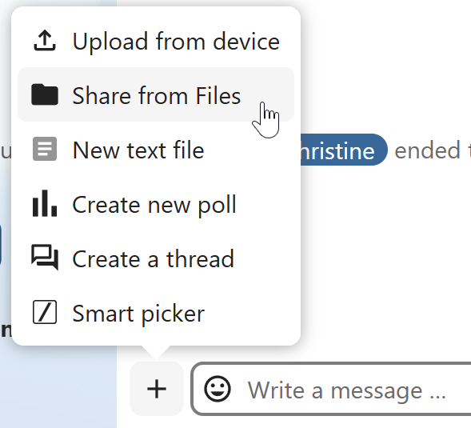
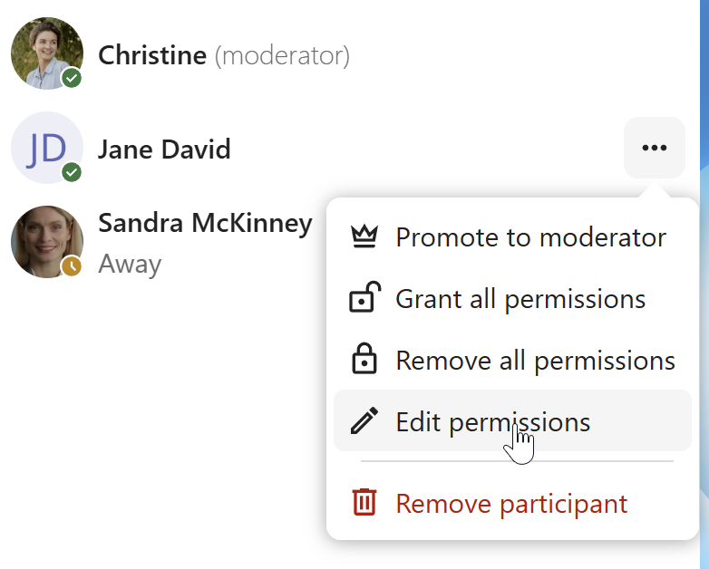
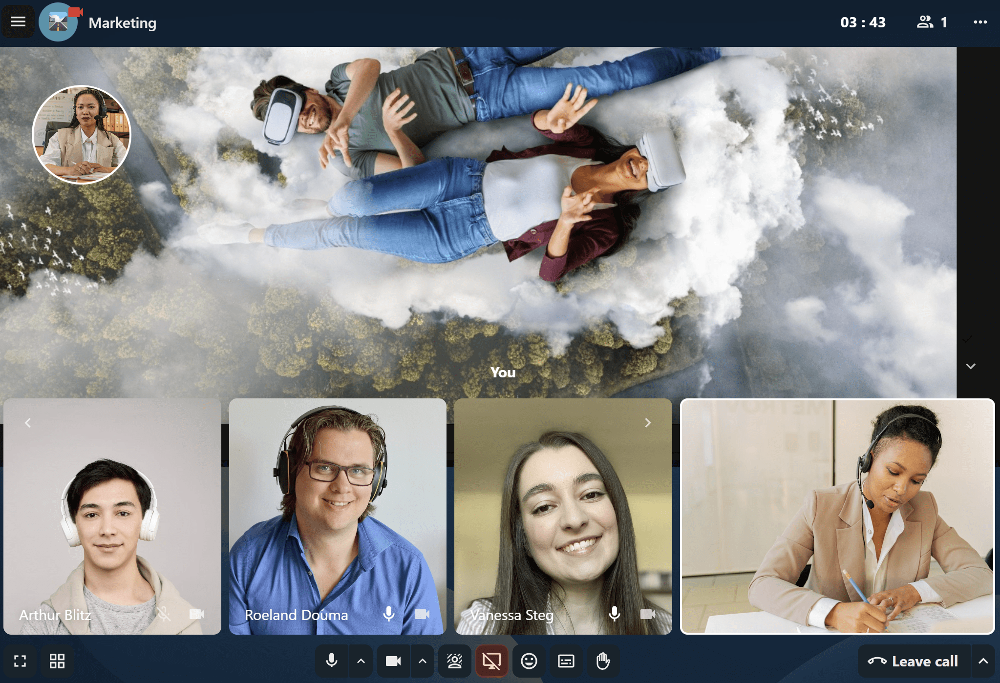
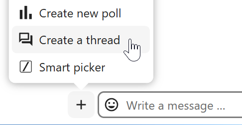
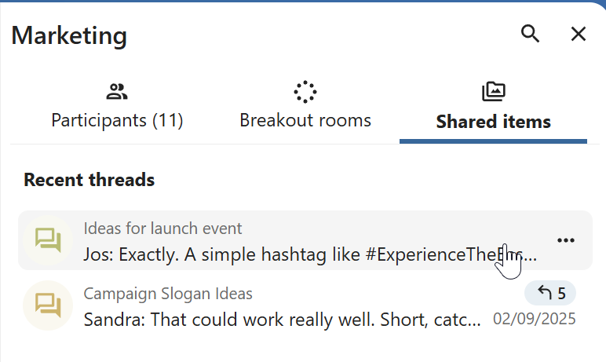
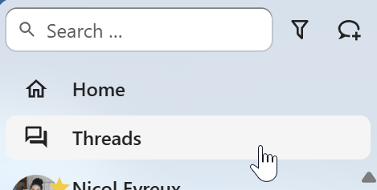

========================
Basics of Nextcloud Talk
========================

Nextcloud Talk lets you chat and have video calls on your own server.

Getting started
---------------

Chats and calls take place in conversations. You can create any number of conversations. There are different types of conversations:

1. Private (one-to-one) conversations
^^^^^^^^^^^^^^^^^^^^^^^^^^^^^^^^^^^^^
This is where you have a private chat or call with another Talk user.

In content sidebar, you can find additional information about the person you are chatting with, such as their email address, phone number, or other details they have shared in their profile.


Nobody except you and the other person can see this conversation or join a call in it.
You can extend an ongoing call to a new group conversation by adding more people. Call will be continued there without interruption.

.. image:: images/one-to-one-extend.png
    :width: 300px

If a user becomes unavailable and set an **out-of-office** status in ``Personal settings > Availability``, you will find additional information in this conversation, such as provided description, absence date, or their replacement person.

.. image:: images/one-to-one-out-of-office.png
    :width: 500px

2. Group conversations
^^^^^^^^^^^^^^^^^^^^^^
A group conversation can have any number of people in it.
You can add internal users, email guests, groups or teams to a group conversation upon creation, or when it already exists, via the ``Participants`` tab.

A group conversation can be shared with a public link, so guests can join a chat and a call.
It can also be opened to registered users (or users from 'Guests' app), so they can discover and join this conversation.

.. image:: images/group-public-settings.png
    :width: 400px


3. Note to self
^^^^^^^^^^^^^^^
This is a special conversation with yourself. Messages here do not have a limit for editing or deletion. You can use it to:

- **Take notes**: write down ideas, reminders, or important information you want to keep handy.
- **Create to-do lists**: use Markdown syntax to create checklists for tasks you need to complete.
- **Forward messages from other chat**: use the message menu to forward important messages from other conversations to your Note to self.

.. image:: images/note-to-self.png
    :width: 500px

4. Disposable conversations
^^^^^^^^^^^^^^^^^^^^^^^^^^^
These conversations cover some special cases and exist for a limited period of time. Retention period can be configured by an instance administration:

- **Instant meetings**: these conversations can be created for quick, ad-hoc meetings. They can be started instantly from the Talk Dashboard.
- **Event conversations**: these are created when set as an event location by Calendar app.
- **Phone conversations**: these are dedicated for SIP dial-in & dial-out phone calls (requires a SIP gateway).
- **Video verification**: these are created, when someone tries to access a public link, protected by password with video verification (deleted instantly after call ends).

.. image:: images/instant-meeting-dispose.png
    :width: 500px

Talk Dashboard
--------------

The Talk Dashboard is your central hub for managing and accessing your conversations. It provides an overview of your:

- Unread mentions and messages in private chats;
- Message reminders, scheduled to be tackled on later;
- Scheduled meetings, with event details and shortcut buttons to join them;
- Shortcut actions to create new conversations, join open ones, or quickly check your media devices.


Creating a chat
---------------

You can create a private (one-to-one) chat by searching for the name of a user, a group or a team and clicking it. For a single user, a conversation is immediately created and you can start your chat. For a group or circle you get to pick a name and settings before you create the conversation and add the participants.

.. image:: images/chat-with-one-user.png
    :width: 400px

If you want to create a custom group conversation, click the button next to the search field and filters button and then on ``Create a new conversation``.

.. image:: images/create-new-conversation.png
    :width: 400px

You can then pick a name for the conversation, put a description, and set up an avatar for it (with uploaded photo or emoji), and select if the conversation should be open to external users and if other users on the server can see and join the conversation.

.. image:: images/creating-open-conversation.png
    :width: 500px

In the second step, you get to add participants and finalize the creation of the conversation.

.. image:: images/add-participants.png
    :width: 500px

After confirmation you will be redirected to the new conversation and can start communicating right away.

.. image:: images/new-room.png
    :width: 700px

View all open conversations
---------------------------

You can view all the conversations that you can join by clicking the button next to the search field and filters button and then on ``Join open conversations.``

.. image:: images/join-open-conversations.png
    :width: 400px

Filter your conversations
-------------------------

You can filter your conversations using the filter button next to the search field. There are several options for filtering:
1. **Unread mentions**: view unread private conversations, or group conversations, where you have been mentioned.
2. **Unread messages**: view unread messages in all conversations you are a part of.
2. **Event conversations**: view all conversations, created for upcoming or past events.

.. image:: images/filters-menu.png
    :width: 400px

You can then clear the filter from the filters menu.

.. image:: images/clear-filter.png
    :width: 400px

Archive conversations
---------------------
You can archive conversations that you no longer need to see in your main conversation list. When a conversation is archived, it will be moved to the ``Archived conversations`` section.
An archived conversation will not appear in your main conversation list, but it will still align with notification level set in its settings.

.. image:: images/archived-conversations-list.png
    :width: 400px

The list is accessible from the button at the bottom of the navigation bar.

.. image:: images/archived-conversations-button.png
    :width: 400px

Sharing files in a chat
-----------------------

You can share files in a chat in 3 ways.

First, you can simply drag'n'drop them on the chat.

.. image:: images/drag-and-drop.png
   :width: 600px

Second, you can select a file from your Nextcloud Files or a file manager by choosing the little paperclip and selecting where you'd like to pick the file from.



.. image:: images/share-files-in-chat-selection.png
    :width: 600px

You can add more files until you are done and decide to share the files. You can also add a text caption to your shared files, providing a brief description or context.

.. image:: images/talk-upload-files.png
   :width: 500px

All users will be able to click the files to view, edit or download them, irrespective of them having a user account. Users with an account will have the file automatically shared with them while external guest users will get them shared as a public link.

.. image:: images/editing-document-in-chat-room.png
   :width: 600px

Inserting emoji
---------------

You can add emoji using the picker on the left of the text input field.


Smart Picker
------------

Smart picker shortcut makes it easier to insert links, files, or other content into your conversations.
Just choose the type of content you want to insert (files, Talk conversations, Deck cards, GIFs, etc.)
You can also type `/` in the chat input to open the selector.

.. image:: images/smart-picker.png
   :width: 400px

Editing messages
----------------

You can edit messages and captions to file shares up to 6 hours after sending.

.. image:: images/message-editing.png
   :width: 600px

Using Markdown
---------------

You can enhance your messages with a markdown syntax support. See list for usage:

**Headings and dividers**

.. code-block:: none

  # Heading 1
  ## Heading 2
  ### Heading 3
  #### Heading 4
  ##### Heading 5
  ###### Heading 6

  Heading
  ===
  Normal text
  ***
  Normal text

**Inline decorations**

.. code-block:: none

  **bold text** __bold text__
  *italicized text* _italicized text_
  `inline code` ``inline code``
  ```
  .code-block {
    display: pre;
  }
  ```

**Lists**

.. code-block:: none

  1. Ordered list
  2. Ordered list

  * Unordered list
  - Unordered list
  + Unordered list

**Quotes**

.. code-block:: none

  > blockquote
  second line of blockquote

**Task lists**

.. code-block:: none

  - [ ] task to be done
  - [x] completed task

**Tables**

.. code-block:: none

  Column A | Column B
  -- | --
  Data A | Data B

Polls in chat
-------------

You can create a poll in groups chats from the new message additional actions.


A poll has two settings:

- **Anonymous polls**: Participants cannot see who voted for which option.
- **Allow multiple choices**: Participants can select more than one option.

You can also import polls for auto-fill and export polls as JSON files to save it locally.


Closing poll is possible from the poll dialog.


As a moderator, you can create the poll directly or you can save it as a draft to edit it later. 


You can find poll drafts in ``Shared items`` tab or next to the poll title input field.


Setting reminder on messages
----------------------------

You can set reminders on specific messages. If there's an important message you want to be notified about later, simply hover over it and click on the reminder icon.

.. image:: images/set-message-reminder.png
   :width: 400px

In the submenu, you can select an appropriate time to receive a notification later.

.. image:: images/configure-message-reminder.png
   :width: 400px

Replying to messages and more
-----------------------------

You can reply to a message using the arrow that appears when you hover a message.

.. image:: images/reply.png
   :width: 600px

In the ``...`` menu you can also choose to reply privately. This will open a one-to-one chat.

.. image:: images/chat-message-menu.png
   :width: 600px

Here you can also create a direct link to the message or mark it unread so you will scroll back there next time you enter the chat. When it is a file, you can view the file in Files.

Silent messages
---------------

If you don't want to disturb anyone in the middle of the night, there is a silent mode for chatting.
While it is enabled, other participants will not receive notifications from your messages.

.. image:: images/message-silent.png
   :width: 600px

Managing a conversation
-----------------------

You are always moderator in your new conversation. In the participant list you can promote other participants to moderators using the ``...`` menu to the right of their user name, assign them custom permissions or remove them from the conversation.

Changing permissions of a user that joined a public conversation will also permanently add them to the conversation.



Moderators can configure the conversation. Select ``Conversation settings`` from the ``...`` menu of the conversation on the top to access the settings.

.. image:: images/open-settings.png
    :width: 400px

Here you can configure the description, guest access, if the conversation is visible to others on the server and more.

.. image:: images/conversation-settings-dialog.png
   :width: 600px

Ban participants
----------------

To help keep discussions safe and under control, moderators can ban participants from conversations.
It could be internal users or guests (in this case their IP-addresse will additionally be banned).

In the participants list, select the user or guest you, and click ``Remove participant``.

.. image:: images/ban-participant.png
    :width: 300px

There, toggle checkbox ``Also ban from this conversation`` and provide a reason for the ban. The banned user will be removed and prevented from rejoining.

.. image:: images/ban-participant-dialog.png
    :width: 400px

You can later find the list of banned users in the ``Moderation`` section of conversation settings.
Here, you can see the reason for the ban and revert it if needed.

.. image:: images/ban-participant-list.png
    :width: 400px

Messages expiration
-------------------

A moderator can configure message expiration under the ``Conversation settings`` within the ``Moderation`` section. Once a message reaches its expiration time, it is automatically removed from the conversation.
The available expiration durations are 1 hour, 8 hours, 1 day, 1 week, 4 weeks, or never (which is the default setting).

.. image:: images/messages-expiration.png
   :width: 500px


Starting a call
---------------

When you're in a conversation, you can start a call any time with the ``Start call`` button. Other participants will get notified and can join the call.

.. image:: images/device-settings-before-call.png
    :width: 600px

If somebody else has started a call already, the button will change in a green ``Join call`` button.

.. image:: images/join-call.png
    :width: 600px

During a call, you can mute your microphone and disable your video with the buttons on the right side of the top bar, or using the shortcuts ``M`` to mute audio and ``V`` to disable video. You can also use the space bar to toggle mute. When you are muted, pressing space will unmute you so you can speak until you let go of the space bar. If you are unmuted, pressing space will mute you until you let go.

You can hide your video (useful during a screen share) with the little arrow just above the video stream. Bring it back with the little arrow again.

You can access your settings and choose a different webcam, microphone and other settings in the ``...`` menu in the top bar.

.. image:: images/media-settings.png
    :width: 300px

From media settings dialog, you can also change the background of your video.

.. image:: images/background-settings-in-call.png
    :width: 400px

All these settings are also available as direct actions in the bottom bar.

.. image:: images/call-bottom-bar.png
    :width: 300px

You can change other settings in the ``Talk settings`` dialog.

.. image:: images/talk-settings.png
    :width: 600px

Starting a screen share
-----------------------

You can click the monitor icon on your video stream to share your screen. Depending on your browser, you will get the option to share a monitor, an application window or a single browser tab.
If video from your camera is also available, other participants will see it in a small presenter view next to the screen share.



You can zoom in and out of the shared screen with mouse wheel, double click or touchpad gestures.

Changing view in a call
-----------------------

You can switch the view in a call in the bottom bar between promoted view and grid view. 


The grid view will show as many people as the screen can fit, allowing navigation with buttons on the left and right.

.. image:: images/talk-grid-view.png
    :width: 700px

The promoted view shows the speaker large and others in a row below. If the people do not fit on the screen, buttons will appear on the left and right that let you navigate.

.. image:: images/talk-promoted-view.png
    :width: 700px


Download call participants list
-------------------------------

You can download the list of participants in a call from the ``...`` menu in the top bar. This will download a CSV file with the names and email addresses of all participants in the call.

.. image:: images/download-participants-list.png
   :width: 400px

The table in the CSV file contains the following columns:

- **Name**: The name of the participant.
- **Email**: The email address of the participant.
- **Type**: Indicates whether the participant is a registered user or a guest.
- **Identifier**: Unique identifier for the participant.

Compact view of conversations list
----------------------------------

Compact view allows to hide last message preview in the conversation list, providing a more focused interface. 
You can enable it from the ``Talk settings`` dialog  in ``Appearance`` section.

.. image:: images/talk-compact-view.png
   :width: 200px


Messages search in a conversation
---------------------------------

In addition to global unified search, you can search for messages within a specific conversation. In the content sidebar of a conversation, click the search icon to open the search tab.

.. image:: images/chat-search-messages.png
   :width: 500px

You can narrow down your search by using filters such as date range, and sender.

.. image:: images/chat-search-messages-tab.png
   :width: 500px

Threaded messages
-----------------

You can create threads in conversations to keep discussions organized. The thread creation option is available in the new message additional actions.



Then, you can add a title and description for the thread and start the discussion.

.. image:: images/thread-example.png
   :width: 500px

You can view all replies in a thread either from the replies button on the message or from ``Shared items`` tab in the content sidebar.



You can subscribe to a thread to receive notifications about new replies. It is possible to subscribe from the thread itself or from the sidebar.

.. image:: images/thread-notifications.png
   :width: 500px

Subscribed threads are easily accessible from the navigation bar in ``Threads`` navigation.



Editing thread title is possible from the thread itself or from the sidebars.

