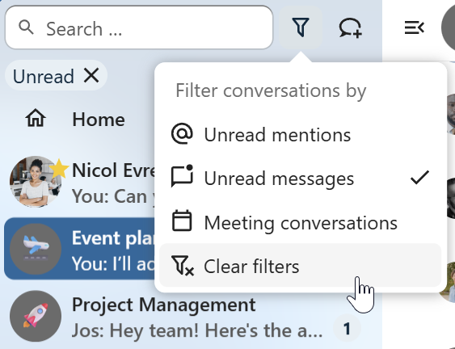

========================
Basics of Nextcloud Talk
========================

Nextcloud Talk lets you chat and have video calls on your own server.

Chats and calls take place in conversations. You can create any number of conversations. There are two kinds of conversations:

1. **One-on-one conversations.** This is where you have a private chat or call with another Talk user. You can't add other people to this conversation or share it with a link. You start a direct one-on-one chat by looking for another user in the search bar and then clicking their name.


2. **Group conversations.** Besides the person who created the conversation, a group conversation can have any number of people in it. A group conversation can be shared publicly with a link, so external guest users can join a call. It can also be listed, so other people on your Nextcloud server can join the conversation.

Creating a chat
---------------

You can create a direct, one-on-one chat by searching for the name of a user, a group or a team and clicking it. For a single user, a conversation is immediately created and you can start your chat. For a group or circle you get to pick a name and settings before you create the conversation and add the participants.


If you want to create a custom group conversation, click the button next to the search field and filters button and then on ``Create a new conversation``.

.. image:: images/create-new-conversation.png
    :width: 400px

You can then pick a name for the conversation, put a description, and set up an avatar for it (with uploaded photo or emoji), and select if the conversation should be open to external users and if other users on the server can see and join the conversation.

.. image:: images/creating-open-conversation.png
    :width: 500px

In the second step, you get to add participants and finalize the creation of the conversation.


After confirmation you will be redirected to the new conversation and can start communicating right away.

.. image:: images/new-room.png
    :width: 700px

View all open conversations
---------------------------

You can view all the conversations that you can join by clicking the button next to the search field and filters button and then on ``Join open conversations.``

.. image:: images/join-open-conversations.png
    :width: 400px

Filter your conversations
-------------------------

You can filter your conversations using the filter button located next to the search field. There are two options for filtering:
1. Filter unread mentions: This option allows you to view group conversations with unread mentions or unread one-on-one conversations.
2. Filter unread messages: This option allows you to view all unread messages in all joined conversations.

.. image:: images/filters-menu.png
    :width: 400px

You can then clear the filter from the filters menu.



Sharing files in a chat
-----------------------

You can share files in a chat in 3 ways.

First, you can simply drag'n'drop them on the chat.

.. image:: images/drag-and-drop.png
   :width: 600px

Second, you can select a file from your Nextcloud Files or a file manager by choosing the little paperclip and selecting where you'd like to pick the file from.

.. image:: images/share-files-in-chat.png
   :width: 500px

.. image:: images/share-files-in-chat-selection.png
    :width: 600px

You can add more files until you are done and decide to share the files. You can also add a text caption to your shared files, providing a brief description or context.

.. image:: images/talk-upload-files.png
   :width: 500px

All users will be able to click the files to view, edit or download them, irrespective of them having a user account. Users with an account will have the file automatically shared with them while external guest users will get them shared as a public link.

.. image:: images/editing-document-in-chat-room.png
   :width: 600px

Inserting emoji
---------------

You can add emoji using the picker on the left of the text input field.

.. image:: images/emoji-picker.png
   :width: 400px

Editing messages
----------------

You can edit messages and captions to file shares up to 6 hours after sending.

.. image:: images/message-editing.png
   :width: 600px

Using Markdown
---------------

You can enhance your messages with a markdown syntax support. See list for usage:

**Headings and dividers**

.. code-block:: none

  # Heading 1
  ## Heading 2
  ### Heading 3
  #### Heading 4
  ##### Heading 5
  ###### Heading 6

  Heading
  ===
  Normal text
  ***
  Normal text

**Inline decorations**

.. code-block:: none

  **bold text** __bold text__
  *italicized text* _italicized text_
  `inline code` ``inline code``
  ```
  .code-block {
    display: pre;
  }
  ```

**Lists**

.. code-block:: none

  1. Ordered list
  2. Ordered list

  * Unordered list
  - Unordered list
  + Unordered list

**Quotes**

.. code-block:: none

  > blockquote
  second line of blockquote

**Task lists**

.. code-block:: none

  - [ ] task to be done
  - [x] completed task

**Tables**

.. code-block:: none

  Column A | Column B
  -- | --
  Data A | Data B

Setting reminder on messages
----------------------------

You can set reminders on specific messages. If there's an important message you want to be notified about later, simply hover over it and click on the reminder icon.

.. image:: images/set-message-reminder.png
   :width: 400px

In the submenu, you can select an appropriate time to receive a notification later.

.. image:: images/configure-message-reminder.png
   :width: 400px

Replying to messages and more
-----------------------------

You can reply to a message using the arrow that appears when you hover a message.

.. image:: images/reply.png
   :width: 600px

In the ``...`` menu you can also choose to reply privately. This will open a one-on-one chat.

.. image:: images/chat-message-menu.png
   :width: 600px

Here you can also create a direct link to the message or mark it unread so you will scroll back there next time you enter the chat. When it is a file, you can view the file in Files.

Silent messages
---------------

If you don't want to disturb anyone in the middle of the night, there is a silent mode for chatting.
While it is enabled, other participants will not receive notifications from your messages.

.. image:: images/message-silent.png
   :width: 600px

Managing a conversation
-----------------------

You are always moderator in your new conversation. In the participant list you can promote other participants to moderators using the ``...`` menu to the right of their user name, assign them custom permissions or remove them from the conversation.

Changing permissions of a user that joined a public conversation will also permanently add them to the conversation.

.. image:: images/participant-menu.png
    :width: 400px

Moderators can configure the conversation. Select ``Conversation settings`` from the ``...`` menu of the conversation on the top to access the settings.

.. image:: images/open-settings.png
    :width: 400px

Here you can configure the description, guest access, if the conversation is visible to others on the server and more.

.. image:: images/conversation-settings-dialog.png
   :width: 600px

Messages expiration
-------------------

A moderator can configure message expiration under the ``Conversation settings`` within the ``Moderation`` section. Once a message reaches its expiration time, it is automatically removed from the conversation.
The available expiration durations are 1 hour, 8 hours, 1 day, 1 week, 4 weeks, or never (which is the default setting).

.. image:: images/messages-expiration.png
   :width: 500px


Starting a call
---------------

When you're in a conversation, you can start a call any time with the ``Start call`` button. Other participants will get notified and can join the call.


If somebody else has started a call already, the button will change in a green ``Join call`` button.

.. image:: images/join-call.png
    :width: 600px

During a call, you can mute your microphone and disable your video with the buttons on the right side of the top bar, or using the shortcuts ``M`` to mute audio and ``V`` to disable video. You can also use the space bar to toggle mute. When you are muted, pressing space will unmute you so you can speak until you let go of the space bar. If you are unmuted, pressing space will mute you until you let go.

You can hide your video (useful during a screen share) with the little arrow just above the video stream. Bring it back with the little arrow again.

You can access your settings and choose a different webcam, microphone and other settings in the ``...`` menu in the top bar.


From media settings dialog, you can also change the background of your video.

.. image:: images/background-settings-in-call.png
    :width: 400px

You can change other settings in the ``Talk settings`` dialog.

.. image:: images/talk-settings.png
    :width: 600px

Starting a screen share
-----------------------

You can click the monitor icon on your video stream to share your screen. Depending on your browser, you will get the option to share a monitor, an application window or a single browser tab.
If video from your camera is also available, other participants will see it in a small presenter view next to the screen share.

.. image:: images/share-screen-with-camera.png
    :width: 700px

Changing view in a call
-----------------------

You can switch the view in a call with the little four-block icon in the top-right between promoted-view and grid view. The grid view will show everyone equally big and if the people do not fit on the screen, buttons will appear on the left and right that let you navigate.


The promoted view shows the speaker large and others in a row below. If the people do not fit on the screen, buttons will appear on the left and right that let you navigate.

.. image:: images/talk-promoted-view.png
    :width: 700px


