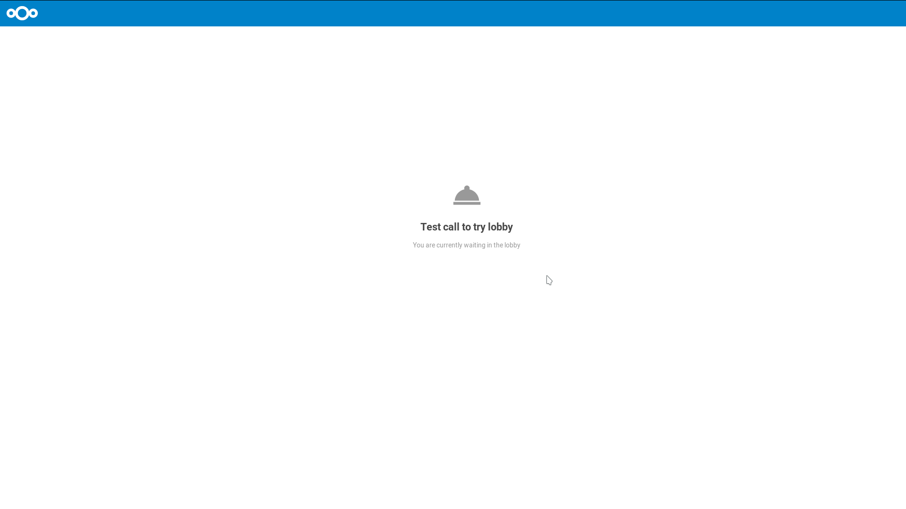

=================
Webinar and lobby
=================

The lobby feature allows you to show guests a waiting screen until the call starts. This is ideal for webinars with external participants, for example.

You can choose to let the participants join the call at a specific time, or when you dismiss the lobby manually.

You can configure the lobby in ``Conversation settings`` under the ``Webinar`` section.
