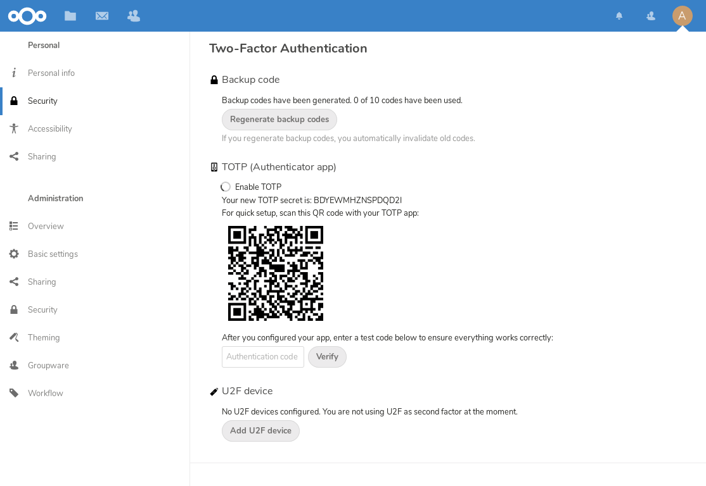

===============================
Using two-factor authentication
===============================

Two-factor authentication (2FA) is a way to protect your Nextcloud account
against unauthorized access. It works by requiring two different 'proofs' of
your identity. For example, *something you know* (like a password) and 
*something you have* like a physical key. Typically, the first factor is a
password like you already have and the second can be a text message you
receive or a code you generate on your phone or another device
(*something you have*). Nextcloud supports a variety of 2nd factors and
more can be added.

Once a two-factor authentication app has been enabled by your administrator
you can enable and configure it in :doc:`userpreferences`. Below you can
see how.

Configuring two-factor authentication
-------------------------------------

In your Personal Settings look up the Second-factor Auth setting. In this
example this is TOTP, a Google Authenticator compatible time-based code:

You will see your secret and a QR code which can be scanned by the TOTP app
on your phone (or another device). Depending on the app or tool, type in the
code or scan the QR and your device will show a login code which changes
every 30 seconds.

Recovery codes in case you lost your 2nd factor
-----------------------------------------------

You should always generate backup codes for 2FA. If your 2nd factor device
gets stolen or is not working, you will be able to use one of these codes to
unlock your account. It effectively functions as a backup 2nd factor. To
get the backup codes, go to your Personal Settings and look under Second-factor
Auth settings. Choose *Generate backup codes*:

You will then be presented with a list of one-time-use backup codes:
     

You should put these codes in a safe spot, somewhere you can find them. Don't
put them together with your 2nd factor like your mobile phone but make sure that
if you lose one, you still have the other. Keeping them at home is probably
the best thing to do.

Logging in with two-factor authentication
-----------------------------------------

After you have logged out and need to log in again, you will see a request to
enter the TOTP code in your browser. If you enable not only the TOTP factor
but another one, you will see a selection screen on which you can choose
two-factor method for this login. Select TOTP:

.. figure:: images/totp_login_1.png
     :alt: Choosing a two-factor authentication method.

Now, just enter your code:

.. figure:: images/totp_login_2.png
     :alt: Entering TOTP code at login.

If the code was correct you will be redirected to your Nextcloud account.

.. note:: Since the code is time-based, it’s important that your server’s and
  your smartphone’s clock are almost in sync. A time drift of a few seconds
  won’t be a problem.

Using two-factor authentication with hardware tokens
----------------------------------------------------
You can use two-factor authentication based on hardware tokens. The following devices are known to work:

*    TOTP based:

     *    `Nitrokey Pro <https://shop.nitrokey.com/shop/product/nitrokey-pro-2-3>`_
     *    `Nitrokey Storage <https://shop.nitrokey.com/shop>`_

*    FIDO2 based:

     *    `Nitrokey FIDO2 <https://shop.nitrokey.com/shop/product/nkfi2-nitrokey-fido2-55>`_
     *    `Nitrokey FIDO U2F <https://shop.nitrokey.com/shop/product/nitrokey-fido-u2f-20>`_

Using client applications with two-factor authentication
--------------------------------------------------------

Once you have enabled 2FA, your clients will no longer be able to connect with
just your password unless they also have support for two-factor authentication.
To solve this, you should generate device specific passwords for them. See 
:doc:`session_management` for more information on how to do this.

Considerations
--------------

If you use WebAuthn to login to your Nextcloud be sure to not use the same token for 2FA. As this
would mean you are again only using a single factor.
