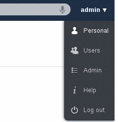

Changing Preferences
====================

As a user, you can change your personal settings by clicking on your username
on the top-right of ownCloud instance and choosing *Personal*.

If you are an administrator, you can also manage users and administer the server
by using the related links. Those links will not be shown to a normal user.

This document will explain the default items on this page. Depending on the enabled
applications, you may have more options listed.

* In the beginning of the page, you will see your usage and available quota.

* You can change your password. For that, you need to enter your current and new password in the field
  named *Password*. If you would like to able to recover your password via e-mail, fill the e-mail field
  with the one that you currently using.

* By default, your image will have the initial of your username. This image is currently used in editing documents.
  You can either upload a new image or choose one from the existing images on your ownCloud to set.

* In this page, you can also change your web interface language if you want to override the browser settings.

* WebDAV link will allow you to only view and download your ownCloud files using a browser. You will still need
  your username and password to access this page.

* Documents app will have an option to specify the folder for newly created documents. You can set the folder here.

* This page will have more options if you have e.g. external storage app enabled.
