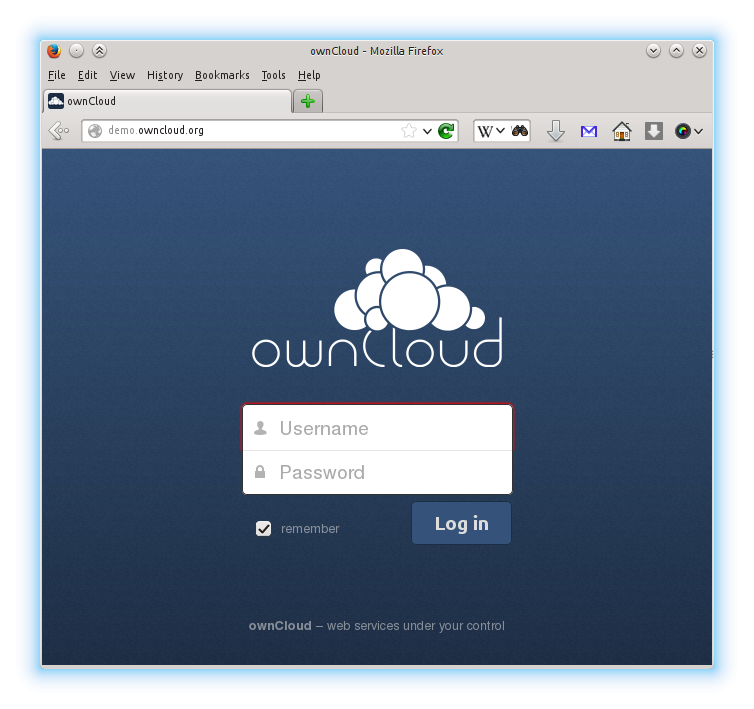

The ownCloud Web Interface 
==========================

You can connect to ownCloud with your web browser by pointing
it to the address that you have received from your service
provider. In case you are administering the server yourself,
have a look at `ownCloud Administrators Manual <http://doc.owncloud.org/server/7.0/admin_manual/>`_.

When you enter the URL, you will receive a page that is similar
to the one depicted below:

   The ownCloud login screen

Login with the user name and password with you have received from
your service provider. If you have set up the server yourself,
log in with the user name which you have created during the
setup process. You can add further users through the settings,
or by hooking up a user backend, such as LDAP.

Overview
--------

After clicking the :guilabel:`Log in` button, you will be redirected
to ownCloud's main web interface:

   The ownCloud main interface with the essential elements numbered

The web interface comprises of the following items:

1. **Apps menu**: Allows navigation between different parts of ownCloud,
   provided by apps. Administrators will also see a button called **Apps**.
   Using this button allows administrators to enable/disable apps.
2. **Application view**: This is where apps show their content. By default, this
   will show the files and directory (file view) of your user on the ownCloud
   installation.
3. **New/Upload button**: This allows you to create new files or upload
   existing ones from your device. Note that you can also drop files from
   Explorer or Finder onto the ownCloud file view and they will get uploaded to
   ownCloud. With *New* button, you can create a text file, folder or download
   a file from the provided URL.
4. **Search/Settings**: *Search* allows you to look for files and
   directories. Currently, ownCloud provides a full text search. If full text seach does
   not work, administrators need to enable this app from app settings.
   *Settings* menu provides access to the settings menu, where you can
   change your personal settings, such as the interface language or your
   password. You can also retrieve the WebDAV URL (see next chapter) and show
   your quota. Administrators will also get access to user management
   (:guilabel:`Users`), the apps settings (:guilabel:`Apps`) and administrative settings (:guilabel:`Admin`)
   including access to ownCloud's log. You will also find a logout button in this menu.
5. **App Settings** field will contain various sections to access different views of the app. For example,
   the files app allows you to see the files *Shared with you* or *Shared with others*.
   This field may also include a |gear| icon to access to various options provided by the app.

.. |gear| image:: images/gear.png
