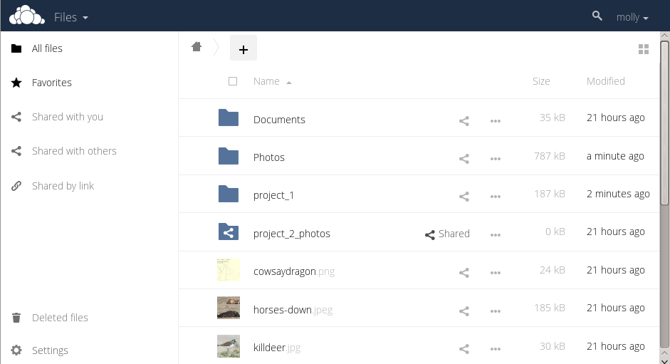

The ownCloud Web Interface
==========================

You can connect to your ownCloud server using any web browser. To access the 
ownCloud server using a web browser, specify the uniform resource link (URL) 
address of the server in the browser navigation bar.  This can be the URL 
address of your personal ownCloud setup or a URL address that you have received 
from your company or your service provider.

.. note:: If you are administering the server yourself, we recommend that you 
   read the `ownCloud Administrators Guide
   <http://doc.owncloud.org/server/8.0/admin_manual/>`_.
.. TODO ON RELEASE: Update version number above on release

Accessing the ownCloud Web Interface
------------------------------------

To access the ownCloud web interface:

1. Enter the URL address of the ownCloud server into your browser navigation 
bar.

  The ownCloud login window opens.

  .. figure:: images/oc_connect.png
    :scale: 75%

    **ownCloud login window**

2. Enter your valid username and password.

   The username and password combination can be those that you set up yourself
   when creating your ownCloud server setup or those provided by your company or
   your service provider.

   If you have set up the server yourself or are administering the server, you
   can add additional users by configuring a user backend (for example, LDAP).

3. Click the :guilabel:`Log in` button.

   The ownCloud main interface opens.

   .. figure:: images/oc_main_web.png

     **ownCloud main user interface**

Navigating the Main User Interface
------------------------------------

Once you have accessed the ownCloud Server main web interface you can add files, 
remove files, and make changes based on the access privileges set by you
(if you are administering the server) or by your server administrator.

  **Navigating the main user interface**

The ownCloud Main User Interface contains the following fields and functions:

* **Apps Selection Menu**: Located in the upper left corner of the user
  interface, this bar contains apps that are configured on the ownCloud server.
  The icons in this bar enable you to launch the different apps available and
  navigate between them within the ownCloud user interface.

.. note:: ownCloud supports a number of apps that can be installed and used for
   various features and functions.  Not all apps are installed and enabled by
   default.  For example, the :guilabel:`Apps` button is visible only to
   administrators.  This button allows administrators to enable or disable
   installed applications.

* **Apps Information** field: Located in the left side bar, this field provides
  filters and tasks associated with the chosen app.  For example, using the
  Files app, you can use the filters in the apps information field to view only
  files that have been shared with you, files that you have shared with others,
  files that you have shared through the use of a link, or an option to delete
  files.  Other app-specific information fields might provide tasks for creating
  new documents or modifying calendar entries.

* **Application View**: The main, central field in the ownCloud user interface.
  This field displays the contents or user features of the app selected in the
  Navigation Bar.  By default, this field shows the files and directory
  ("Files" view) of your user account.

* **Navigation Bar**: Located over the main viewing window (the Application
  View), this bar provides a type of breadcrumbs navigation that enables you to
  migrate to higher levels of the folder hierarchy up to the root level (home) 
  of your ownCloud instance.

* **New** button: Located in the Navigation Bar, the :guilabel:`New` button
  enables you to create new files, new folders, or upload existing files from a
  specified link.

.. note:: You can also drag and drop files from your file manager (e.g. Windows 
   Explorer or your Mac OS X Finder) into the ownCloud Files Application 
   View to upload them to ownCloud.

* **Upload** button: Located next to the :guilabel:`New` button in the
  Navigation Bar, the :guilabel:`Upload` button enables you to upload files
  from your system to the ownCloud server.  Clicking this button launches a
  file picker (e.g. Windows Explorer or Mac OS X Finder) window with which you
  can choose files for uploading.

* **Search** field: Residing in the upper right hand corner of the Main User
  Interface window, the Search field enables you to search for files and
  folders stored in ownCloud. The ownCloud search function provides a full text
  search. However, for searching to function, administrators must enable the app
  in the search app settings.

* **Personal Settings** menu: Located to the right of the Search field, the
  Personal Settings dropdown menu provides access to your personal settings
  page and the ability to log out of your ownCloud user session.  The personal
  settings page provides access to the following:

  * Activity notifications
  * Server usage and space availability
  * Password management
  * Name, email, and profile picture settings
  * Interface language settings
  * WebDAV URL for receiving files using WebDAV (see next chapter).
  * Mozilla Sync information for creating a synchronization to a Mozilla 
    (Firefox) account.
  * ownCloud Version information

  You can see :doc:`userpreferences` section to learn more about those settings.

In addition to these standard settings, administrators have access to user
management (:guilabel:`Users`), apps settings (:guilabel:`Apps`), and
administrative settings (:guilabel:`Admin`) including access to the ownCloud
log files.

