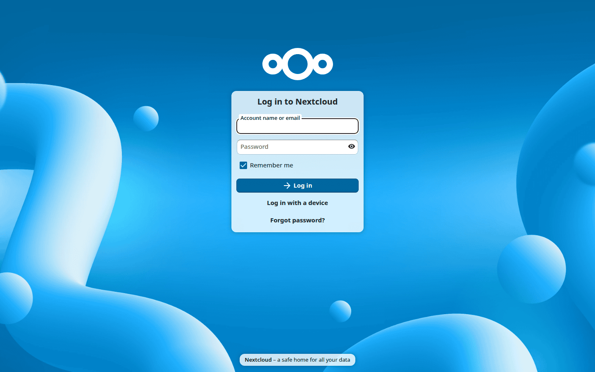
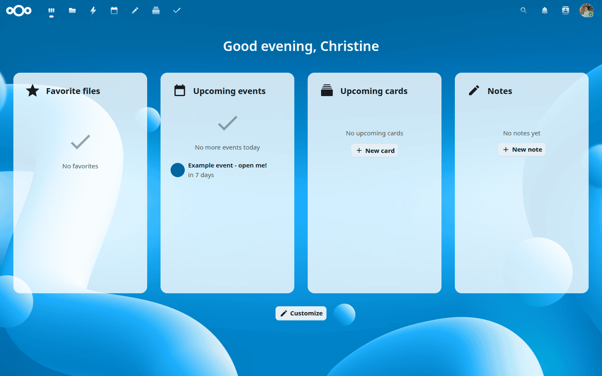
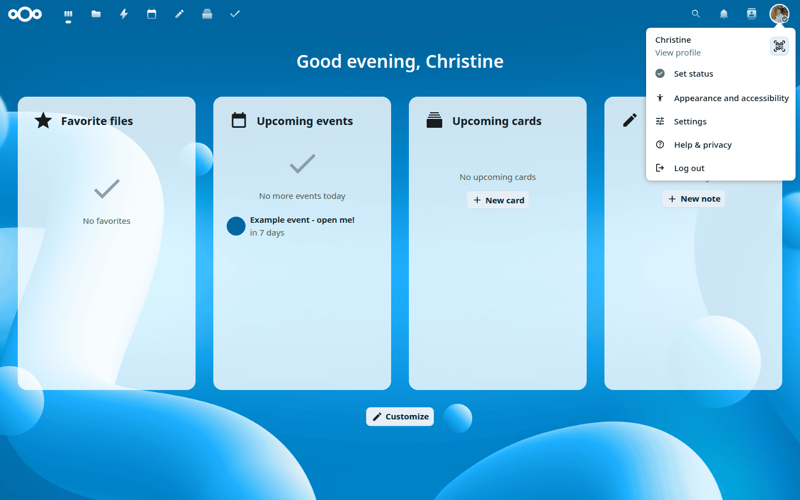
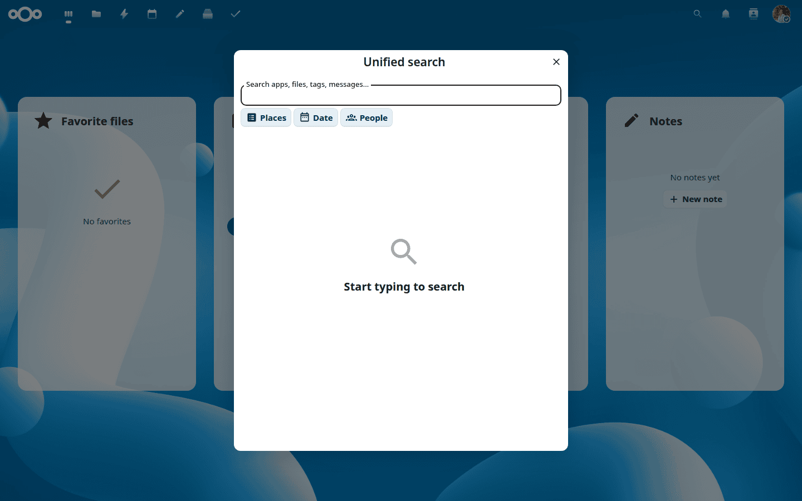

===========================
The Nextcloud web interface
===========================

Open your Nextcloud server's URL in any web browser and log in with your account name (or email address) and password:

You can also log in using a passkey or hardware security key by clicking **Log in with a device**.

Web browser requirements
------------------------

For the best experience, use the latest version of one of these browsers:

* Google **Chrome** / Chromium
* Mozilla **Firefox**
* Apple **Safari**
* Microsoft **Edge**

.. note:: Not all versions are supported. Nextcloud targets `browsers meeting the minimum usage threshold <https://browserslist.dev/?q=PjAuMjUlLCBub3Qgb3BfbWluaSBhbGwsIG5vdCBkZWFkLCBGaXJlZm94IEVTUg==>`_.

The Dashboard
-------------

After logging in, Nextcloud opens the **Dashboard** — a customisable overview of your most important activity: upcoming calendar events, unread messages, recent files, and more.

Use the **Customise** button at the bottom of the page to add, remove, or rearrange widgets to suit your workflow.

Navigating the interface
------------------------

The navigation bar at the top of every page is your main access point:

* The **Nextcloud logo** (top left) takes you back to the Dashboard.
* **App shortcuts** are shown next to the logo — click any icon to switch to that app (Files, Calendar, Talk, and so on).
* The **search icon** on the right opens :ref:`unified search <unified-search>`, which searches across all your apps at once.
* The **bell icon** shows your notifications.
* The **contacts icon** lets you quickly look up and contact other users on your server.
* Your **profile picture** (far right) opens the settings menu.

Each app also has its own **left sidebar** with filters and actions specific to that app.

Settings and profile
--------------------

Click your profile picture in the top-right corner to access your account options:

From this menu you can:

* View and edit your profile
* Set your online status
* Change appearance and accessibility settings
* Open your personal :doc:`Settings <userpreferences>` page
* Access help and privacy information
* Log out

Unified search
--------------

.. _unified-search:

Click the search icon in the navigation bar (or press :kbd:`Ctrl+F`) to open the unified search modal:

Unified search looks across all your installed apps — files, calendar events, messages, contacts, and more — at once. Results are grouped by app so you can quickly see where a match was found.

Use the filter chips to narrow results:

* **Places** — limit the search to a specific app, such as Files or Calendar.
* **Date** — filter by time period (today, last 7 days, last 30 days, this year, or a custom range).
* **People** — show only results related to a specific person.
