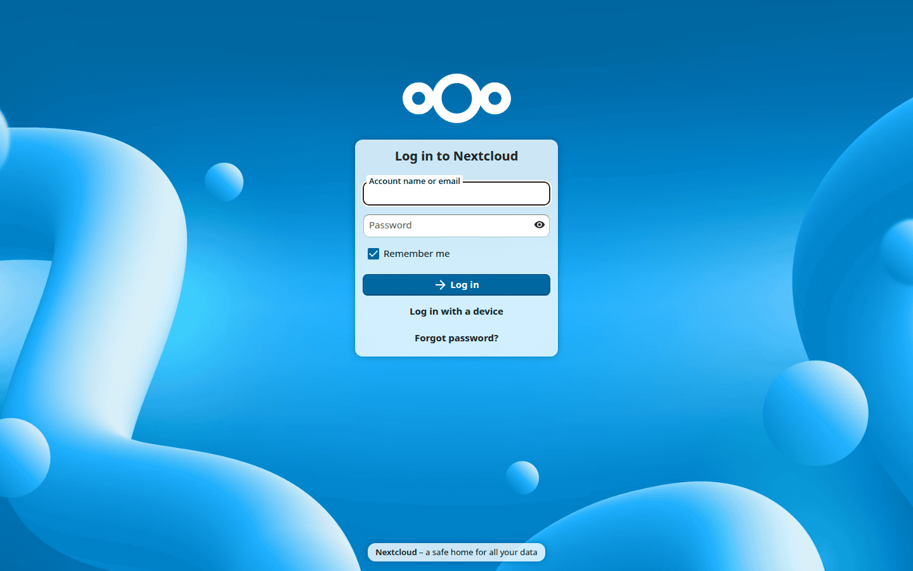
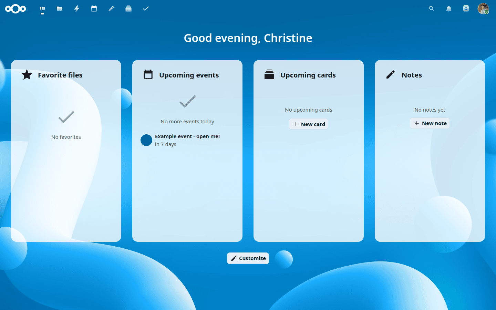
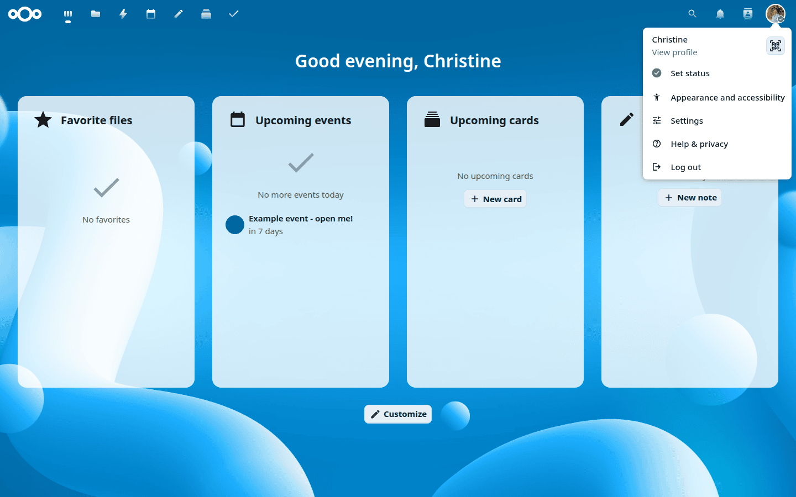
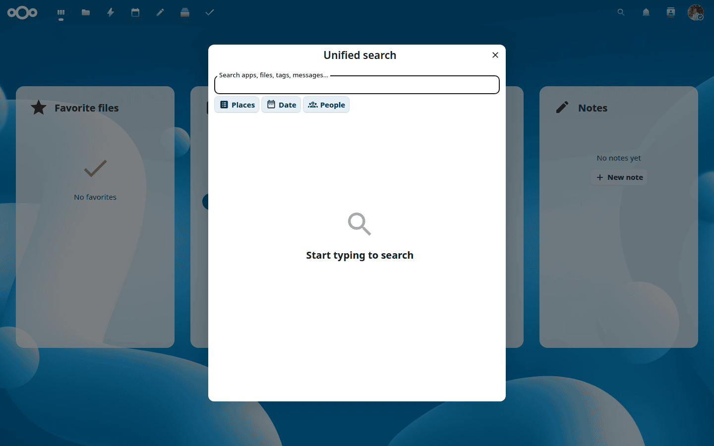

===========================
A interface Web do Nextcloud
===========================

Abra a URL do seu servidor Nextcloud em qualquer navegador web e acesse com o seu nome de usuário (ou endereço de e-mail) e a sua senha:

Você também pode fazer login usando uma senha ou chave de segurança clicando em **Fazer login com um dispositivo**.

Requisitos do navegador web
------------------------

Para uma melhor experiência, utilize a versão mais recente de um destes navegadores:

* Google **Chrome** / Chromium
* Mozilla **Firefox**
* Apple **Safari**
* Microsoft **Edge**

.. note:: Nem todas as versões são suportadas. O Nextcloud tem como alvo navegadores que atendam ao limite mínimo de uso <https://browserslist.dev/?q=PjAuMjUlLCBub3Qgb3BfbWluaSBhbGwsIG5vdCBkZWFkLCBGaXJlZm94IEVTUg==>`_.

O painel de controle
-------------

Após fazer login, o Nextcloud abre o **Painel de Controle** — uma visão geral personalizável das suas atividades mais importantes: eventos futuros da agenda, mensagens não lidas, arquivos recentes e muito mais.

Use o botão **Personalizar** na parte inferior da página para adicionar, remover ou reorganizar widgets de acordo com seu fluxo de trabalho.

Navegando pela interface
------------------------

A barra de navegação no topo de cada página é o seu principal ponto de acesso:

* O **logotipo do Nextcloud** (canto superior esquerdo) leva você de volta ao Painel de Controle.
* **Atalhos de aplicativos** são exibidos ao lado do logotipo — clique em qualquer ícone para alternar para o aplicativo correspondente (Arquivos, Calendário, Talk etc.).
* O **ícone de pesquisa** à direita abre a :ref:`busca unificada <unified-search>`, que pesquisa em todos os seus aplicativos ao mesmo tempo.
* O **ícone de sino** mostra suas notificações.
* O **ícone de contatos** permite que você localize e entre em contato rapidamente com outros usuários em seu servidor.
* Sua **foto de perfil** (à direita) abre o menu de configurações.

Cada aplicativo também possui sua própria **barra lateral esquerda** com filtros e ações específicas para aquele aplicativo.

Configurações e perfil
--------------------

Clique na sua foto de perfil para acessar as opções da sua conta:

A partir deste menu você pode:

* Ver e edite seu perfil
* Definir seu status online
* Alterar as configurações de aparência e acessibilidade
* Abra sua página pessoal de :doc:`Configurações <userpreferences>`
* Acesse informações sobre ajuda e privacidade
* Sair

Busca unificada
--------------

.. _unified-search:

Clique no ícone de pesquisa na barra de navegação (ou pressione :kbd:`Ctrl+F`) para abrir o modal de pesquisa unificada:

A busca unificada pesquisa em todos os seus aplicativos instalados — arquivos, eventos da agenda, mensagens, contatos e muito mais — simultaneamente. Os resultados são agrupados por aplicativo para que você possa ver rapidamente onde uma correspondência foi encontrada.

Use os chips de filtro para refinar os resultados:

* **Lugares** — limite a pesquisa a um aplicativo específico, como Arquivos ou Calendário.
* **Data** — filtre por período (hoje, últimos 7 dias, últimos 30 dias, este ano ou um intervalo personalizado).
* **Pessoas** — mostrar apenas resultados relacionados a uma pessoa específica.
