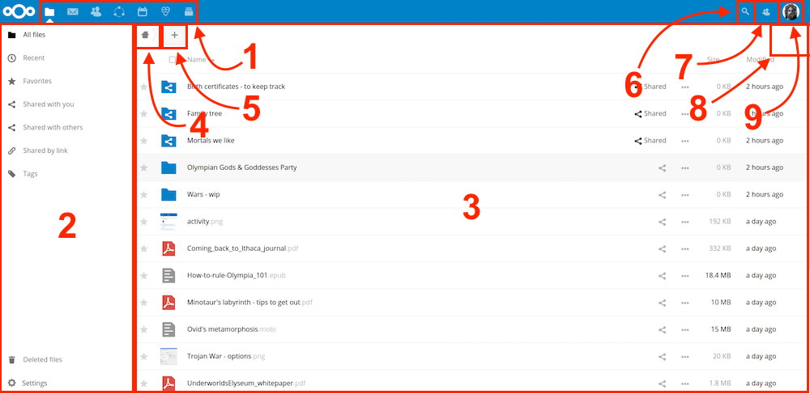

===========================
The Nextcloud Web interface
===========================

You can connect to your Nextcloud server using any Web browser. Just point it to
your Nextcloud server URL (e.g. cloud.example.com) and enter your username and password:

Web browser requirements
------------------------

For the best experience with the Nextcloud web interface, we recommend that
you use the latest and supported version of a browser from this list:

* Google **Chrome**/Chromium (Desktop and Android)
* Mozilla **Firefox** (Desktop and Android)
* Apple **Safari** (Desktop and iOS)
* Microsoft **Edge**

.. note:: Not all versions are supported. Nextcloud is tested and built to work with `these versions only.
   <https://browserslist.dev/?q=PjAuMjUlLCBub3Qgb3BfbWluaSBhbGwsIG5vdCBkZWFkLCBGaXJlZm94IEVTUg==>`_

.. note:: If you want to use Nextcloud Talk you need to run Mozilla **Firefox** 52+
   or Google **Chrome**/Chromium 49+ to have the full experience with video calls and
   screensharing.

.. warning:: Microsoft **Internet Explorer** is **NOT** supported.

Navigating the main user interface
----------------------------------

By default, the Nextcloud Web interface opens to your Dashboard or Files page:

In Files you can add, remove, and share files, and the server administrator
can change access privileges.

The Nextcloud user interface contains the following fields and functions:

* **Apps Selection Menu** (1): Located in the upper left corner, you'll find all
  your apps which are available on your instance of Nextcloud. Clicking on an
  app icon will redirect you to the app.

* **Apps Information** field (2): Located in the left sidebar, this provides
  filters and tasks associated with your selected app. For example, when you
  are using the Files app you have a special set of filters for quickly
  finding your files, such as files that have been shared with you, and files
  that you have shared with others. You'll see different items for other apps.

* **Application View** (3): The main central field in the Nextcloud user interface.
  This field displays the contents or user features of your selected app.

* **Navigation Bar** (4): Located over the main viewing window (the Application
  View), this bar provides a type of breadcrumbs navigation that enables you to
  migrate to higher levels of the folder hierarchy up to the root level (home).

* **New** button (5): Located in the Navigation Bar, the ``New`` button
  enables you to create new files, new folders, or upload files.

.. note:: You can also drag and drop files from your file manager into the
   Files Application View to upload them to your instance.

* **Search** field (6): Click on the Magnifier in the upper right corner
  to search for files and entries of the current app.

* **Contacts Menu** (7): Gives you an overview about your contacts and users on
  your server. Dependent on the given details and available apps, you can
  directly start a video call with them or send emails.

* **Grid view** button (8): This looks like four little squares, which toggles
  the grid view for folders and files.

* **Settings** menu (9): Click on your profile picture,
  located to the right of the Search field, to open your Settings
  dropdown menu. Your Settings page provides the following settings and features:

  * Links to download desktop and mobile apps
  * Server usage and space availability
  * Password management
  * Name, email, and profile picture settings
  * Manage connected browsers and devices
  * Group memberships
  * Interface language settings
  * Manage notifications
  * Federated Cloud ID and social media-sharing buttons
  * SSL/TLS certificate manager for external storages
  * Your Two-factor Settings
  * Nextcloud Version information

See :doc:`userpreferences` section to learn more about these settings.
