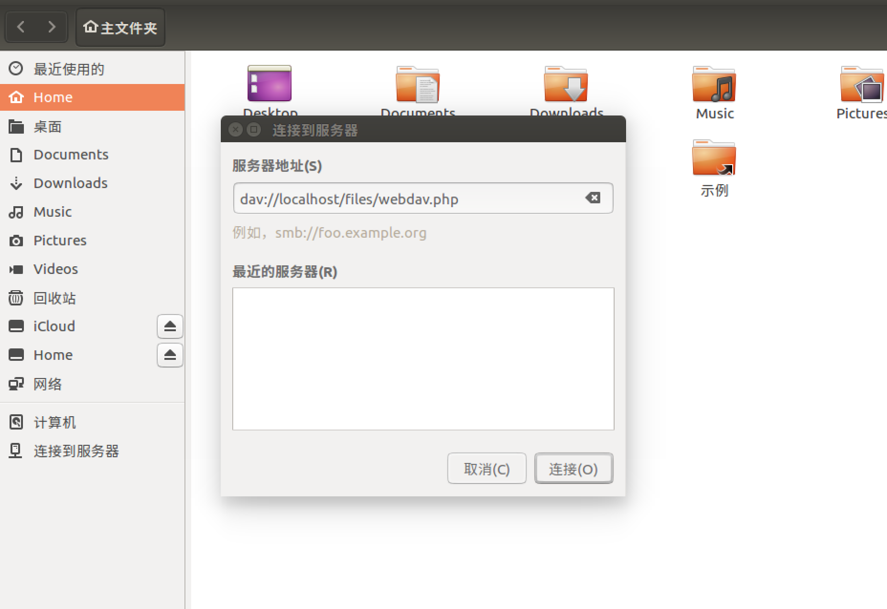
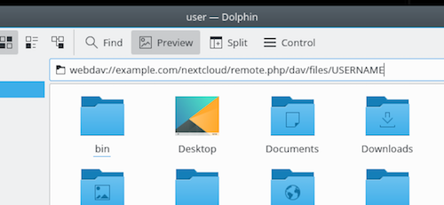
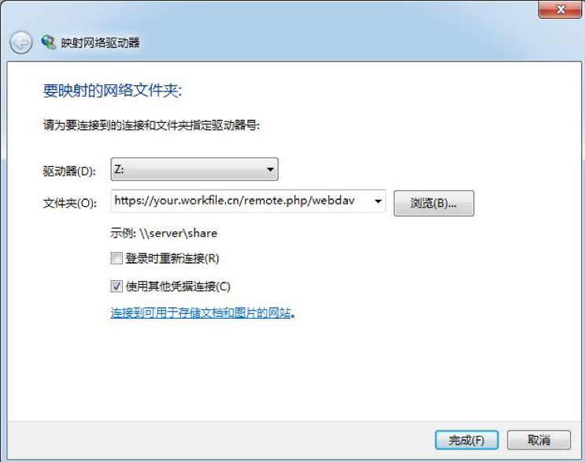

==========================
使用WebDAV访问Nextcloud文件
==========================

Nextcloud完全支持WebDAV协议，您可以通过WebDAV与您的Nextcloud文件进行连接和同步。 在本章中，您将学习如何通过WebDAV将Linux，Mac OS X，Windows和移动设备连接到Nextcloud服务器。 在配置WebDAV之前，让我们快速了解一下将客户端设备连接到Nextcloud服务器的推荐方法。

Nextcloud桌面和移动客户端
-------------------------

将桌面PC与您的Nextcloud服务器同步的推荐方法是使用 `Nextcloud/Owncloud同步客户端 <https://nextcloud.com/install/#install-clients>`_。您可以将客户端配置为将文件保存在所需的任何本地目录中，并可选择Nextcloud服务器上要同步的目录。客户端显示当前连接状态并记录所有活动，因此您始终知道哪些远程文件已下载到您的PC，您可以验证在本地PC上创建和更新的文件是否与服务器正确同步。

建议与您Nextcloud服务器和安卓、苹果IOS设备的方法是使用 `移动App应用 <https://nextcloud.com/install/>`_。

要使用移动应用连接到您的Nextcloud服务器，请只使用基本URL和文件夹::

    example.com/nextcloud

除了由Nextcloud或ownCloud提供的移动应用程序，您还可以使用其他应用程序使用WebDAV从您的移动设备连接到Nextcloud。 `WebDAV Navigator`_ 是个优秀的专有的App，适 `安卓设备`_ 和 `iPhone`_ 。在这些设备上使用的URL地址是:
    
    example.com/nextcloud/remote.php/dav/files/USERNAME/

WebDAV配置
----------

如果您愿意，还可以使用WebDAV协议将桌面PC连接到Nextcloud服务器，而不是使用特殊的客户端应用程序。 Web分布式创作和版本控制（WebDAV）是一种超文本传输协议（HTTP）扩展，可以轻松地在Web服务器上创建，读取和编辑文件。 使用WebDAV，您可以以与任何远程网络共享相同的方式访问Linux，Mac OS X和Windows上的Nextcloud共享，并保持同步。

.. 提示:: 在下面的示例中, 您需要用您的Nexcloud服务器安装地址替换 **example.com/**。

使用Linux访问文件
----------------

您可以在Linux操作系统中通过下面方法访问文件。

Nautilus文件管理器 
^^^^^^^^^^^^^^^^^^^^^

在Nautilus文件管理器中使用 ``davs://`` 协议:

  davs://example.com/nextcloud/remote.php/dav/files/USERNAME/

.. 提示:: 如果服务器连接不是安全的HTTPS，使用 `dav://`代替 `davs://` 。

在KDE中使用Dolphin 文件管理器
^^^^^^^^^^^^^^^^^^^^^^^^^^^^^^^^^^^^^^^^^^^^^^^^^

使用KDE中的Dolphin文件管理器访问您的Nextcloud文件, 使用 ``webdav://`` 协议::

    webdav://example.com/nextcloud/remote.php/dav/files/USERNAME/

您可以创建一个链接到Nextcloud服务器的持久链接:

#. 打开Dolphin，然后点击左侧“位置”列中的“网络”。
#. 点击“增加网络文件夹”图标。所显示的对话框应该包括WebDAV。
#. 如果WebDAV没有选中，选中它。
#. 单击下一步。
#. 输入下面配置:

    * 名称：显示在“位置”书签中的名字，例如Nextcloud。

    * 用户名：您的Nextcloud登录名，例如admin。

    * 服务器：Nextcloud服务域名, 例如 **example.com** (开头不包括 **http://**，结尾不包括目录)。

    * 文件夹： 输入路径 nextcloud/remote.php/dav/files/USERNAME/。

#. (可选) 检查“创建图标”复选框以使书签显示在“位置”列中。

#. (可选) 在“端口和加密”复选框中提供任何特殊设置或SSL证书。

在Linux命令行上创建WebDAV挂载
------------------------------------------------

您可以从Linux命令行创建WebDAV挂载。 如果您喜欢以与任何其它远程文件系统挂载相同的方式访问Nextcloud，这将非常有用。 以下示例显示如何创建个人挂载并在每次登录到Linux计算机时自动安装。

1. 安装 ``davfs2`` WebDAV文件系统驱动，这将允许您像其它远程文件系统一样挂载 WebDAV共享。在Debian/Ubuntu中安装使用以下命令:: 

    apt-get install davfs2

2. 在CentOS、Fedora和openSUSE中使用以下命令::

    yum install davfs2

3. 增加用户到 ``davfs2`` 组::

    usermod -aG davfs2 <username>

4. 然后在用户家目录中创建 ``nextcloud`` 挂载目录, 为个人的配置文件创建 ``.davfs2/`` 目录::

    mkdir ~/nextcloud
    mkdir ~/.davfs2

5. 复制 ``/etc/davfs2/secrets``到 ``~/.davfs2`` ::

    cp  /etc/davfs2/secrets ~/.davfs2/secrets

6. 设置所有者和读写权限:

    chown <username>:<username> ~/.davfs2/secrets
    chmod 600 ~/.davfs2/secrets

7. 将您的Nextcloud登录凭证添加到 ``secrets``文件末尾，使用您的Nextcloud服务器URL和您的Nextcloud用户名和密码：

    example.com/nextcloud/remote.php/dav/files/USERNAME/ <username> <password>

8. 在 ``/etc/fstab`` 中增加挂载配置::

    example.com/nextcloud/remote.php/dav/files/USERNAME/ /home/<username>/nextcloud
    davfs user,rw,auto 0 0

9. 然后通过运行以下命令来测试挂载和认证。如果配置正确，您将不需要root权限:
    
   mount ~/nextcloud

10. 您也可以卸载: 

    umount ~/nextcloud

现在每次登录到您的Linux系统时，您的Nextcloud共享通过WebDAV自动挂载 ``~/nextcloud`` 目录中。如果您喜欢手动挂载，请在 ``/etc/fstab`` 中将 ``auto`` 更改为 ``noauto`` 。
    

已知的问题
------------

问题
^^^^^^^
资源暂时不可用

解决方法
^^^^^^^^
如果在目录中创建文件时遇到问题，请编辑 ``/etc/davfs2/davfs2.conf`` 并添加::

    use_locks 0

问题
^^^^^^^
证书警告

解决方法
^^^^^^^^

如果您使用自签名证书，您将收到警告。要更改此警告，您需要配置 ``davfs2`` 认可您的证书。将 ``mycertificate.pem`` 复制到 ``/etc/davfs2/certs/`` 。然后编辑 ``/etc/davfs2/davfs2.conf`` 并取消注释行 ``servercert`` 。现在添加证书的路径，如本例所示::

 servercert /etc/davfs2/certs/mycertificate.pem

使用macOS访问Nextcloud文件
---------------------------

.. 提示::
 macOS Finder遇到 `一系列实现问题 <http://sabre.io/dav/clients/finder/>`_，需要在Nextcloud服务器运行 **Apache**和 **mod_php**， **Nginx 1.3.8以上版本**。

通过 macOS Finde访问文件:

1. 选择 **前往** > **链接服务器**。

   "连接服务器"窗口打开。

2. 在 **服务器地址**中输入Nextcloud服务器地址。 

  .. image:: ../images/osx_webdav1.png
     :alt: 在Mac OS X上输入 Nextcloud 服务器地址

  例如用于从macOS Finder连接到Nextcloud服务器的地址是::
 
    https://example.com/nextcloud/remote.php/dav/files/USERNAME/

  .. image:: ../images/osx_webdav2.png

3. 点击 **连接**。

  设备将连接到服务器。 

有关如何使用Mac OS X连接到外部服务器的详细信息，查看 `参数文档
<http://docs.info.apple.com/article.html?path=Mac/10.6/en/8160.html>`_ 。

使用微软Windows访问Nextcloud文件
--------------------------------

最好从 `WebDAV项目页面 <http://www.webdav.org/projects/>`_ 选择合适的WebDAV客户端。

如果您必须使用原生的Windows实现，则可以将Nextcloud映射到新的驱动器。 映射到驱动器可以以文件存储在映射网络驱动器中的方式浏览存储在Nextcloud服务器上的文件。

.. 提示:: 在映射驱动器之前, 必须允许Windows注册表使用基本身份验证。过程记录在KB841215，在Windows XP/Server 2003和Windows Vista/7不同。请按照知识库文章继续操作，如果运行Windows 7，请遵循Vista说明。 

.. _KB841215: https://support.microsoft.com/kb/841215

使用命令行映射驱动器
^^^^^^^^^^^^^^^^^^^^^^^^^^^^^^^^^^^^

以下示例显示如何使用命令行映射驱动器。 为了映射驱动器:

1. 在Windows中打开命令行提示符。

2. 在命令行提示符中输入以下命令映射到驱动器Z:: 

    net use Z: https://<drive_path>/remote.php/dav/files/USERNAME/ /user:youruser
    yourpassword

  <drive_path>您的Nextcloud服务器地址。

例如: ``net use Z: https://example.com/nextcloud/remote.php/dav/files/USERNAME/
/user:youruser yourpassword``

计算机将您的Nextcloud帐户的文件映射到驱动器Z。

.. 提示:: 
 虽然不推荐，您也可以使用HTTP挂载Nextcloud服务器，使连接未加密。如果您在公共场所在设备上使用HTTP连接，建议您使用VPN隧道技术来提供必要的安全。

另一种命令语法是::

  net use Z: \\example.com@ssl\nextcloud\remote.php\dav /user:youruser
  yourpassword

使用Windows资源管理器映射驱动器
^^^^^^^^^^^^^^^^^^^^^^^^^^^^^^^

为了使用Windows资源管理器映射:

1. 打开Windows资源管理器。

2. 在 **我的电脑**右键下拉菜单单击打开 **映射网络驱动器...**。

3. 选择需要映射到Nextcloud的本地网络驱动器。

4. 指定您的Nextcloud实例的地址，接着输入 **/remote.php/dav/files/USERNAME/**。

  例如::

    https://example.com/nextcloud/remote.php/dav/files/USERNAME/

.. 提示:: 
 对于受SSL保护的服务器，请在**登录时重新连接**，以确保在后续重现启动时映射是持久的。如果要以其他用户身份连接到Nextcloud服务器，请使用 **连接其他凭据连接**。

5. 单击 ``完成`` 按钮。

  Windows资源管理器映射了网络驱动器，使您的Nextcloud实例可用。

使用Cyberduck访问文件
--------------------

`Cyberduck <https://cyberduck.io/?l=en>`_ 是一款开源的FTP、SFTP、WebDAV、OpenStack Swift和Amazon S3浏览器，专为Mac OS X和Windows上的文件传输而设。 

.. 提示:: 
 示例使用Cyberduck版本为4.2.1。

为了使用Cyberduck:

1. 指定一个没有任何主导协议信息的服务器，例如:

  ``example.com``

2. 指定相应的端口。您选择的端口取决于您的Nextcloud服务器是否支持SSL。 如果您打算使用SSL，Cyberduck需要您选择不同的连接类型。 例如:
  80 (使用WebDAV)
  443 (使用WebDAV (HTTPS/SSL))
 
3. 使用下拉菜单“更多选项”将您的WebDAV URL的其余部分添加到“路径”字段中。 例如:
  ``remote.php/dav/files/USERNAME/``

现在Cyberduck 开启了Nextcloud服务器文件访问。

通过WebDAV访问公开共享
----------------------

Nextcloud提供通过WebDAV访问公开共享的可能性。为了使用公开共享，在WebDAV客户端打开::

  https://example.com/nextcloud/public.php/dav

, 使用共享令牌作为用户名和（可选）共享密码作为密码。

已知的问题
----------

问题
^^^^^^^
Windows不支持HTTPS连接。

解决方法1
^^^^^^^^^^

Windows WebDAV客户端可能不支持加密连接的服务器名称指示（SNI）。如果遇到挂载SSL加密的Nextcloud实例的错误，请与您的提供商联系，为您的基于SSL的服务器分配专用IP地址。

解决方法2
^^^^^^^^^^

Windows WebDAV客户端可能不支持TLSv1.1 / TLSv1.2连接。 如果您将服务器配置限制为仅提供TLSv1.1及更高版本，则与服务器的连接可能会失败。 有关详细信息，请参阅WinHTTP_文档。

.. _WinHTTP: https://msdn.microsoft.com/en-us/library/windows/desktop/aa382925.aspx#WinHTTP_5.1_Features

问题
^^^^

您收到以下错误消息：**错误0x800700DF：文件大小超过允许的限制，无法保存**。

解决方法
^^^^^^^^

Windows限制从WebDAV共享传输的文件的最大值。您可以 **修改**增加**HKEY_LOCAL_MACHINE\SYSTEM\CurrentControlSet\Services\WebClient\Parameters的FileSizeLimitInBytes**值。

要将限制增加到最大值4GB，请选择 **十进制**，输入值为 **4294967295**，然后重新启动Windows或重新启动 **WebClient**服务。

问题
^^^^

通过WebDAV从Microsoft Office访问您的文件失败。

解决办法
^^^^^^^^

KB2123563_文章记录了已知的问题及解决方案。

问题
^^^^^^^
在Windows中使用自签名证书无法将Nextcloud映射为WebDAV驱动器。

解决方法
^^^^^^^^

  #. 通过您喜爱的Web浏览器转到您的Nextcloud实例。
  #. 点击浏览，直到浏览器状态行中的证书错误。
  #. 查看证书，然后从“详细信息”选项卡中选择“复制到文件”。
  #. 使用任意名称保存到桌面，例如 ``myNextcloud.pem``。
  #. 开始，运行，MMC。
  #. 文件，添加/删除管理单元。
  #. 选择证书，单击添加，我的用户帐户，然后单击完成，然后单击确定。
  #. 信任根证书颁发机构，证书。
  #. 右键单击证书，选择所有任务，导入。
  #. 从桌面选择保存的证书。
  #. 选择将所有证书放在以下存储中，单击浏览，
  #. 选中显示物理存储的框，展开受信任的根证书颁发机构，然后选择本地计算机，单击确定，完成导入。
  #. 检查列表以确保显示。您可能需要刷新才能看到它。退出MMC。
  #. 打开浏览器，选择工具，删除浏览历史记录。
  #. 选择除私有过滤数据之外的所有数据，完成。
  #. 转到Internet选项，内容选项卡，清除SSL状态。
  #. 关闭浏览器，然后重新打开并测试。

问题
^^^^^^^

Windows 7中使用Web Client上传时间超过30分钟时，您无法下载超过50 MB或上传大型文件。

解决方法
^^^^^^^^

 解决方法记录在 KB2668751_ 文章中。

通过cURL访问Nextcloud文件
------------------------

由于WebDAV是HTTP的扩展，cURL可用于脚本文件操作。

创建具有当前日期的文件夹作为名称:

.. code-block:: bash

	$ curl -u user:pass -X MKCOL "https://example.com/nextcloud/remote.php/dav/files/USERNAME/$(date '+%d-%b-%Y')"

在目录中上传 ``error.log``:

.. code-block:: bash

	$ curl -u user:pass -T error.log "https://example.com/nextcloud/remote.php/dav/files/USERNAME/$(date '+%d-%b-%Y')/error.log"

移动文件:

.. code-block:: bash

	$ curl -u user:pass -X MOVE --header 'Destination: https://example.com/nextcloud/remote.php/dav/files/USERNAME/target.jpg' https://example.com/nextcloud/remote.php/dav/files/USERNAME/source.jpg

获取根文件夹中的文件属:

.. code-block:: bash

	$ curl -X PROPFIND -H "Depth: 1" -u user:pass https://example.com/nextcloud/remote.php/dav/files/USERNAME/ | xml_pp
	<?xml version="1.0" encoding="utf-8"?>
    <d:multistatus xmlns:d="DAV:" xmlns:oc="http://nextcloud.org/ns" xmlns:s="http://sabredav.org/ns">
      <d:response>
        <d:href>/nextcloud/remote.php/dav/files/USERNAME/</d:href>
        <d:propstat>
          <d:prop>
            <d:getlastmodified>Tue, 13 Oct 2015 17:07:45 GMT</d:getlastmodified>
            <d:resourcetype>
              <d:collection/>
            </d:resourcetype>
            <d:quota-used-bytes>163</d:quota-used-bytes>
            <d:quota-available-bytes>11802275840</d:quota-available-bytes>
            <d:getetag>"561d3a6139d05"</d:getetag>
          </d:prop>
          <d:status>HTTP/1.1 200 OK</d:status>
        </d:propstat>
      </d:response>
      <d:response>
        <d:href>/nextcloud/remote.php/dav/files/USERNAME/welcome.txt</d:href>
        <d:propstat>
          <d:prop>
            <d:getlastmodified>Tue, 13 Oct 2015 17:07:35 GMT</d:getlastmodified>
            <d:getcontentlength>163</d:getcontentlength>
            <d:resourcetype/>
            <d:getetag>"47465fae667b2d0fee154f5e17d1f0f1"</d:getetag>
            <d:getcontenttype>text/plain</d:getcontenttype>
          </d:prop>
          <d:status>HTTP/1.1 200 OK</d:status>
        </d:propstat>
      </d:response>
    </d:multistatus>

.. _KB2668751: https://support.microsoft.com/kb/2668751
.. _KB2123563: https://support.microsoft.com/kb/2123563
.. _WebDAV Navigator: http://seanashton.net/webdav/
.. _Android devices: https://play.google.com/store/apps/details?id=com.schimera.webdavnavlite
.. _iPhones: https://itunes.apple.com/app/webdav-navigator/id382551345
.. _BlackBerry devices: http://appworld.blackberry.com/webstore/content/46816
