=================================
使用Nextcloud web界面访问您的文件
=================================

您可以使用Nextcloud Web界面访问您的Nextcloud文件，并创建、预览、编辑、删除、共享和重新共享文件。 您的Nextcloud管理员可以选择禁用这些功能，因此如果系统中缺少任何功能，请咨询服务器管理员。

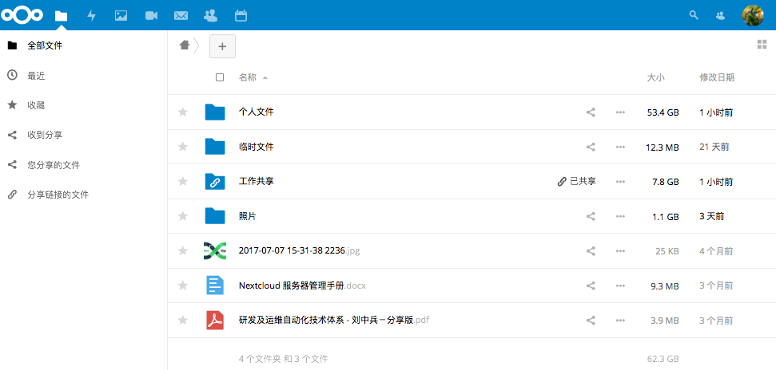

给文件打标签
-------------

您可以为文件分配标签。 要创建标签，请将文件打开到“详细信息”视图。 然后键入您的标签。 创建每个标签后按回车键可以输入多个标签。 所有标签都是系统标签，并由您的Nextcloud服务器上的所有用户共享。

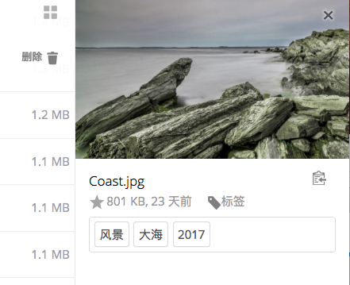

然后使用左侧栏上的“标签”过滤器按标签过滤文件。

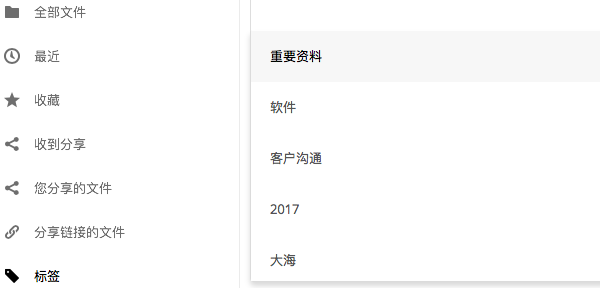

评论
--------

使用“详细信息”视图在任何文件或文件夹中添加和阅读评论。每个有权访问该文件的人都可以看到评论。

figure:: ../images/file_menu_comments_2.png
   :alt: 创建和查看评论。 

视频播放器
----------

您可以通过简单地点击该文件，在Video Player应用程序中播放Nextcloud中的视频。Nextcloud视频播放器依赖于您的web浏览器和视频格式。如果您的Nextcloud管理员开启了视频播放器但是不能在您的浏览器中播放，这可能是浏览器的问题。查看https://developer.mozilla.org/en-US/docs/Web/HTML/Supported_media_formats#Browser_compatibility 来获得浏览器支持的多媒体格式。

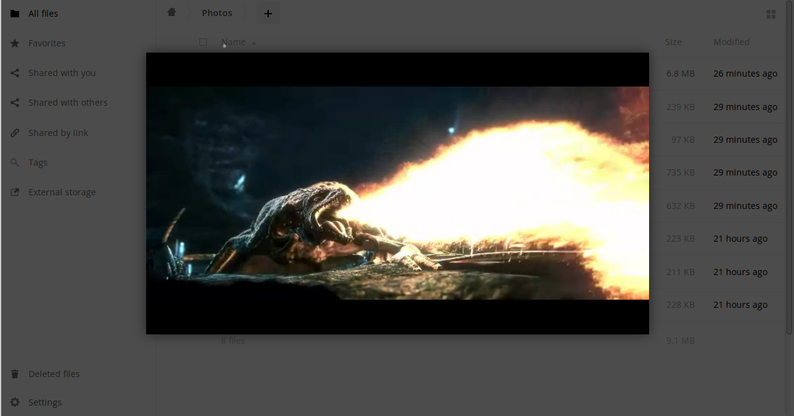

文件控制
--------

如果服务器管理员启用，Nextcloud可以显示图像文件、MP3封面和文本文件的缩略图预览。 将光标悬停在文件或文件夹上，以显示以下操作的控件：

收藏
  点击文件图标左侧的星标将其标记为收藏夹，并使用左侧栏上的收藏夹过滤器快速找到所有收藏。

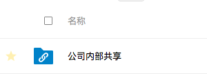

共享
  与组或其他用户共享文件或文件夹，并使用超链接创建公共共享。 您还可以查看您已经分享的人，以及通过点击回收站图标撤消共享。

.. note:: 从9.0版本开始，您可以看到原始共享的所有重新共享用户。

  如果启用了用户名自动完成功能，当您开始输入用户名或组名称时，Nextcloud将自动为您完成。如果您的管理员启用了电子邮件通知，您可以从共享屏幕发送新共享的电子邮件通知。

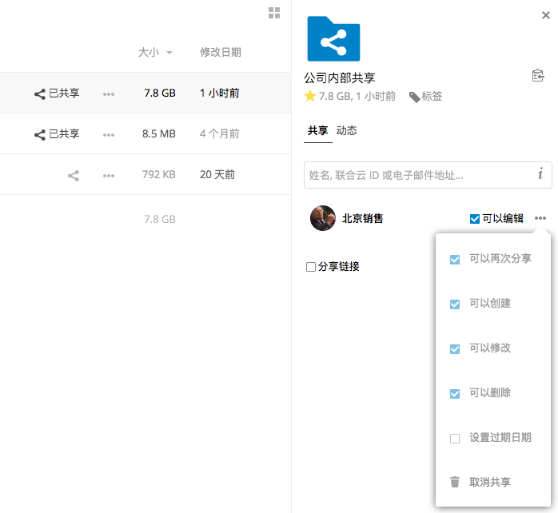

共有5种共享权限设置：

* 可以再次共享： 允许您共享的用户再次共享给其他用户。
* 可以编辑：允许您共享的用户编辑共享文件、使用文档编辑应用进行协作。
* 创建：允许您共享的用户创建新文件和增加它们进行共享。
* 变更：运行上传一个新版本共享文件代替原文件。
* 删除：允许您共享的用户删除共享文件。

扩展菜单：
  扩展菜单(三个点) 显示文件详细信息、允许您重命名、下载和删除文件。

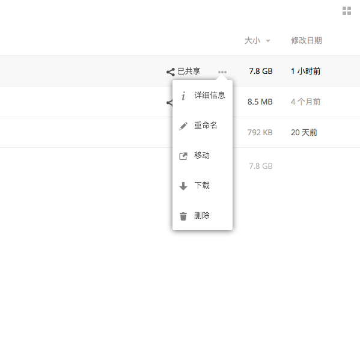

   详细信息视图显示活动，共享和版本信息。

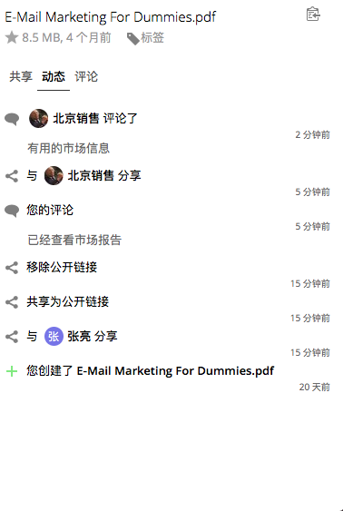

左下角的 **设置**齿轮图标允许您在Nextcloud Web界面中显示或隐藏隐藏的文件。这些也称为dotfiles，因为它们以点为前缀，例如 ``.mailfile``。该点告诉您的操作系统将这些文件隐藏在文件浏览器中，除非您选择显示它们。 通常这些都是配置文件，因此可以选择隐藏它们会减少混乱。

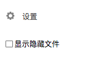

文件预览
--------

您可以通过单击文件名，在Nextcloud嵌入式查看器中显示未压缩的文本文件、OpenDocument文件、视频和图像文件。 如果您的Nextcloud管理员启用了它们，可能还有其他可以预览的文件类型。 如果Nextcloud无法显示文件，则会启动下载进程并将文件下载到计算机。

在您的NextCloud内进行导航
-------------------------

在Nextcloud中浏览文件夹与点击文件夹打开一样简单，并使用浏览器上的后退按钮移动到上一级。 Nextcloud还在“文件”字段的顶部提供了一个导航栏。

共享状态图标
------------

已共享的任何文件夹都标有 ``共享``覆盖图标。公共链接共享标记有链接链接。未共享的文件夹为空。

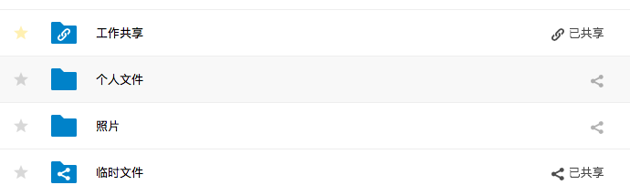

创建或上传文件和文件夹
-------------------------------------------

直接在Nextcloud 文件应用中点击 **新建**按钮来上传或者创建新文件或目录。

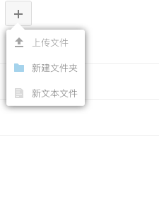

  *新建*按钮提供以下选项: 

上箭头:
  将文件从计算机上传到Nextcloud。 您还可以通过从文件管理器拖放文件来上传文件。

文本文件:
  在当前文件夹新建文本文件。

文件夹
  在当前文件夹新建文件夹。

选择文件或文件夹
----------------

您可以通过点击其复选框来选择一个或多个文件或文件夹。 要选择当前目录中的所有文件，请单击位于文件列表顶部的复选框。

当您选择多个文件时，您可以删除所有这些文件，或使用顶部显示的 **删除**按钮删除，可以使用 **下载**按钮将其作为ZIP文件下载。

.. note:: 如果 ``下载``按钮不可见，是因为管理员已经禁用了这个特性。 

文件过滤视图
------------

“文件”页面上的左侧边栏包含几个用于快速排序和管理文件的过滤器。

全部文件：
  默认视图；显示您有权访问的所有文件。

收藏:
  被黄色星标记的文件或文件夹。

收到分享:
  显示其他用户或组与您分享的全部文件。

您分享的文件:
  显示全部您和其他用户和组共享的所有文件。

分享链接的文件:
  显示所有您通过公开链接分享的文件。

外部存储（可选）:
  您可以访问外部存储设备和服务（如Dropbox，Google和Amazon S3）上的文件。

移动文件
------------

您可以通过拖拽方式移动文件和文件夹到任何其他文件夹。

共享文件过期日期的变更：
-----------------------

在老的Nextcloud版本中，您可以同时设置本地用户和公开用户的共享过期日期。现在当公开共享没有过期，而本地共享已经过期，只可设置公开链接的过期日期。**过期**本地共享的唯一方法是单击回收站图标以取消共享您的文件。

创建或者连接到联合云链接
------------------------

联合云共享允许您从远程Nextcloud服务器挂载文件共享，并像本地共享一样进行管理。 在Nextcloud 9中，创建新的共享链接的过程更简单、更快速。请参阅:doc:`使用联合云共享`进一步学习如何创建和连接到新的联合云共享。

