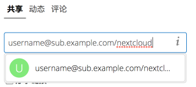
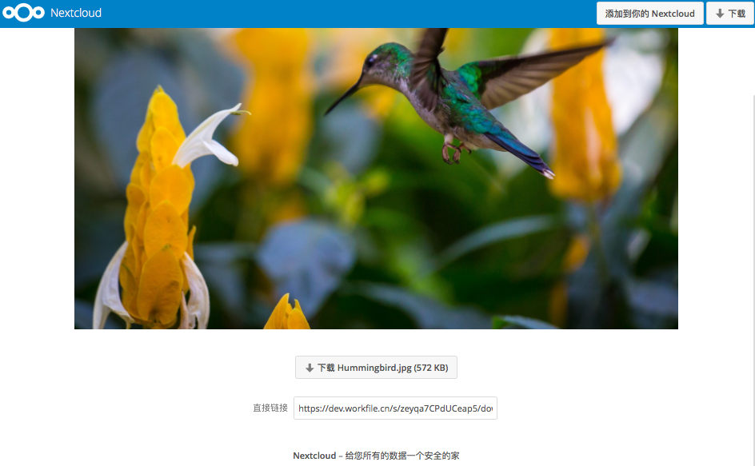
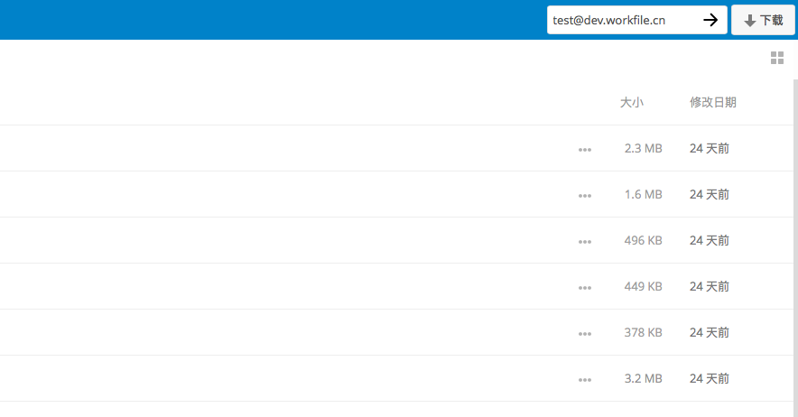

============
使用联合共享
============

联合共享允许您从远程Nextcloud服务器装载文件共享，实际上创建您自己的Nextclouds云。您可以与其它 Nextcloud服务器上的用户建立直接共享链接。

创建新的联合共享
----------------

默认情况下，在新的或升级后的Nextcloud安装中启用联合共享。 按照以下步骤与其它Nextcloud或ownCloud 9以上的服务器建立新的共享:

1. 前往“文件”页面，然后单击要共享的文件或目录上的“共享”图标。侧边栏中输入以下形式的远程用户的用户名和URL：<username> @ <oc-server-url>。 在这个例子中，那就是layla @ remote-server / nextcloud。 表单会自动回显您键入的地址，并将其标记为“远程”。 点击标签。

2. 当您的本地Nextcloud服务器与远程的Nextcloud服务器成功连接时，您将看到一个确认。您唯一的共享选项是 **可以编辑** 。
   
任何时候点击“共享”按钮，查看您与谁共享文件，点击回收站图标即可删除链接的共享。这只会取消链接共享，不会删除任何文件。

通过电子邮件创建新的联合云共享
---------------------------------------------

当您与ownCloud 8.x及更早版本的用户共享时，请使用此方法。

您不知道用户名或网址是什么吗？那么您可以让Nextcloud为您创建链接并将其发送给收件人。

.. figure:: ../images/create_public_share-6.png

收件人收到你的电子邮件时，他们必须采取一些步骤才能完成共享链接。首先，他们必须打开您在Web浏览器中发送的链接，然后单击 **添加到您的Nextcloud按钮** 。

 **添加到您的Nextcloud** 按钮更改为表单字段，您的收件人需要在此字段中输入其Nextcloud或ownCloud服务器的URL，然后按回车键，或单击箭头。

接下来，他们将看到一个对话框，要求确认。他们只需点击 **添加远程共享** 按钮即可完成。
 
随时点击回收站图标即可删除链接的分享。这只会取消链接共享，不会删除任何文件。
