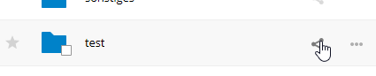
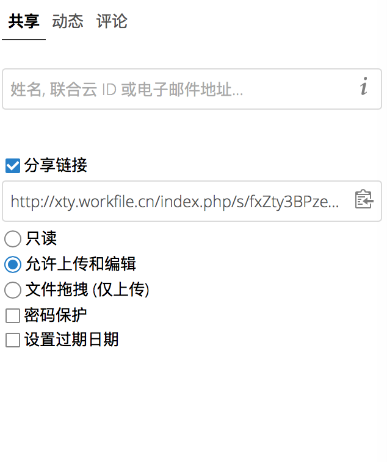

============
使用匿名上传
============

您可以创建自己的指定上传目录，以便其他人无需登录到服务器可以将文件匿名上传给您。
它们将不被允许查看此目录的内容，或进行任何更改。这是通过电子邮件，使用FTP服务器或使用商业文件共享服务发送大型附件的绝佳选择。

设置您的文件上传
----------------

前往“文件”应用并创建或选择文件夹，操作匿名上传。

选中“分享链接”，然后选中“允许上传和编辑”和“设置密码保护”。

现在，您可以手动将链接发送到上传文件，或者通过使用Nextcloud发送功能，如果您的管理员启用了它。

上传文件
--------

使用匿名上传功能很简单。您收到上传文件夹的链接，单击链接，然后您将看到一个带有**点击上传**按钮的Nextcloud页面。

.. image:: ../images/anonym_upload.png

这将打开文件选择器，并选择要上传的文件或目录。您也可以将文件拖入窗口。

当上传完成，文件被列出:

.. image:: ../images/anonym_uploaded_files.png
