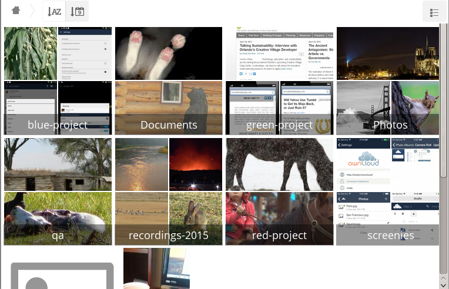

========
相册应用
========

图片应用程序已被重写和改进，现在称为相册应用程序。它支持更多的图像格式、排序、缩放和滚动。还可通过简单的文本文件支持高级自定义功能。

在您的主Nextcloud“文件”页面上，单击右上角的小图标，在您的用户名下，打开相册应用程序。相册应用程序会自动查找您的Nextcloud文件夹中的所有图像，并在文件夹名称中展示缩略图。点击文件夹缩略图打开文件夹。在左上角，您有两个排序选项，字母顺序和日期排序。

进入任何文件夹后，单击任何图像将会以幻灯片模式打开它。具有以下功能：顶部居中的下载按钮，右侧和左侧的前进后退按钮，右下角的自动幻灯片按钮和右上角的关闭按钮。

自定义配置
----------

您可以使用名为 **gallery.cnf** 的简单文本文件来自定义图库相册，其使用 `Yaml <https://en.wikipedia.org/wiki/YAML>`_ 标记语言构造参数。您可以有多个 **gallery.cnf** 文件; 你需要一个在您自己的根Nextcloud文件夹（您的Home文件夹）中定义全局功能。然后如果要在不同专辑中定义不同的行为，则可使用单个专辑 **gallery.cnf** 文件。

功能特性
^^^^^^^^

目前实现了以下常见功能:

 * 原生SVG支持。 
 * 访问外部共享。

目前已经实现了下列专辑功能:

  * 向包含说明的文件添加链接。
  * 在配置文件中直接键入简单的版权声明。
  * 添加链接到包含版权声明的文件。
  * 定义排序类型及顺序。
  * 定义背景颜色。
  * 定义子专辑是否会继承配置。

目前实现了以下幻灯片功能:

 * 显示一个按钮，您可以选择黑色或白色的背景，用于您正在查看的图片（对于具有透明背景的图像）。

配置
^^^^

配置文件的名字必须为 **gallery.cnf** 。 您可能有多个专辑的 **gallery.cnf** 文件。要启用全局功能，请将其放置在您的顶级文件夹中，该文件夹通过家图标在Web GUI中标识。（将存放在``data/<user>/files/``中）。参考:ref: `<supported_variables_label>` 在 **全局功能** 部分的示例。

.. 提示:: 更改配置后，需要刷新浏览器以查看更改。 

格式
^^^^

UTF-8，**没有BOM**。在Nextcloud Web图形界面中创建的文件可以正常工作。

结构
^^^^

文件中应该添加注释，以便其他人知道这是什么，注释以#开始。

空格长度使用两个空格。**不要使用tab制表符**。

如果报错，请查阅 `YAML格式文档 <https://symfony.com/doc/current/components/yaml/yaml_format.html>`_。 

一个 `gallery.cnf` 示例::

  # Gallery configuration file
  # Created on 31 Jan 2016 by Nextcloud User
 features:
   external_shares: yes
   native_svg: yes
   background_colour_toggle: yes
 design:
   background: "#ff9f00"
   inherit: yes
 information:
   description: This is an **album description* * which is only shown if there
   is no `description_link`
   description_link: readme.md
   copyright: Copyright 2003-2016 [interfaSys sàrl](https://www.interfasys.ch),
   Switzerland
   copyright_link: copyright.md
   inherit: yes
 sorting:
   type: date
   order: des
   inherit: yes

.. _supported_variables_label:

支持的变量
^^^^^^^^^^

**全局特性**

将其放在您的Nextcloud根文件夹中，这是您的主文件夹。

 * **external_shares**: 如果要加载存储在外部位置的图像，请使用 **files_external** 应用程序，在根配置文件中设置为 **yes** 。

 * **native_svg**: 在根配置文件中设置为 **yes**，以便在浏览器中显示SVG图像。如果您的SVG文件不能完全可信，则可能会导致安全风险。

 * **background_colour_toggle**: 在根配置文件中设置为 **yes**，以启用在透明图像上的黑白背景之间切换的按钮。

.. note:: 外部共享比本地共享慢20-50倍。准备好等待很长时间才能看到共享相册中包含的所有图像。

**专辑配置**

可以使用以下配置部分单独配置每张专辑。使用 **inherit** 参数将配置传递给子专辑。

**设计**

 * **background**: 使用该颜色的RGB十六进制表示来定义照片墙背景的颜色。例如：“#ffa033”。您必须在该值周围使用引号，否则将被忽略。如果您打算使用此功能，强烈建议使用自定义主题，使用CSS加载微调框。您可以使用此色轮来找到您喜欢的颜色。 

**专辑介绍**

 * **description**: 将显示在信息框中的一个markdown标记格式字符串。可以使用Yaml标记分散在多行。
 * **description_link**: 专辑中的一个标记文件，将在信息框中解析并显示，而不是描述。 
 * **copyright**: markdown标记格式字符串。支持外部资源。 
 * **copyright_link**: 专辑本身中的任何文件（例如copyright.html），当用户点击链接时将被下载。
 * **inherit**: 如果希望子文件夹继承此部分配置，请设置为**yes**。 

查看markdown标记语法：`<http://www.markitdown.net/markdown>`_。

.. note:: 如果使用 **copyright_link**变量，不要在`copyright`中增加链接。

**排序**

 * **排序**: 按照**日期**或者**名称**排序。 **日期**只适合文件。
 * **sort_order**: **asc**或者 **des** (正序或者倒叙)。
 * **inherit**: 如果希望子文件夹继承此部分配置，请设置为**yes**。

提示
----

 * 当只设置“sort order”变量时，将使用默认排序顺序。
 * 当只找到“sort order”变量时，排序配置将被忽略，脚本将继续在上层文件夹中查找有效的配置。
 * 要在公开共享中启用原生SVG等功能，您需要在该文件夹中创建一个包含该功能的配置文件。

 * 如果您公开共享文件夹，请勿忘记添加所有链接到的文件（例如description.md或copyright.md），因为用户将无法访问存储在父文件夹中的文件。
•由于人们可以下载整个文件夹作为存档，通常最好将所有文件包含在共享文件夹中，而不是直接在配置文件中添加文本。

示例
----

**只是排序**

只在当前文件夹中应用::

 # Gallery configuration file
   sorting:
   type: date
   order: asc

简要说明和链接到“copyright”文件，适用于当前文件夹及其所有子文件夹。这也显示了您可以用来在多行展示“description”的语法::

 # Gallery configuration file
   information:
   description: | # La Maison Bleue, Winter '16
     This is our Winter 2016 collection shot in **Kyoto**
     Visit our [website](http://www.secretdesigner.ninja) for more information
   copyright: Copyright 2015 La Maison Bleue, France
   copyright_link: copyright_2015_lmb.html
   inherit: yes

**从外部云服务加载图像**

.. note:: 该特性只能在根文件夹中定义。

您可以将标准配置项添加到同一配置文件中::

 # Gallery configuration file
   features:
   external_shares: yes

**开启原生SVG**

.. note:: 该特性只能在根文件夹中定义。 

您可以将标准配置项添加到同一配置文件中:

 # Gallery configuration file
  features:
  native_svg: yes

可能的特性扩展
--------------

专辑的不同排序参数。
