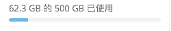

========
存储配额
========

您的Nextcloud管理员可以选择为用户设置存储配额。查看您的个人页面的顶部，看看你的配额是多少，你使用了多少。

解如何计算配额可能会有所帮助。

元数据（缩略图，临时文件，缓存和加密密钥）占用大约10％的磁盘空间，但不计入用户配额。一些应用程序将信息存储在数据库中，例如日历和联系人应用程序。此数据将从您的配额中排除。

当其他用户与您共享文件时，共享文件将计入原始共享拥有者的配额。当您共享文件夹并允许其他用户或组向其上传文件时，所有上传和编辑的文件都将计入您的配额。当您重新共享与您共享的文件时，重新分配仍然会计入原始所有制的配额。

加密文件比未加密的文件大一点; 未加密的大小是根据您的配额计算的。

仍在回收站中的已删除的文件不计入配额。回收站设置在配额的50％。删除的文件寿命设置为30天。当删除的文件超过配额的50％时，最旧的文件将被删除，直到总数低于50％。
启用版本控制时，旧的文件版本不会计入配额。

如果您通过网址创建公共共享，并允许上传，则任何上传的文件都将计入您的配额。

