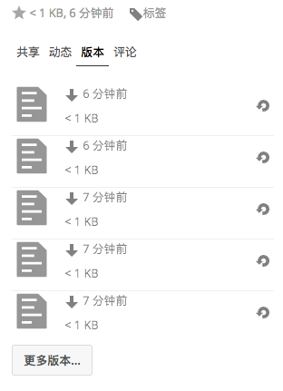

========
版本控制
========

Nextcloud支持文件的简单版本控制系统。版本控制可通过“文件”应用的“详细信息”侧栏的“版本”选项卡访问，它创建了文件的备份。此选项卡包含文件的历史记录，您可以将文件回滚到任何以前的版本。间隔大于两分钟的更改将保存在 **数据/[用户]/版本** 中。

要恢复文件的特定版本，请单击左侧的圆形箭头。点击时间戳进行下载。

版本控制应用程序会自动让旧版本过期，以确保用户不会耗尽空间。此模式用于删除旧版本:

 * 前1秒我们保留一个版本
 * 前10秒Nextcloud每2秒保留一个版本
 * 前1分钟Nextcloud每10秒保留一个版本
 * 前1小时Nextcloud每1分钟保留1个版本
 * 前24小时Nextcloud每小时保留一个版本
 * 前30天Nextcloud每天保留一个版本
 * 30天后Nextcloud每周保留一个版本

每次创建新版本时，将根据此模式调整版本。

版本控制应用程序从未使用超过用户当前可用空间的50％。如果存储的版本超过此限制，Nextcloud将删除最旧版本，直到再次满足磁盘空间限制为止。
