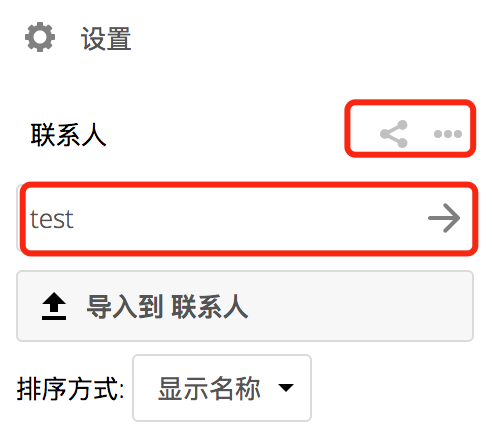

==================
使用联系人应用程序
==================

默认情况下，Nextcloud |version| 中的“Contacts联系人”应用程序未启用，需要单独启用。

Nextcloud Contacts应用程序与其他移动联系人应用程序类似，但是具有更多的功能。当您首次访问联系人应用程序时，默认通讯录变得可用。

 **Contacts app应用程序 (empty)**

增加联系人
----------
您可以通过以下方法中的一种增加联系人。

 * 使用Variant Call Format (VCF)文件导入联系人

 * 手动增加联系人 

导入联系人
~~~~~~~~~~

增加联系人最快的方法是使用Variant Call Format (VCF)格式文件。 

使用VCF文件导入联系人:

 1. 位于齿轮设置按钮的底部有Contacts联系人应用程序信息。

  .. figure:: ../images/contact_bottombar.png

  **联系人设置齿轮按钮**

 2. 点击齿轮按钮。联系人应用程序大连上传区域。 

**Contacts应用程序上传区域**

手动创建联系人
~~~~~~~~~~~~~~

您可以手动创建联系人。

创建一个新的联系人:

 1. 点击``+新联系人``按钮。

  
  在应用程序视图区域中将打开一个空的新联系人配置。

  .. figure:: ../images/contact_new.png

 2. 指定新的联系人信息。您所做的更改将立即生效。 

编辑或者移除联系人信息
~~~~~~~~~~~~~~~~~~~~~~

联系人应用程序使您能够编辑或删除联系人信息。

为了编辑或者移除联系人信息:

 1. 导航到要修改的特定联系人。 

 2. 在需要编辑或者要移除的联系人区域选择相关信息。

 3. 进行修改或者点击回收站。

您对任何联系信息所做的更改或删除都会立即生效。

联系人图片
~~~~~~~~~~

点击上传按钮来定义联系人图片:

.. figure:: ../images/contact_picture.png

  **联系人图片(上传按钮)**

在设置联系人图片后，效果如下:

.. figure:: ../images/contact_picture_set.png

  **联系人图片 (设置)**

如果要上传新的，请将其删除，查看完整尺寸或下载点击联系人图片。

.. figure:: ../images/contact_picture_options.png

增加或者管理联系人地址薄
------------------------

点击应用信息底部的设置（齿轮）按钮区域提供对联系人应用程序设置的访问。此字段显示所有
可用的通讯录，每个通讯录的特定选项，并使您能够通过指定地址簿名称来创建新的地址簿。

   **在联系人设置中增加地址簿**

联系人设置还使您能够共享，导出和删地址簿。您还会在那里找到CardDAV的URL网址。

有关同步地址簿与iOS，macOS，Thunderbird等CardDAV客户端的更多详细信息，请参阅:doc:`index`。
