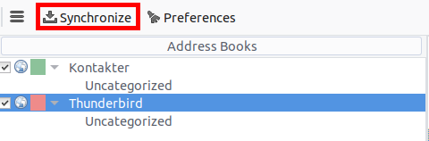

雷鸟Thunderbird - 同步地址簿和日历
==================================

地址薄
------

作为一个Nextcloud和CardBook新手，这有让其工作的简明细节描述:

- 在您的操作系统中安装`雷鸟Thunderbird邮件客户端程序 <https://www.mozilla.org/en-US/thunderbird/>`_，Linux操作系统已经内置。 
- `CardBook <https://addons.mozilla.org/en-US/thunderbird/addon/cardbook/>`_ (Thunderbird联系人扩展应用)。

一旦您已安装了CardBook和Thunderbird就这样操作:

 1. 在联系人视图的左下角（在Nextcloud联系人中）查找一个像这样的曲别针符号。 

将显示类似如下的URL地址：
https://cloud.nextcloud.com/remote.php/dav/addressbooks/users/daniel/Thunderbird/

 2. Cardbook位于雷鸟Thunderbird的右上角： 

.. image:: ../images/cardbook_icon.png

 3. 在Thunderbird的附加组件Cardbook中:

   -  "Adressbook > New Adressbook **Remote** > Next
   -  填写您的信息

.. image:: ../images/new_addressbook.png

 4. 验证您的设置，然后单击下一步，然后选择地址簿的名称，然后再次单击下一步。 

.. image:: ../images/addressbook_name.png

5. 安装完成后，点击CardBook左上角的“同步”同步您的通讯录。你会看到你的通讯录从Nextcloud填充！

您将看到从Nextcloud的地址簿填充信息！

处理雷鸟Thunderbird CardBook的其余细节留给读者.....

日历
----

 1. 在您的操作系统中安装 `雷鸟Thunderbird邮件客户端程序 <https://www.mozilla.org/en-US/thunderbird/>`_，Linux操作系统已经内置。 

 2. `Lightning扩展应用 <https://addons.mozilla.org/en-US/thunderbird/addon/lightning/>`_ 。

一旦您安装了Lighning和Thunderbird就这样操作:

 1. 转到您的Nextcloud日历，然后单击要同步显示的日历的3个点菜单，显示类似于如下的URL:
     https://cloud.nextcloud.com/remote.php/dav/calendars/daniel/personal/

 2. 转到雷鸟Thunderbird的日历视图，右键单击左侧的日历菜单（日历的名称） **新建日历**。

 3. 选择 **保存在网络上**。

4. 选择 **CalDAV** 并填写空白的信息: 

处理雷鸟Thunderbird日历的其他细节留给读者......
