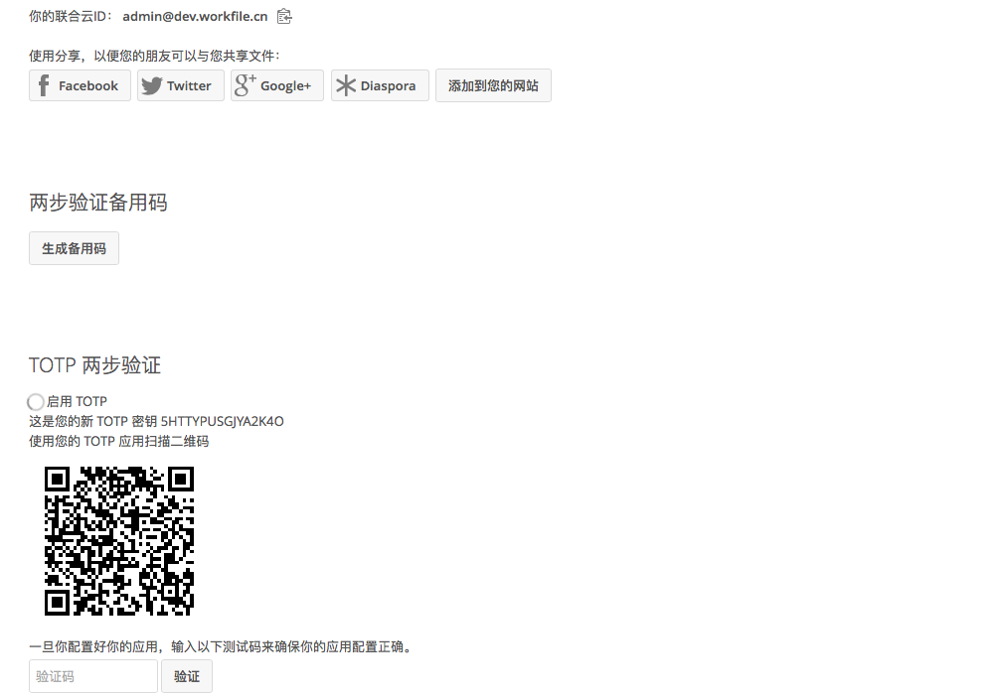

=============
使用双重身份认证
=============

双重身份验证（2FA）是保护您的Nextcloud帐户免受未经授权的访问的一种方式。它需要您的身份的两个不同的“证明”。例如，你熟悉的（如密码）和物理键盘。 通常，第一验证因素是您已经拥有的密码，第二验证因素可以是您收到的短信，或您在手机或其他设备上生成的代码（您拥有的）。Nextcloud支持各种第二验证因素，还可以添加更多种。

双重身份验证（2FA）是保护您的Nextcloud帐户免受未经授权的访问的一种方式。它需要您的身份的两个不同的“证明”。例如，你熟悉的（如密码）和物理键盘。 通常，第一验证因素是您已经拥有的密码，第二验证因素可以是您收到的短信，或您在手机或其他设备上生成的代码（您拥有的）。Nextcloud支持各种第二验证因素，还可以添加更多种。

配置双重身份验证
=====================================
在您的个人设置中，查看第二验证因素身份验证设置。 在这个例子中，这是TOTP，一个Google Authenticator兼容的基于时间的代码。

     :alt: TOTP 配置

您将看到您的秘密和QR码，可以通过手机（或其他设备）上的TOTP应用扫描。 根据应用程序或工具，输入代码或扫描QR，您的设备将显示每30秒更改的登录代码。

为双重验证生成恢复码
===============================================
您应该始终为双重认证生成恢复码。如果您的双重认证设备被盗或无法使用，您将可以使用其中恢复码解锁您的帐户。它作为双重身份验证的备用是有效的。要获取恢复码，请转到您的个人设置，然后查看第二验证因素身份验证设置。选择生成 *恢复码*。

     :alt: 生成双重身份验证恢复码

然后看到一次性备用码的列表。

     
.. figure:: images/2fa_backupcode_2.png
     :alt: 双重身份验证码

你应该把这些代码放在一个你可以找到的安全地方，不要把它们与你的手机的第二验证因素放在一起，但要确保如果你丢失了一个，你还有另一个。把他们放在家里可能是最好的选择。

使用双重身份验证登录
=========================================
在您注销并需要重新登录后，您将看到在浏览器中输入TOTP代码的请求。 只需输入您的代码：
  

     :alt: 在登录时输入TOTP码 

如果代码正确，您将被重定向到您的Nextcloud帐户。

.. 提示:: 由于代码是基于时间的，因此您的服务器和智能手机的时钟保持几乎同步很重要。几秒钟的时间漂移不会是一个问题。

使用客户端应用程序进行双重身份验证
========================================================
一旦启用了双重身份验证，您的客户端如果只使用单一密码无法连接，除非他们也支持双重身份验证。要解决这个问题，你应该为它们生成特定于设备的密码。有关如何执行此操作的更多信息，请参阅管理已连接的浏览器和设备。

